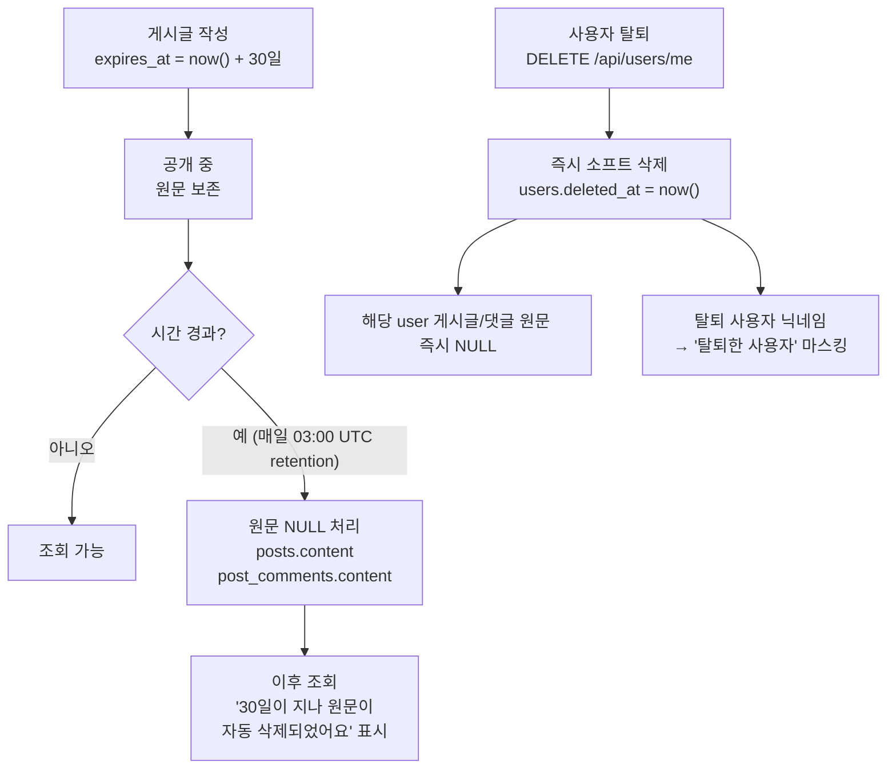

# 데이터 보존 정책

다시봄은 광장형 모델에서 사용자가 입력한 원문을 **30일 후 자동 삭제**한다. 약관 명시.

## Source of truth

- BE 스케줄러: `backend/.../service/retention/` (cron `0 0 3 * * *`)
- 사용자 삭제: `backend/.../service/retention/UserDeletionService.java`
- DB: `posts.content`, `post_comments.content` (Flyway V48+)

## 데이터 생명주기



## 30일 원문 만료

### 대상 컬럼

| 테이블 | 컬럼 | 만료 동작 | 용도 |
|---|---|---|---|
| `posts` | `content` (사용자 원문) | NULL 처리 | 게시글 본문 |
| `post_comments` | `content` (댓글 원문) | NULL 처리 | 댓글 본문 |

만료 후에도 다음은 보존:
- 메타: `posts.id`, `author_id`, `title`, `created_at`, `empathy_ratio`, `vote_options` 등
- 댓글 메타: `post_comments.id`, `author_id`, `parent_id`, `created_at`

### 스케줄러 동작

매일 03:00 UTC에 `expires_at` 시점 경과 게시글의 `posts.content` / `post_comments.content`를 NULL 처리한다. 진행 중 게시글은 만료되지 않는다.

## 사용자 요청 즉시 삭제

```
DELETE /api/users/me
  ↓
UserDeletionService:
  1. users.deleted_at = now() (소프트 삭제)
  2. 해당 user의 posts/post_comments 원문 즉시 NULL
  3. user_relationships의 user 측 nullify
```

상대방 입장에서 본인이 참여한 게시글·댓글은 계속 조회 가능하되, 탈퇴한 사용자의 닉네임은 "탈퇴한 사용자"로 마스킹.

## 게시글 조회 화면 노출

`GET /api/community/posts/{id}` 만료 후:
- `content` = `null`
- FE는 "30일이 지나 원문은 자동 삭제되었어요" 표시
- `title`, `votes` 등 메타·분석 결과는 계속 조회 가능

## 댓글 조회 화면 노출

`GET /api/community/posts/{id}/comments` 만료 후:
- `content` = `null`
- `is_deleted` 플래그 확인
- FE는 "[삭제된 댓글]" 또는 원문 자동 삭제 안내 표시

## 알림 정책

- `notifications` (읽음 상태) → 30일 후 DELETE
- `notifications` (미읽 상태) → 영구 보관 (사용자가 읽을 때까지)

## 약관 명시 (제6조)

> 1. 서비스는 이용자의 게시글·댓글 원문을 **최대 30일** 보관한 후 자동 삭제합니다.
> 2. 이용자가 삭제를 요청하는 경우 즉시 해당 데이터를 삭제합니다.
> 3. 서비스는 이용자의 데이터를 AI 학습용으로 사용하지 않습니다.

## 변경 시 절차

1. 보존 기간 변경: retention 상수 + Flyway (필요 시) + 본 문서 + 약관 동시 갱신
2. 새 만료 대상 컬럼 추가: 스케줄러 로직 보강 + Flyway 마이그레이션 (필요 시)
3. 사용자 알림 UX 변경: FE의 게시글/댓글 조회 페이지 카피 갱신
