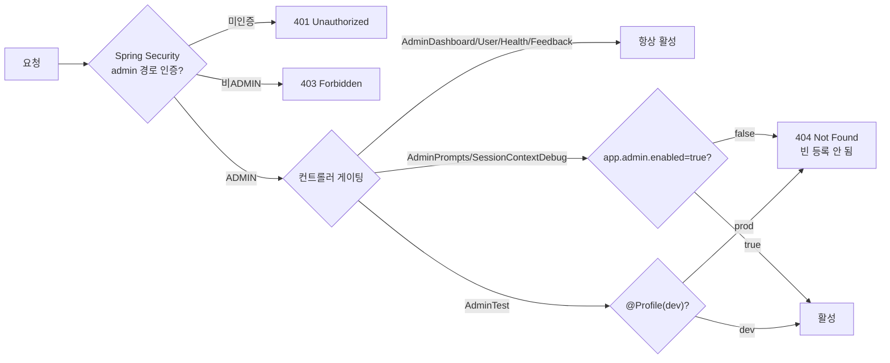

# Admin API — 관리자 전용 API

> 대시보드 통계·사용자 관리·피드백 관리·시스템 상태 모니터링·프롬프트 핫리로드·테스트 데이터 조작·세션 컨텍스트 디버그를 담당하는 API.
> **모든 엔드포인트는 ADMIN 권한 필요** (Spring Security 경로 기반 제한 + 일부 `@PreAuthorize`).

## Source of truth

| 항목 | 위치 |
|---|---|
| Dashboard 컨트롤러 | `backend/src/main/java/com/againspring/api/admin/AdminDashboardController.java` |
| User 컨트롤러 | `backend/src/main/java/com/againspring/api/admin/AdminUserController.java` |
| Health 컨트롤러 | `backend/src/main/java/com/againspring/api/admin/AdminHealthController.java` |
| Crawl Status 컨트롤러 | `backend/src/main/java/com/againspring/api/admin/AdminCrawlStatusController.java` |
| Crawl Status 서비스 | `backend/src/main/java/com/againspring/service/admin/AdminCrawlStatusService.java` |
| Feedback 컨트롤러 | `backend/src/main/java/com/againspring/api/AdminFeedbackController.java` |
| Prompts 컨트롤러 | `backend/src/main/java/com/againspring/api/AdminPromptsController.java` |
| Test 컨트롤러 | `backend/src/main/java/com/againspring/api/AdminTestController.java` |
| Debug 컨트롤러 | `backend/src/main/java/com/againspring/api/SessionContextDebugController.java` |
| 관리자 가이드 | `docs/shared/admin-dashboard.md` |

## 환경별 활성화 규칙



## Dashboard API — PMF 통계 · 리텐션 · 위기 모니터링

**Base path:** `/api/admin/dashboard` — 인증: JWT + ADMIN

| Method | Path | 설명 | 응답 |
|---|---|---|---|
| `GET` | `/summary` | PMF 핵심 지표 (DAU·세션 수·완료율·평균 턴) | `Map<String, Object>` |
| `GET` | `/daily-stats` | 최근 30일 일별 통계 | `List<Map<String, Object>>` |
| `GET` | `/retention` | 최근 14일 코호트별 리텐션 | `List<Map<String, Object>>` |
| `GET` | `/crisis-recent?limit=20` | 위기 감지된 최근 메시지 | `List<CrisisMessageResponse>` |
| `GET` | `/llm-failure-rate?days=7` | LLM 호출 실패율 (일별) | `List<Map<String, Object>>` |

```json
// GET /summary 응답 예시
{
  "todayTotalSessions": 42,
  "todayCompletedSessions": 18,
  "finalizeRate": 42.9,
  "avgTurnsToday": 7.3,
  "todayNewUsers": 12,
  "todayGuestSessions": 8,
  "totalFeedbacks": 156
}
```

## User API — 사용자 조회 · 삭제 · 역할 관리

**Base path:** `/api/admin/users` — 인증: JWT + ADMIN

| Method | Path | 설명 | 요청 | 응답 |
|---|---|---|---|---|
| `GET` | `/search?q=` | 닉네임·이메일 검색 | — | `List<User>` |
| `GET` | `?page=0&size=20&includeGuest=false` | 전체 사용자 페이지네이션 | — | `Page<User>` |
| `GET` | `/{id}` | 사용자 상세 조회 | — | `AdminUserDetailResponse` |
| `DELETE` | `/{id}/data` | 사용자 데이터 익명화 예약 | — | `{ status, userId }` |
| `PATCH` | `/{id}/roles` | 역할 변경 (USER·TESTER 한정) | `{ roles: [...] }` | `{ userId, roles }` |

**역할 변경 규칙:**
- 허용 역할: `USER`, `TESTER` — `ADMIN` 역할은 이 API로 변경 불가 (AdminRoleAssigner 전용)
- 잘못된 역할 지정 → 400 `INVALID_ROLE`
- 사용자 없음 → 404 `USER_NOT_FOUND`

```json
// PATCH /{id}/roles 요청
{ "roles": ["USER", "TESTER"] }

// 응답
{ "userId": "usr_xxxxx", "roles": ["USER", "TESTER"] }
```

## Health API — 시스템 상태 모니터링

**Base path:** `/api/admin/health` — 인증: JWT + ADMIN

| Method | Path | 설명 | 응답 |
|---|---|---|---|
| `GET` | `/system` | DB·LLM·디스크 상태 점검 | `SystemHealthResponse` |

```json
// GET /system 응답 예시
{
  "status": "UP",
  "database": { "status": "UP", "responseMs": 5 },
  "llmBridge": { "status": "UP", "lastSuccessAt": "2026-05-16T10:00:00Z" },
  "timestamp": "2026-05-16T10:01:00Z"
}
```

## Crawl Status API — AI Learning 크롤 신선도 모니터링

**Base path:** `/api/admin/crawl-status` — 인증: JWT + ADMIN

| Method | Path | 설명 | 응답 |
|---|---|---|---|
| `GET` | `` | 최근 24시간 크롤 저장 건수·실패 건수·신선도 플래그 | `CrawlStatusResponse` |

**배경:** 36일간 크롤이 침묵한 사고(2026-06-24~07-30) 재발 방지. 이 엔드포인트는 admin 대시보드에 "크롤 신선도 배지"를 표시하기 위해 설계.

**응답 스키마:**
```json
{
  "savedBySource24h": {
    "natepan": 120,
    "blind": 45,
    "theqoo": 87
  },
  "lastSuccessfulAt": {
    "natepan": "2026-07-29T14:30:00Z",
    "blind": "2026-07-29T10:15:00Z",
    "theqoo": "2026-07-29T18:45:00Z"
  },
  "failureCount24h": 2,
  "stale": false,
  "checkedAt": "2026-07-30T08:22:15.123Z",
  "errorMessage": null
}
```

**응답 필드 설명:**

- `savedBySource24h` (Object<string, number>): 각 크롤 소스(natepan, blind, theqoo, clien 등)별 최근 24시간 내 저장된 항목 수 합계. 값이 없으면 (24시간 내 성공 크롤 없음) 해당 소스는 키가 없을 수 있음.
- `lastSuccessfulAt` (Object<string, string>): 각 소스의 마지막 성공 크롤 시각 (ISO-8601 UTC). 성공 기록이 없으면 해당 소스 키가 없음.
- `failureCount24h` (number): 최근 24시간 내 실패한 크롤 총 건수.
- `stale` (boolean): `true`이면 24시간 내 성공 크롤이 0건 — 프론트엔드는 배지를 "신선하지 않음" 상태로 표시.
- `checkedAt` (string, ISO-8601 UTC): 이 조회의 기준 시각. 프론트엔드는 이 값을 기준으로 "N시간 전" 표시 가능.
- `errorMessage` (string|null): AI Learning 서비스 조회 실패 시 오류 메시지. 정상이면 `null`.

**오류 케이스:**
- AI Learning 서비스 불가 → 200 OK 반환, `errorMessage` 필드에 오류 내용, `stale=true` 표시.
- 프론트엔드는 `errorMessage`가 존재하면 "조회 실패" 상태로 표시 가능.

## Feedback API — 피드백 목록 · 상태 관리

**Base path:** `/api/admin/feedbacks` — 인증: JWT + ADMIN

| Method | Path | 설명 | 요청 | 응답 |
|---|---|---|---|---|
| `GET` | `?category=&status=&page=0&size=20` | 피드백 목록 (필터·페이지네이션) | — | `Page<Feedback>` |
| `PATCH` | `/{id}` | 처리 상태·관리자 메모 업데이트 | `UpdateFeedbackStatusRequest` | `Feedback` |

## Prompts API — LLM 프롬프트 핫리로드

**Base path:** `/api/admin/prompts` — 인증: JWT + ADMIN + `@PreAuthorize("hasRole('ADMIN')")`
**활성 조건:** `app.admin.enabled=true`

| Method | Path | 설명 | 응답 |
|---|---|---|---|
| `POST` | `/reload` | 디스크에서 LLM 프롬프트 전체 리로드 | `{ status, message }` |

> 프롬프트 파일 변경 후 재배포 없이 즉시 적용하려면 이 API 호출.
> `docs/shared/prompts/` 경로의 `.md` 파일을 모두 재로드.

## AI User API — 생성 정책 · 모니터링 · 안전정지

**Base path:** `/api/admin/ai-user` — 인증: JWT + ADMIN

| Method | Path | 설명 | 응답 |
|---|---|---|---|
| `GET` | `/generation-config` | AI 유저 생성 목표량·legacy backend·PLAN provider/pause/kill·batch 상한 조회 | `ConfigResponse` |
| `PUT` | `/generation-config` | 생성 목표량과 PLAN 실행 정책 저장 | `ConfigResponse` |
| `POST` | `/cleanup/reduce-ㅠ` | AI 댓글의 연속 `ㅠ`를 단일 `ㅠ`로 정규화 | `{ updated, message }` |
| `POST` | `/backfill-comment-likes?days=30&personasPerPost=8` | orchestrator에 댓글 좋아요 백필 작업 큐잉 | `{ queued, posts, personasPerPost, message }` |
| `POST` | `/kill` | POST/COMMENT/REPLY backend를 모두 `OFF`로 전환 | `{ status, message, killedAt }` |
| `GET` | `/generation-status` | 오늘 KST 기준 생성 진행 현황 | `GenerationStatusResponse` |
| `GET` | `/action-feed?limit=50&status=&actionType=` | 최근 persona action feed | `AiUserMonitorService.ActionFeedDto` |
| `GET` | `/persona-performance?range=24h` | persona별 성과 집계 | `List<AiUserMonitorService.PersonaPerformanceDto>` |
| `GET` | `/hourly-distribution?hours=24` | 시간대별 생성 분포 | `AiUserMonitorService.HourlyDistributionDto` |

메모:
- 외부 진단용 read-only probe는 `/api/admin/ai-user/*`의 읽기 경로만 사용한다.
- strict runtime h2h는 이 API가 아니라 dev docker network 안에서 기존 harness를 돌려야 한다.
- PLAN 필드: `schedulerMode`(`LEGACY`/`PLAN`), `providerAiPostBundle`, `providerHumanPostPlan`, `providerHumanInteraction`(`CLAUDE`/`CODEX`/`OFF`), `scheduleExecutionPaused`, `aiUserKillSwitch`, `candidatePoolSize`(8~30), `humanBatchMaxPosts`(1~10), `humanBatchMaxInteractions`(1~50).
- `OFF`는 이후 해당 workload의 새 job만 차단한다. 이미 생성한 item의 게시 중지는 `scheduleExecutionPaused`, 전체 생성·게시 정지는 `aiUserKillSwitch`/runtime kill-switch를 사용한다.
- **댓글 생성량 SSOT (2026-08-01, V91)**: `hr_*` 컬럼 — `/admin/ai-user` UI. orchestrator는 0(미설정)일 때만 yml 폴백.

## Content API — 공개 스레드 · 예약 홀딩 (2026-08-01~)

**Base path:** `/api/admin/content` — 인증: JWT + ADMIN  
**권위 표:** [`rest-spec.md`](rest-spec.md) §Admin Content. 흐름: [`flows.md`](flows.md) §5 · UX: `docs/frontend/ux/flows/09-admin.md`.

| Method | Path | 설명 |
|---|---|---|
| `GET`/`PATCH` | `/posts/{postId}/thread` | 공개 글 타임라인 + **미게시 AI 예약 댓글** (`pending`/`pendingItems`) |
| `GET` | `/scheduled-posts` | AI 예약 홀딩 목록 (`status` 기본 `SCHEDULED`) |
| `GET`/`PATCH`/`DELETE` | `/scheduled-posts/{id}` | 홀딩 상세·수정(`SCHEDULED`만)·취소 |

`PATCH` 시 글 `createdAt` delta는 댓글·예약 시각에 일괄 적용된다. orchestrator `ai_scheduled_posts`는 BE가 프록시한다.

## Social Publishing / Marketing API

| Method | Path | 설명 |
|---|---|---|
| `GET` | `/api/admin/marketing/quota` | 24h 자동 분배 일일 상한·오늘 KST 사용량 |
| `PUT` | `/api/admin/marketing/quota` | 글/영상 상한 저장 (`system_setting`) |
| 잡·자격증명·통계 | `/api/admin/marketing/jobs*` 등 | ASM 프록시 — [`platforms.md`](../marketing/platforms.md) |

24h 배분: 공유 풀(`dailyTextCap` 기본 6) · 영상 우선(`dailyVideoCap` 기본 3, X 없음) · 잔여 글 슬롯 = X+IG 피드.

## 전체 Admin 엔드포인트 수

| 컨트롤러 | 엔드포인트 수 | 활성 조건 |
|---|---|---|
| AdminDashboardController | 5 | 항상 |
| AdminUserController | 5 | 항상 |
| AdminHealthController | 1 | 항상 |
| AdminFeedbackController | 2 | 항상 |
| AdminPromptsController | 1 | `app.admin.enabled=true` |
| AdminTestController | 2 | `@Profile("dev")` |
| SessionContextDebugController | 1 | `app.admin.enabled=true` |
| AdminAiUserController | 9 | 항상 |
| SocialPublishController | 7 | `app.features.marketing.enabled=true` (dev) |
| **합계** | **33** | |

## 변경 시 절차

- 신규 admin 엔드포인트 추가: 이 문서 + `docs/shared/admin-dashboard.md` 동시 갱신
- TESTER role 지정: `PATCH /api/admin/users/{id}/roles { "roles": ["USER", "TESTER"] }`
- 역할 체계 변경: `docs/shared/policies/user-permissions.md` 권위본 + `AdminRoleAssigner.java`
