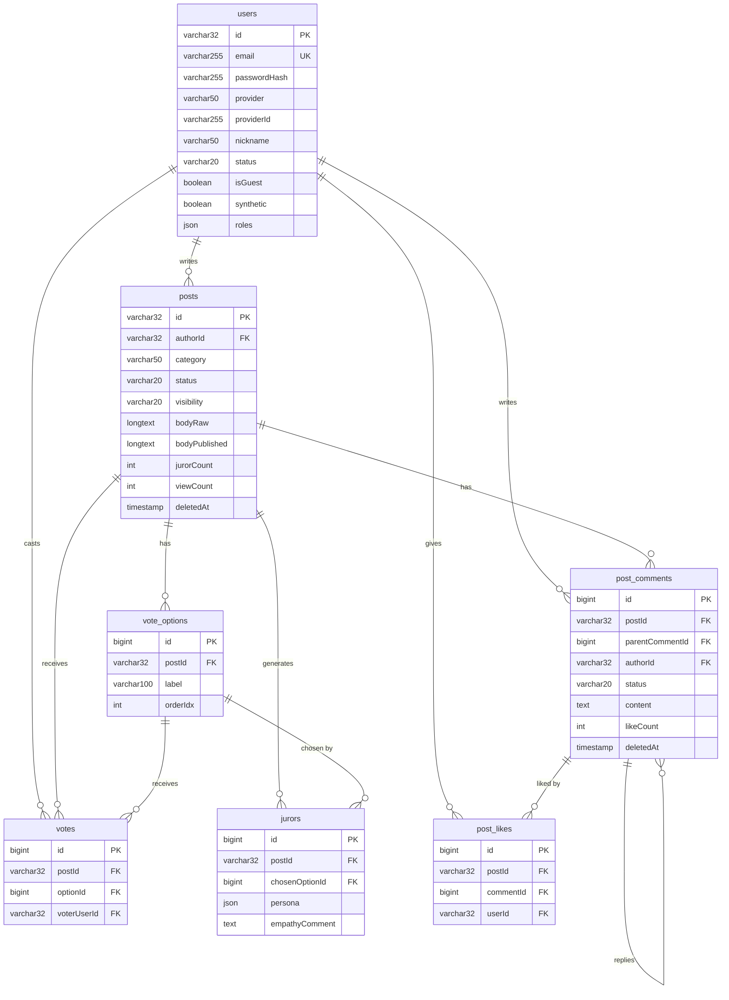

# 데이터베이스 스키마 (MariaDB 11)

> last-verified: 2026-08-01 · code-ref: `backend/src/main/resources/db/migration/V48~V90.sql` · `backend/.../domain/community/` · `ai-user/orchestrator/src/main/resources/db/migration/V1~V13.sql`
>
> 충돌 시 Flyway 마이그레이션 SQL이 우선. 이 ER은 코드 기준 현행 상태 반영.

**주의**: 2026-06-02 커뮤니티 광장 피벗 완료. V56 = `DROP TABLE sessions, turns, messages, reports` (구 중재 모델 제거).

## 핵심 도메인 ER 다이어그램



> UNIQUE 제약: `votes(postId, voterUserId)` — 사용자 1인 1투표.

## Source of truth

| 항목 | 위치 |
|---|---|
| Flyway 마이그레이션 | `backend/src/main/resources/db/migration/V*.sql` |
| AI-user Flyway 마이그레이션 | `ai-user/orchestrator/src/main/resources/db/migration/V*.sql` |
| JPA 엔티티 | `backend/src/main/java/com/againspring/domain/**` |
| AI-user JPA 엔티티 | `ai-user/orchestrator/src/main/java/com/againspring/aiuser/orchestrator/domain/**` |
| Repository | `backend/src/main/java/com/againspring/repository/**` |

코드와 문서가 충돌하면 **마이그레이션 SQL이 옳습니다**.

## 환경

| 환경 | 호스트 | DB 이름 | 컨테이너 |
|---|---|---|---|
| local | localhost:3306 | `againspring` | `againspring-mariadb` |
| dev | dev 서버 internal + 호스트:3309 | `againspring_dev` | `againspring-mariadb-dev` |
| prod | prod 서버 internal only | `againspring` | `againspring-mariadb-prod` |

설정: `backend/src/main/resources/application*.yml` + `env/.env.{dev,prod}.example`  
CHARSET: `utf8mb4` / COLLATION: `utf8mb4_unicode_ci` / TIMEZONE: `UTC`

## 현재 테이블 (광장형)

### 핵심 엔티티

| 테이블 | 역할 | PK | 추가 정보 |
|---|---|---|---|
| `users` | 회원/게스트 계정 | VARCHAR(32) | V1~V24, ULID-style |
| `posts` | 커뮤니티 광장 게시글 | BIGINT auto | **V48** 신규, 배심원/투표 기반 |
| `vote_options` | 투표 선택지 | BIGINT auto | **V49** 신규 (배심원 공감도) |
| `votes` | 사용자 투표 기록 | BIGINT auto | **V49** 신규 |
| `post_comments` | 게시글 댓글 | BIGINT auto | **V50** 신규 |
| `post_likes` | 좋아요 | BIGINT auto | **V50** 신규 |
| `jurors` | AI 배심원 (9명) | BIGINT auto | **V51** 신규, persona_name / opinion_text |
| `community_reports` | 신고 | BIGINT auto | **V52** 신규, 게시글/댓글 신고 |
| `notifications` | 알림 | BIGINT auto | **V53** 신규, 댓글/좋아요 알림 |

### 마케팅 테이블 (V15+, dev 전용)

| 테이블 | 역할 | PK |
|---|---|---|
| `marketing_source_stories` | 사연 수집·승인 | BIGINT auto |
| `marketing_simulations` | 시뮬레이션 실행 기록 | BIGINT auto |
| `marketing_contents` | 플랫폼별 콘텐츠 | BIGINT auto |
| `marketing_usage_logs` | LLM 비용 기록 | BIGINT auto |
| `marketing_audit_logs` | 콘텐츠 감사 이력 | BIGINT auto |
| `marketing_hashtag_library` | 해시태그 풀 | BIGINT auto |
| `marketing_content_templates` | 카피 템플릿 | BIGINT auto |

### 지원 테이블

| 테이블 | 역할 | PK |
|---|---|---|
| `feedbacks` | 사용자 피드백 | BIGINT auto |
| `daily_stats` | 일별 PMF 집계 | BIGINT auto |
| `email_verifications` | 이메일 인증 코드 | BIGINT auto |
| `password_reset_tokens` | 비밀번호 재설정 | BIGINT auto |
| `revoked_tokens` | JWT 블랙리스트 | BIGINT auto |

### AI-user 운영 테이블

| 테이블 | 역할 | PK |
|---|---|---|
| `personas` | AI-user 행동 주체 프로필 | VARCHAR(32) |
| `persona_relationships` | 페르소나 관계 그래프 | BIGINT auto |
| `persona_seen_posts` | 조회/행동 이력 캐시 | 복합 PK |
| `persona_action_log` | 행동 실행 로그 | BIGINT auto |
| `ai_user_runtime` | global kill-switch / cap | INT(1 row) |
| `persona_history_entries` | 글/댓글 재주입용 history | BIGINT auto |
| `persona_life_state` | casual streak / ongoing situation | VARCHAR(32) |
| `ai_user_outbox` | backend transaction에서 기록하는 AI-user lifecycle event | CHAR(36) UUID | V87, orchestrator 전달 보장 |
| `ai_llm_jobs` | provider/model snapshot과 제한 재시도를 기록하는 LLM job | BIGINT auto | V87, prompt/content 원문 미저장 |
| `ai_thread_plans` | 게시글 revision별 candidate plan | VARCHAR(36) UUID | AI-user Flyway V6가 소유 |
| `ai_thread_plan_items` | candidate와 due/lease/idempotency 실행 상태 | VARCHAR(36) UUID | AI-user Flyway V6가 소유 |
| `ai_human_interaction_inbox` | 사람 댓글/대댓글의 30분 batch 입력 · attempt/error ledger | VARCHAR(36) UUID | source comment unique; V14 attempt_count/last_error_code/schema_version |
| `ai_post_interested_personas` | post별 human-reply 관심 persona pool | BIGINT auto | AI-user Flyway V13. loose refs, UNIQUE(post_id, persona_id) |
| `bot_request_dedup` | synthetic bot 게시 요청의 `Idempotency-Key`와 결과 target 매핑 | VARCHAR(160) | V88, timeout 재시도 중복 게시 방지 |
| `ai_user_generation_config` | AI 유저 생성 정책 싱글톤(id=1) — 일일 목표량·PLAN provider 설정 | INT(1 row) | V70, backend 소유·orchestrator는 읽기 전용 미러. **V90**에서 레거시 필드(scheduler_mode/backend_post·comment·reply/prompt_caching/daily_token_budget) 삭제 + `provider_vote_like` 추가 |

---

## 핵심 테이블 상세

### `users` (V1 + V2 + V11 + V13 + V17 + V20~V24)

| 컬럼 | 타입 | Flyway | 비고 |
|---|---|---|---|
| `id` | VARCHAR(32) PK | V1 | ULID-style |
| `email` | VARCHAR(255) | V1/V2 | nullable (소셜 가입 시) |
| `password_hash` | VARCHAR(255) | V1/V2 | nullable (소셜/게스트) |
| `nickname` | VARCHAR(100) | V1 | 필수 |
| `provider` | VARCHAR(50) | V2 | google/kakao/naver/null |
| `provider_id` | VARCHAR(255) | V2 | OAuth provider user id |
| `is_guest` | BIT(1) | V21 | 게스트 계정 여부 |
| `roles` | JSON | V1 | `["USER"]` 기본. 가능 값: USER/TESTER/ADMIN |
| `communication_style` | VARCHAR(50) | V1 | wave/mountain/flame/leaf/moon/star |
| `onboarding_completed_at` | DATETIME(6) | V21 | NULL이면 온보딩 미완료 |
| `mbti_type` | VARCHAR(8) | **V11** | 16유형 (선택, nullable) |
| `mbti_profile` | JSON | **V13** | 4축 비율 `{e_i,s_n,t_f,j_p}` 0~100 |
| `terms_agreed_at` | DATETIME(6) | **V17** | 이용약관 동의 시각 |
| `privacy_agreed_at` | DATETIME(6) | **V17** | 개인정보 처리방침 동의 시각 |
| `disclaimer_agreed_at` | DATETIME(6) | **V17** | 면책 고지 동의 시각 |
| `marketing_agreed_at` | DATETIME(6) | **V17** | 마케팅 수신 동의 (선택) |
| `must_change_password` | BOOLEAN | **V20** | 임시 비밀번호 강제 변경 플래그 |
| `tutorial_completed_at` | TIMESTAMP | **V24** | 30초 튜토리얼 완료 시각. NULL=미완료 |
| `deleted_at` | TIMESTAMP(3) | V1 | 소프트 삭제 |
| `created_at`, `updated_at` | TIMESTAMP(3) | V1 | |

---

### `posts` (V48~V56, V85, V87, V89)

| 컬럼 | 타입 | Flyway | 비고 |
|---|---|---|---|
| `id` | BIGINT auto PK | V48 | |
| `author_id` | VARCHAR(32) FK | V48 | 작성자 |
| `title` | VARCHAR(255) | V48 | 제목 |
| `content` | MEDIUMTEXT | V48 | 본문 (**30일 후 NULL**) |
| `relationship_type` | VARCHAR(32) | V48 | RelationType enum (couple/marriage/friend/family/parent_child) |
| `category` | JSON | V48 | `{major, middle, minor, customMinor?}` |
| `published` | BOOLEAN | V48 | 공개 여부 |
| `partner_token` | VARCHAR(64) | V54 | 투표 초대 링크 토큰 |
| `partner_user_id` | VARCHAR(32) FK | V54 | 초대 수락 사용자 |
| `three_way_partner_id` | VARCHAR(32) FK | V54 | 3자 중재 파트너 |
| `publish_mode` | VARCHAR(32) | V54 | one_way / two_way / three_way |
| `expires_at` | TIMESTAMP(3) | V48 | 게시글 만료 시각 (선택) |
| `empathy_ratio` | DECIMAL(5,2) | V48 | 공감 비율 (0.0~1.0, 동적 계산) |
| `source_example_id` | BIGINT | **V85** | 원본 사례 예제 ID (nullable) |
| `source_community` | VARCHAR(64) | **V85** | 원본 커뮤니티명 (nullable) |
| `source_url` | VARCHAR(1024) | **V85** | 원본 URL (nullable) |
| `source_original_title` | VARCHAR(512) | **V85** | 원본 제목 (nullable) |
| `source_original_body` | LONGTEXT | **V85** | 원본 본문 (nullable) |
| `created_at`, `updated_at` | TIMESTAMP(3) | V48 | |
| `content_revision` | INT UNSIGNED | V87 | 내용 변경마다 증가. AI thread plan이 참조한 글 revision과 비교하는 optimistic revision |
| `created_by_admin` | BOOLEAN | **V89** | 관리자가 통합 콘텐츠관리 화면에서 수동 생성한 글 여부. 공개 API 미노출, 어드민 전용 표시(배지)용 |

---

### `post_comments` (V50, V87, V89)

| 컬럼 | 타입 | 비고 |
|---|---|---|
| `id` | BIGINT auto PK | |
| `post_id` | BIGINT FK | posts ON DELETE CASCADE |
| `author_id` | VARCHAR(32) FK | users |
| `parent_id` | BIGINT FK | NULL이면 최상위 댓글, 값이면 대댓글 |
| `content` | MEDIUMTEXT | **30일 후 NULL** |
| `is_deleted` | BOOLEAN | 논리적 삭제 플래그 |
| `content_revision` | INT UNSIGNED | 댓글/대댓글 내용 변경마다 증가. 사람 interaction inbox의 stale 처리 기준 |
| `created_by_admin` | BOOLEAN | **V89** 관리자 수동 생성 여부. 공개 API 미노출 |
| `created_at`, `updated_at` | TIMESTAMP(3) | |

---

### `vote_options` (V49)

| 컬럼 | 타입 | 비고 |
|---|---|---|
| `id` | BIGINT auto PK | |
| `post_id` | BIGINT FK | posts |
| `label` | VARCHAR(100) | "공감하는 사람", "상대방 입장 이해" 등 |
| `display_order` | INT | 표시 순서 |

---

### `votes` (V49)

| 컬럼 | 타입 | 비고 |
|---|---|---|
| `id` | BIGINT auto PK | |
| `post_id` | BIGINT FK | posts |
| `user_id` | VARCHAR(32) FK | users |
| `vote_option_id` | BIGINT FK | vote_options |
| `created_at` | TIMESTAMP(3) | |

---

### `jurors` (V51 — AI 배심원)

| 컬럼 | 타입 | 비고 |
|---|---|---|
| `id` | BIGINT auto PK | |
| `post_id` | BIGINT FK | posts |
| `persona_name` | VARCHAR(100) | 심리상담사, 경계 전문가 등 (9개) |
| `opinion_text` | MEDIUMTEXT | AI 생성 배심원 의견 |
| `vote_option_id` | BIGINT FK | 배심원 투표 선택 (vote_options) |
| `model` | VARCHAR(100) | claude-haiku-4-5-20251001 |
| `generation_status` | VARCHAR(32) | pending / completed / failed |
| `created_at` | TIMESTAMP(3) | |

---

### `community_reports` (V52)

| 컬럼 | 타입 | 비고 |
|---|---|---|
| `id` | BIGINT auto PK | |
| `post_id` | BIGINT FK | posts (nullable) |
| `comment_id` | BIGINT FK | post_comments (nullable) |
| `reporter_id` | VARCHAR(32) FK | users |
| `reason` | VARCHAR(100) | 신고 사유 |
| `status` | VARCHAR(20) | pending / reviewed / approved / rejected |
| `created_at` | TIMESTAMP(3) | |

---

### `notifications` (V53)

| 컬럼 | 타입 | 비고 |
|---|---|---|
| `id` | BIGINT auto PK | |
| `user_id` | VARCHAR(32) FK | users |
| `type` | VARCHAR(32) | comment / like / report 등 |
| `ref_id` | BIGINT | 참조 엔티티 ID (post/comment) |
| `is_read` | BOOLEAN | 읽음 여부 |
| `created_at` | TIMESTAMP(3) | |

읽은 알림은 30일 후 자동 삭제 (RetentionScheduler).

---

### `ai_content_corrections` (V68, V74, V86)

| 컬럼 | 타입 | Flyway | 비고 |
|---|---|---|---|
| `id` | BIGINT auto PK | V68 | |
| `target_type` | VARCHAR(16) | V68 | POST \| COMMENT |
| `target_id` | VARCHAR(64) | V68 | 게시글/댓글 ID (문자열화) |
| `persona_id` | VARCHAR(32) FK | V68 | users.id (AI 페르소나) |
| `category` | VARCHAR(50) | V68 | 글 카테고리 (nullable, 예제뱅크 환류 시 사용) |
| `original_text` | LONGTEXT | V68 | 첨삭 전 본문 |
| `corrected_text` | LONGTEXT | V68 | 관리자 수정본 |
| `persona_caution` | TEXT | V68 | 확정된 페르소나 주의사항 (nullable) |
| `admin_id` | VARCHAR(32) FK | V68 | 처리한 관리자 users.id |
| `applied_live` | BIT(1) | V68 | 라이브 글 교체 완료 여부 |
| `pushed_to_bank` | BIT(1) | V68 | 예제뱅크 환류 여부 |
| `source_original_text` | LONGTEXT | **V86** | 원본 비교 시 원본 본문 (nullable) |
| `created_at` | TIMESTAMP(3) | V68 | |

---

### `ai_global_rules` (V68)

| 컬럼 | 타입 | 비고 |
|---|---|---|
| `id` | BIGINT auto PK | |
| `rule_text` | VARCHAR(500) | 규칙 텍스트 (예: "~하지 말 것" 형식) |
| `scope` | VARCHAR(16) | POST \| COMMENT \| ALL \| RECONSTRUCTION |
| `source_correction_id` | BIGINT FK | ai_content_corrections.id (nullable, 수동 추가 시 NULL) |
| `active` | BIT(1) | 활성화 여부 |
| `created_by` | VARCHAR(32) FK | 생성한 관리자 users.id |
| `created_at` | TIMESTAMP(3) | |

### `persona_history_entries` (AI-user orchestrator V5)

| 컬럼 | 타입 | 비고 |
|---|---|---|
| `id` | BIGINT auto PK | |
| `persona_id` | VARCHAR(32) FK | personas.id |
| `entry_type` | VARCHAR(16) | `POST` \| `COMMENT` |
| `target_post_id` | VARCHAR(32) | backend posts.id 문자열 |
| `category` | VARCHAR(32) | 글 history일 때 광장 카테고리 |
| `content_hash` | CHAR(64) | legacy import / 중복 방지 |
| `content` | LONGTEXT | 실제 본문 |
| `created_at` | DATETIME(3) | 생성 시각 |

### `persona_life_state` (AI-user orchestrator V5)

| 컬럼 | 타입 | 비고 |
|---|---|---|
| `persona_id` | VARCHAR(32) PK/FK | personas.id |
| `casual_streak` | INT | 연속 CASUAL 글 수 |
| `ongoing_situation` | VARCHAR(255) | 진행 중 상황 요약 |
| `updated_at` | DATETIME(3) | 마지막 갱신 시각 |

---

### `feedbacks` (V16)

| 컬럼 | 타입 | 비고 |
|---|---|---|
| `id` | BIGINT auto PK | |
| `user_id` | VARCHAR(32) FK | nullable (익명 제출) |
| `post_id` | BIGINT FK | nullable (세션 연동) |
| `category` | VARCHAR(50) | praise / bug / suggestion / other / crisis |
| `content` | TEXT | 피드백 본문 (최소 10자) |
| `contact_consent` | BOOLEAN | 연락 동의 여부 |
| `contact_email` | VARCHAR(255) | consent=true 시만 저장 |
| `page_url` | VARCHAR(500) | nullable |
| `user_agent` | VARCHAR(500) | nullable |
| `status` | VARCHAR(20) | pending / reviewed / resolved |
| `created_at`, `updated_at` | DATETIME(6) | |

---

## 마이그레이션 요약 (V1~V90 + AI-user V1~V14)

| 범위 | 설명 |
|---|---|
| **V1~V27** | 구 중재 모델 (sessions, turns, messages, reports) |
| **V28~V39** | 마케팅 테이블 (V15+ dev 전용) |
| **V40~V47** | (미사용) |
| **V48~V55** | 광장형 신규 (posts, votes, comments, jurors, notifications 등) |
| **V56** | **DROP TABLE sessions, turns, messages, reports** |
| **V57~V67** | 마케팅 기능 확장 (ASM 이관 관련) |
| **V68~V74** | AI 첨삭 학습 시스템 (corrections, global_rules) |
| **V75~V76** | 마케팅 ENUM 정규화 |
| **V77~V84** | (마케팅/운영 기능) |
| **V85** | posts 테이블에 원본 비교 컬럼 추가 (source_example_id, source_community, source_url, source_original_title, source_original_body) |
| **V86** | ai_content_corrections 테이블에 source_original_text 컬럼 추가 |
| **V87** | `posts`/`post_comments` content revision, backend `ai_user_outbox`, `ai_llm_jobs`, PLAN 운영 config 추가 |
| **V88** | `bot_request_dedup` 추가. synthetic 봇 글/댓글의 내부 멱등성 보장 |
| **V89** | `posts`/`post_comments`에 `created_by_admin` 추가. 관리자 콘텐츠관리 통합테이블 수동 생성 표시용 |
| **V90** | `ai_user_generation_config`에서 레거시 스케줄러 필드(scheduler_mode/backend_post·comment·reply/prompt_caching/daily_token_budget) 삭제, `provider_vote_like` 추가 — AI 생성관제 PLAN 모드 일원화 |
| **AI-user V1~V4** | personas / relationships / runtime / action log / seen posts |
| **AI-user V5** | `persona_history_entries`, `persona_life_state` 추가 (legacy file history DB 이관) |
| **AI-user V6** | `ai_thread_plans`, `ai_thread_plan_items`, `ai_human_interaction_inbox` 추가 (별도 Flyway history) |
| **AI-user V7~V12** | scheduled posts · stance · persona history/facts/capsules · match audits |
| **AI-user V13** | `ai_post_interested_personas` — post별 관심 persona pool (PLAN_CAST seed at READY; MATCHER/MANUAL later) |
| **AI-user V14** | `ai_human_interaction_inbox`에 `attempt_count` · `last_error_code` · `schema_version` (자동 재시도 원장) |

---

## 데이터 보존 정책

| 대상 | 보존 기간 | 책임 |
|---|---|---|
| `posts.content` | 30일 후 NULL | RetentionScheduler |
| `post_comments.content` | 30일 후 NULL | RetentionScheduler |
| `post_comments` (is_deleted=true) | 30일 후 NULL | RetentionScheduler |
| `jurors` | 60일 후 DELETE | RetentionScheduler |
| `notifications` (읽음) | 30일 후 DELETE | RetentionScheduler |
| `notifications` (미읽) | 영구 보관 | — |
| `users` (탈퇴) | 소프트 삭제 (deleted_at 설정) | 사용자 요청 |
| 마케팅 테이블 | 별도 정책 | — |

자세한 정책: [`../policies/data-retention.md`](../policies/data-retention.md)

---

## 마이그레이션 추가 절차

```bash
# 다음 버전 번호 확인 (현재 V56 → 다음 V57)
ls backend/src/main/resources/db/migration/

# V57__<descriptive_name>.sql 작성
$EDITOR backend/src/main/resources/db/migration/V57__add_xxx.sql

# dev에서 검증
cd env
docker compose -f docker-compose.dev.yml up -d --build
docker logs againspring-backend-dev | grep -i flyway
```

규칙:
- 파일명: `V<n>__<snake_case>.sql` (밑줄 두 개)
- ROLLBACK은 별도 마이그레이션으로 (Flyway Community는 undo 미지원)
- ALTER TABLE 시 `IF EXISTS` 또는 idempotent 패턴 사용
- **dev 프로파일은 Flyway 비활성** — dev에서 테이블 확인 후 prod 배포 전 반드시 Flyway 실행 검증
