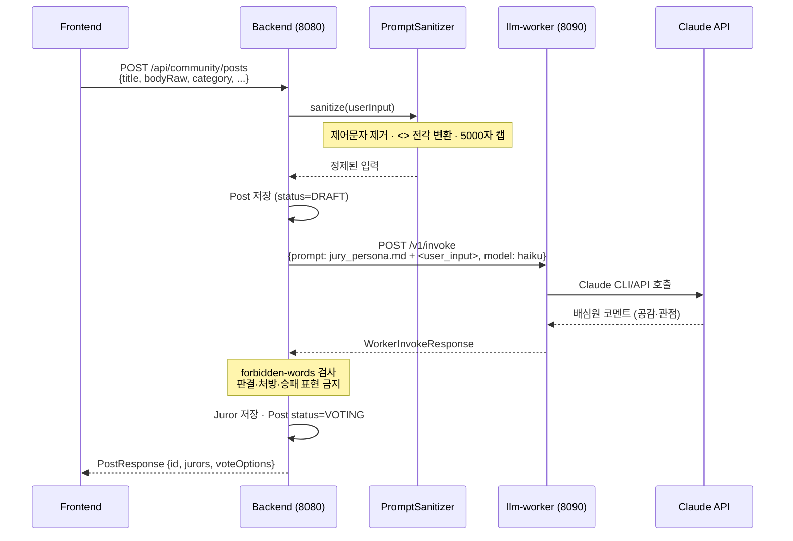
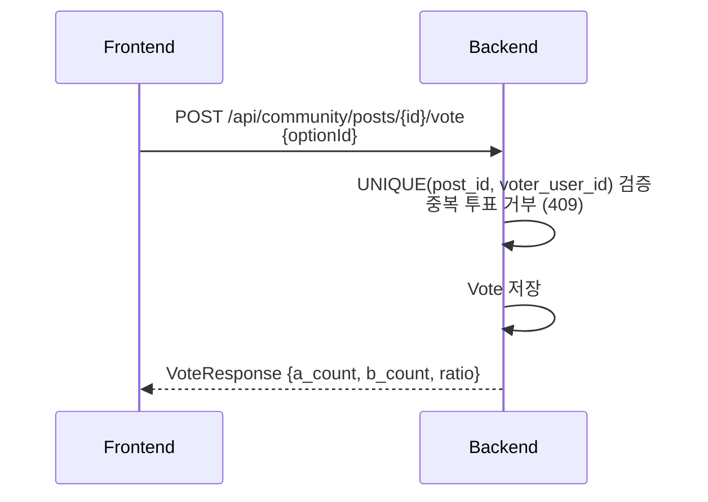
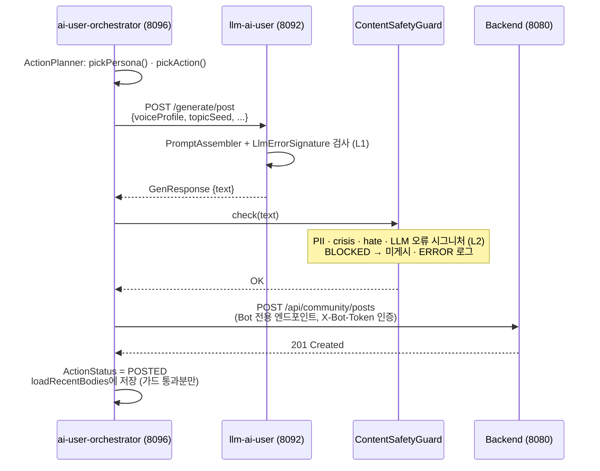
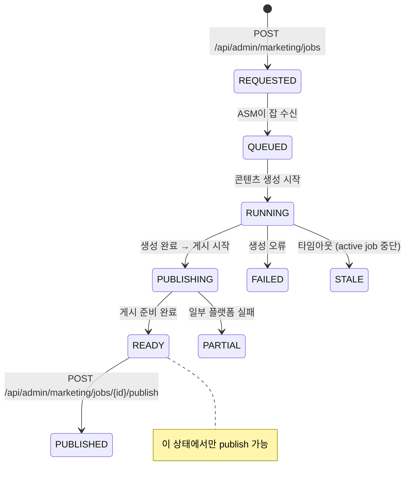
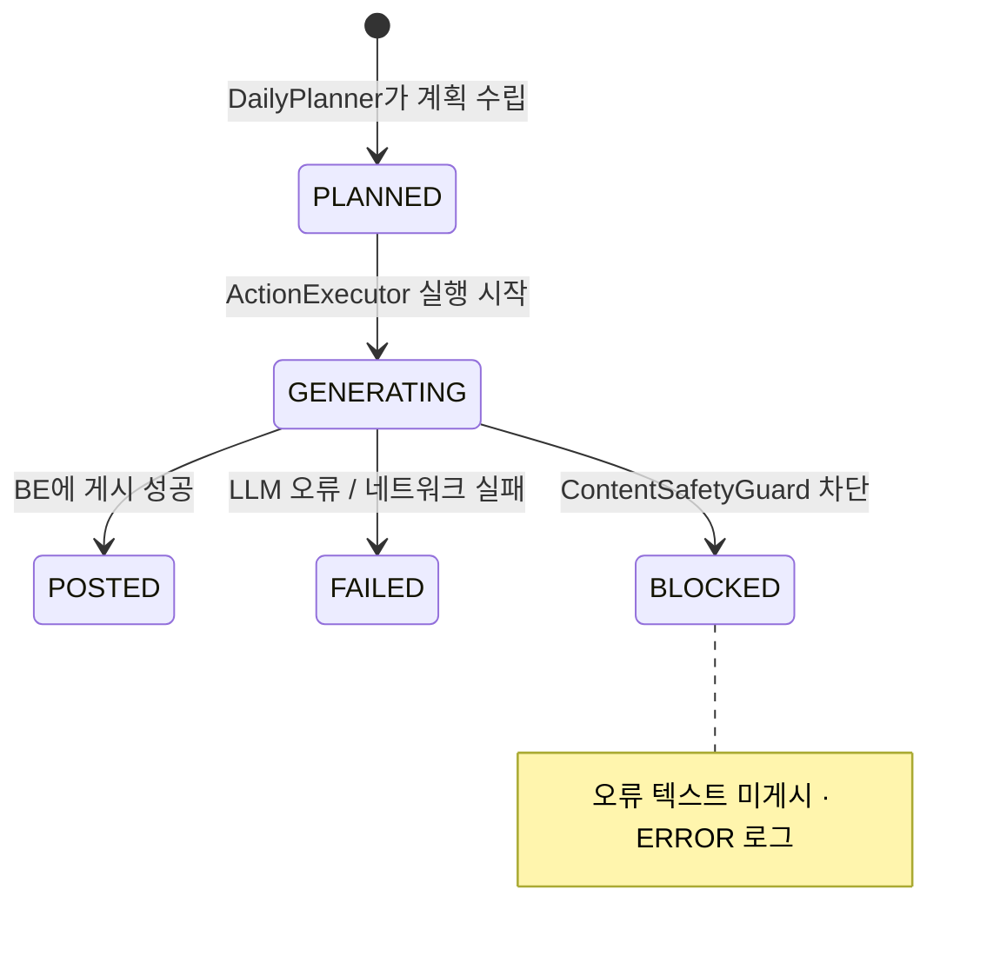

# API 흐름 — 시퀀스 다이어그램

> last-verified: 2026-06-14 · code-ref: `backend/src/main/java/com/againspring/api/` · `backend/.../llm/`
>
> 권위본: `docs/shared/api/rest-spec.md` (엔드포인트 목록). 이 파일은 주요 **시나리오별 흐름**.

---

## 1. 사연 게시 + 배심원 생성 흐름

---

## 2. 투표 흐름

---

## 3. AI 유저 봇 게시 흐름 (오케스트레이터 → BE)

---

## 4. 마케팅 잡 상태 흐름

---

## 5. AI 유저 ActionStatus 상태 흐름

