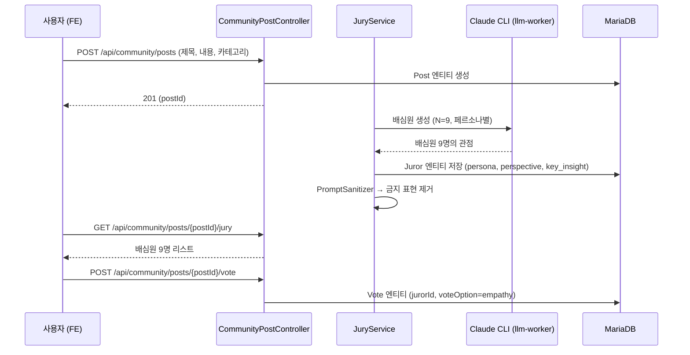
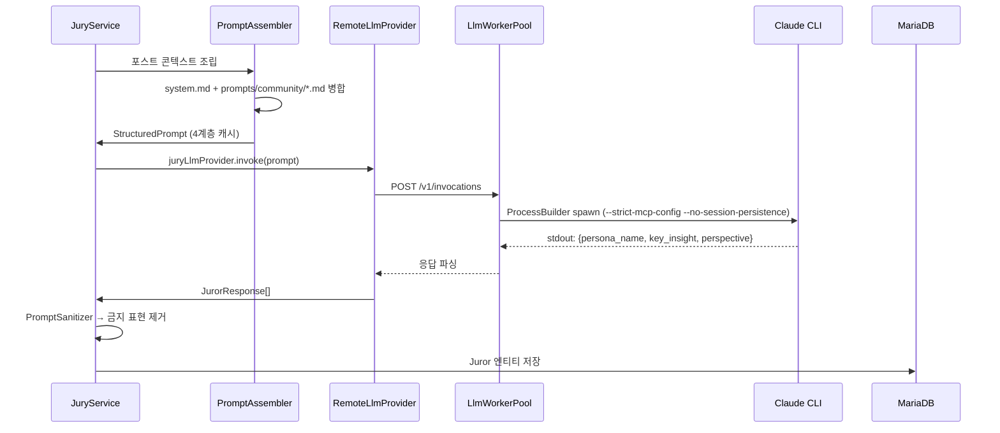

# 시스템 아키텍처

**주의**: 2026-06-02 커뮤니티 광장 피벗 완료. 구 Session/Turn/ChatMessage 모델은 삭제됨 (ADR-0001 참조).

## 한 장 다이어그램

```mermaid
flowchart TB
    Browser[Browser SPA<br/>Next.js 14]
    subgraph Backend["Spring Boot 3.3"]
        API[REST Controller<br/>/api/community/{posts,votes,jury}]
        Auth[Security / JWT]
        PostService[PostComposeService<br/>게시글 처리]
        JuryService[JuryService<br/>배심원 생성]
        LLMProvider["RemoteLlmProvider<br/>(CLI 단일 경로)<br/>ADR-0003"]
        Safety[PromptSanitizer<br/>KeywordGuard<br/>CrisisDetector]
        Retention[RetentionScheduler<br/>30d cron]
    end
    subgraph LLMWorker["llm-worker<br/>Spring Boot<br/>(dev+prod)"]
        Pool[LlmWorkerPool<br/>ThreadPoolExecutor 100<br/>+ queue 500]
    end
    DB[(MariaDB 11<br/>posts, post_comments<br/>votes, jurors<br/>+ llm_call_logs)]
    Claude[Claude CLI<br/>Haiku 4.5]
    Prompts["shared/docs/prompts/<br/>system.md<br/>+ community/<br/>{jury_persona.md<br/>neutralize.md}"]

    Browser -->|HTTPS + JWT| API
    API --> Auth
    Auth --> PostService
    PostService --> JuryService
    JuryService --> Safety
    Safety --> LLMProvider
    LLMProvider -->|POST /v1/invocations| Pool
    Pool -->|--strict-mcp-config<br/>--no-session-persistence| Claude
    LLMProvider -.loads.-> Prompts
    PostService --> DB
    JuryService --> DB
    Retention -.purge expired.-> DB
```

### 배포 토폴로지:

```
사용자 브라우저
      │ HTTPS
      ▼
┌─────────────────────┐
│  Cloudflare Tunnel  │  dev.againspring.net  → :8090
│   (cloudflared)     │  againspring.net      → :8091
└─────────┬───────────┘  www.againspring.net  → :8091
          │ HTTP (호스트)
          ▼
┌─────────────────────┐
│  nginx 컨테이너      │  /api/, /actuator/, /swagger-ui/  → backend:8080
│  (dev/prod)         │  /                                 → frontend:3000
└──┬──────────────┬───┘
   │              │
   ▼              ▼
┌────────────┐  ┌──────────────────┐  ┌────────────────────┐
│ frontend   │  │  backend         │  │  llm-worker        │
│ Next.js 14 │  │  Spring Boot 3.3 │  │  Spring Boot 3.3   │
│ :3000      │  │  :8080           │  │  :8090             │
└──────┬─────┘  └─────────┬────────┘  └────────┬───────────┘
       │ axios            │ Spring Data JPA    │ HTTP /v1/invoke
       │ Bearer JWT       │                    │
       └──────► /api/...  ├─────────────────────┤
                          │                    ▼
                          ▼               ProcessBuilder
                ┌──────────────────┐       │
                │ MariaDB 11       │       ▼
                │ Flyway V1~V56    │    claude CLI
                │ :3306 (local)    │    (--strict-mcp-config
                │ :3309 (dev)      │     --no-session-persistence)
                │ internal (prod)  │       │
                └──────────────────┘       ▼
                                   Anthropic Claude API
                                   (Haiku 4.5, 2024-10-01)
```

## 흐름별 설명

### 1) HTTP 요청 흐름 (커뮤니티 광장)

1. 브라우저 → `https://dev.againspring.net/api/community/posts` 또는 `/comments`
2. Cloudflare Tunnel → 호스트 `localhost:8090` (dev) / `8091` (prod)
3. `againspring-nginx-{dev,prod}` (`env/nginx/`):
   - `/api/` 매치 → `http://againspring-backend-{dev,prod}:8080`
   - 타임아웃 60s, `X-Forwarded-*` 헤더 주입
4. `CommunityPostController` / `CommunityCommentController` / `NotificationController` 진입
5. `PostComposeService` / `JuryService` → `RemoteLlmProvider` (ADR-0003: CLI 단일 경로)
6. RemoteLlmProvider → `POST http://againspring-llm-{dev,prod}:8090/v1/invoke` → 워커가 Claude Code CLI spawn
7. 응답 직렬화 + `LLMCallLogger`로 DB 저장 후 nginx 통해 브라우저 반환

### 2) 인증 흐름

| 단계 | 처리 |
|---|---|
| 회원가입 | `POST /api/auth/send-verification` → 이메일 코드 → `POST /api/auth/signup` |
| 로그인 | `POST /api/auth/login` → access token (JWT 24h) |
| OAuth | `POST /api/auth/oauth2/{provider}` (Google · Kakao · Naver) → `OAuthProviderService` 가 code → token → userinfo |
| 게스트 | `POST /api/auth/guest` → 임시 토큰 (1h) |
| 인증 검증 | 모든 보호 API: `JwtAuthFilter` → `JwtService` 검증 + `RevokedTokenRepository` 블랙리스트 확인 |
| 로그아웃 | `LogoutService` → JTI를 `revoked_tokens` 추가 → `RevokedTokenCleanupScheduler`가 만료된 항목 일일 정리 |

FE의 axios 인터셉터(`frontend/lib/api/client.ts`)가 `localStorage.again-spring-token`을 `Authorization: Bearer ...` 헤더로 자동 주입.

### 3) 게시글 & 배심원 흐름



게시글 생성 시 배심원 생성은 **비동기** (큐 기반, 보통 30초~1분). 사용자는 즉시 게시글을 볼 수 있으며, 배심원은 준비되면 폴링으로 수신.

### 4) LLM 호출 흐름 (배심원 생성)



**프롬프트 구조** (`shared/docs/prompts/community/`):
- `jury_persona.md`: 9개 페르소나 정의 (심리상담사, 경계 전문가 등)
- `neutralize.md`: NVC 중립화 규칙

상세는 [`backend/llm-bridge.md`](../backend/llm-bridge.md) (LLM 워커) 참조.

### 5) 데이터 보존

- 게시글 원문(`posts.content`, `posts.title`) → 30일 후 `RetentionScheduler`(매일 03:00 UTC)가 NULL 처리
- 댓글(`post_comments`) → 30일 후 NULL 처리
- 배심원(`jurors`) → 60일 후 삭제 (논란 최소화)
- 자세한 정책: [policies/data-retention.md](./policies/data-retention.md)

## 컴포넌트 책임 요약

| 컴포넌트 | 책임 | 상호작용 |
|---|---|---|
| Cloudflare Tunnel | 외부 도메인 → 호스트 포트 | nginx 8090/8091 |
| nginx | 경로 분기 + 헤더 주입 | backend, frontend |
| Next.js (FE) | UI · 라우팅 · 상태 · MSW (개발) | axios → BE |
| Spring Boot (BE) | API · 도메인 · 보안 · 프롬프트 어셈블 · 배심원 생성 | MariaDB, llm-worker |
| RemoteLlmProvider (BE) | Claude Code CLI 호출 (배심원 + 미래 리포트) | llm-worker |
| llm-worker | LLM CLI 실행 전용 (ThreadPoolExecutor 100 + queue 500, 120s 타임아웃) | Claude Code CLI |
| MariaDB | 영속 저장소 (posts, post_comments, votes, jurors + llm_call_logs) | BE만 |
| Claude Code CLI | 배심원 생성 (Haiku 4.5), 프롬프트 로드 | llm-worker의 ProcessBuilder |

## 비기능 요구사항 위치

| 요구사항 | 구현 위치 |
|---|---|
| 입력 보안 | `safety/KeywordGuard`, `llm/PromptSanitizer` |
| 위기 대응 | `safety/CrisisDetector` → `CrisisDetectedEvent` |
| 비율 균형 | `safety/RatioEnforcer` |
| Rate limiting | `security/RateLimitFilter` (bucket4j) |
| 감사 로그 | `safety/SafetyAuditLogger`, `llm/monitoring/LLMCallLogger`, `service/retention/AccessLogService` |
| 데이터 만료 | `service/retention/RetentionScheduler` (cron `0 0 3 * * *`) |
| 토큰 정리 | `RevokedTokenCleanupScheduler` (cron `0 0 4 * * *`) |

---

**관련 ADR**: [ADR-0001](./adr/0001-pivot-to-community-plaza.md) (피벗), [ADR-0003](./adr/0003-llm-consolidated-to-claude-code-cli.md) (LLM 통합)
