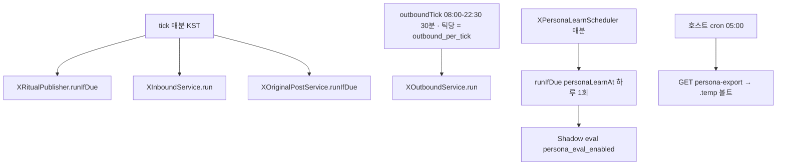

# Justant-Bot — X 성장 루프

> **권위본**: 이 문서. 런타임과 어긋나면 **코드를 따른다**.
> 사연 스크린샷 체인(`x_thread`, 게시 후 24h)은 [`x-thread-strategy.md`](x-thread-strategy.md)가 권위본이다. 두 시스템은 같은 `@againspring_net` 계정을 쓰지만 **파이프가 다르다**.
> 프롬프트 자산: [`x-outbound-reply.md`](../../prompts/marketing/x-outbound-reply.md) · [`x-outbound-donts.md`](../../prompts/marketing/x-outbound-donts.md) · [`x-persona-charter.md`](../../prompts/marketing/x-persona-charter.md) · [`x-persona-judge.md`](../../prompts/marketing/x-persona-judge.md) · [`x-original-post.md`](../../prompts/marketing/x-original-post.md).
> 어드민 REST: [`50-api.md`](../50-api.md) §4.1.1 · [`rest-spec.md`](../../50-api/rest-spec.md).
> 스키마: [`docs/backend/40-data.md`](../../../backend/40-data.md) `system_setting` · `x_ops_action` · `x_persona_example` · `x_persona_eval`.
> 페르소나 볼트(미러): 호스트 `.temp/x-justant-bot/` — 컨테이너는 이 경로에 **쓰지 않는다**.

## 1. 무엇이 Justant-Bot인가

**Justant-Bot**은 운영자(Justant) 말투로 `@againspring_net`에 **선댓글(outbound)** · **우리 글 대댓글(inbound)** · **아침/밤 의식 글(ritual)** · **사연 스쿱 원글(original, 기본 off)** 을 다는 BE 루프다. 운영자가 X에서 수동으로 댓글·인용·원글을 쓸수록 새벽 학습이 그 목소리를 쌓고, 28일 닮음 지표가 **95% 게이트**를 넘으면 원글 파이프를 켤 수 있다.

- 광장 **AI-user**(페르소나 봇이 사연·댓글·투표)와 **별개**다.
- 트윗/댓글 **본문에는** Justant-Bot, AI, 봇이라고 쓰지 않는다.
- 목소리 SSOT는 `system_setting` `marketing.x.persona_profile_json`. 1세대 백업은 `marketing.x.persona_profile_prev_json`.
- 작문 LLM은 **Haiku** (`llm.claude-code.model`, 기본 `claude-haiku-4-5-20251001`). 페르소나 **증류·심판만 Sonnet** (`marketing.x.persona-learn-model` / `MARKETING_X_PERSONA_LEARN_MODEL`, 기본 `claude-sonnet-5`).
- 게시는 Again-Spring이 직접 X API를 치지 않는다. **ASM** (`AsmClient`)이 Playwright 세션으로 게시·후보 조회한다.

### 1.1 `x_thread`와 겹치지 않는 점

| | `x_thread` (사연 스레드) | Justant-Bot 성장 루프 |
|---|---|---|
| 트리거 | 사연 `createdAt` + 24h + 글 슬롯 | 어드민 킬스위치 + cron |
| 콘텐츠 | 스크린샷 체인 + 마스터 훅 | 한 줄 댓글 / 의식 사진+짧은 문장 / 스쿱 원글(게이트 후) |
| 원장 | `marketing_job` / publication | `x_ops_action` |
| 댓글 텔레그램 | 발행 후 N시간 **운영자 수동** 감시 | 선댓글·대댓글·원글 **게시 성공 시** 알림 (`XOpsTelegramAlerts`) |

사연 스레드 감시 창이 같은 트윗에 이미 `x_ops_action` `POSTED`가 있으면 운영자를 미답글로 재촉하지 않는다.

### 1.2 부재 (되살리지 말 것)

- Telegram **페르소나 드릴** (`XPersonaDrillService`, `TelegramDrillCommands`, `POST /api/internal/telegram/webhook`, vault `telegram.webhook_secret`, `TELEGRAM_WEBHOOK_*`, `MARKETING_X_DRILL_DAILY_CAP`, WaggleBot `/drill`). **부활 금지.** Telegram은 **게시 알림 전용**.
- `x_persona_example.source=DRILL` 행은 Flyway **V124**에서 삭제. enum 값 `DRILL`만 코드에 남을 수 있다.
- 학습 소스는 **X 수동 활동 + 원장**만. 컨테이너가 `.temp/x-justant-bot/`에 직접 쓰지 않는다.

## 2. 스위치·한도·스케줄

어드민 `/admin/marketing` → 설정 → **X 운영**.  
`GET`/`PUT /api/admin/marketing/x-ops`. 키 `marketing.x.*`. **운영 값의 SSOT는 `system_setting`이다.** 어드민 저장(또는 DB 행만 UPDATE)하면 **커밋 없이** 다음 스케줄 틱부터 반영된다. 아래 「폴백」은 행이 없을 때만 코드가 쓰는 값이다.

| 항목 | 폴백 | 키 |
|---|---|---|
| 아침 시각 | 07:30 KST | `marketing.x.morning_time` |
| 밤 시각 | 22:00 KST | `marketing.x.night_time` |
| 사연 퍼오기 /일 | 2 | `marketing.x.story_scoops_per_day` (**원글 파이프가 켜져 있을 때 소비**. 실제 발행 = `min(original_post_daily_cap, story_scoops_per_day)`) |
| 선댓글 /일 | 20 | `marketing.x.outbound_daily_cap` |
| 선댓글 /틱 | 1 (1–5) | `marketing.x.outbound_per_tick` |
| 우리 글 대댓글 /일 | 40 | `marketing.x.inbound_daily_cap` |
| 우리 글당 대댓글 | 12 | `marketing.x.inbound_per_post_cap` |
| 대댓글 /틱 | 3 (1–10) | `marketing.x.inbound_per_tick` |
| 불 난 글 최소 댓글 | 3 (`0`이면 댓글 0도 후보) | `marketing.x.hot_min_replies` |
| 불 난 글 최대 나이 | 6시간 | `marketing.x.hot_max_age_hours` |
| ritual / inbound / outbound | **false** | `marketing.x.{ritual,inbound,outbound}_enabled` |
| 페르소나 학습 | **true** · 04:30 KST | `marketing.x.persona_learning_enabled` · `persona_learn_at` |
| 페르소나 채점 | **true** (게시 아님) | `marketing.x.persona_eval_enabled` |
| 원글 자동 작성 | **false** · 한도 1 (0–5) | `marketing.x.original_post_enabled` · `original_post_daily_cap` |

코드 기본값이 꺼져 있어도 **prod DB의 `system_setting`이 켜져 있으면 실제로 게시한다.** 문서가 “prod는 꺼져 있다”고 가정하지 말 것. 현재 on/off는 어드민 GET 또는 DB를 본다.

**원글 파이프는 95% 게이트(평균 ≥95 ∧ 삭제율 ≤2% ∧ n≥30) 통과 전 prod에서 켜지 말 것.**

켤 때 권장 순서: inbound → outbound → ritual → (게이트 통과 후) original.

### 2.1 스케줄러

<!-- last-verified: 2026-09-01 -->
<!-- code-ref: backend/src/main/java/com/againspring/marketing/XGrowthLoopScheduler.java -->

- `XGrowthLoopScheduler.tick`: `0 * * * * *` Asia/Seoul — ritual + inbound + original(`runIfDue`, 스위치 기본 false).
- `outboundTick`: `0 0,30 8-22 * * *` — 08:00, 08:30, … **22:30** KST. 틱당 게시 성공 상한 = `marketing.x.outbound_per_tick`. 스킵은 다음 후보.
- `XPersonaLearnScheduler.tick`: 매분. 실제 학습은 `personaLearnAt` 그 시각에만 (`runIfDue`). 말미에 shadow eval (`llmEnabled ∧ persona_eval_enabled`).
- `llm.enabled=false`(dev L3): 작문·발행 **no-op**. 새벽 학습은 돌아가되 증류는 `INGESTED_LLM_DISABLED`이고 **프로필 JSON은 저장하지 않음**.

수동: `POST .../x-ops/learn`, `POST .../x-ops/outbound`. nginx `/api/admin/marketing/` 읽기 타임아웃 **300s**.

## 3. 파이프

원장 `x_ops_action`: kind `RITUAL` / `INBOUND` / `OUTBOUND` / `ORIGINAL`, status `POSTED` / `SKIPPED` / `FAILED`.  
`target_tweet_id`에 이미 처리 기록이 있으면 재시도하지 않는다 (`alreadyHandled`).  
성공 게시의 `posted_tweet_id`는 학습 때 자동 게시 id 집합에 들어간다 (`ALL_KINDS`, 리추얼·원글 포함).  
`ORIGINAL`은 `ref_post_id`로 스쿱한 광장 사연을 가리킨다.

### 3.1 Outbound — 팔로우 타임라인 선댓글

코드: `XOutboundService`. ASM `GET /api/v1/x/outbound-candidates`.

- 후보 = **팔로우 중 원글**(맞팔 필수 아님). 필터 `hotMinReplies` / `hotMaxAgeHours`.
- 그 글에 우리 댓글이 없으면 **원글(root)** 에 달고, 있으면 `ourReplyTweetId` 아래로 스레드.
- `hasVideo` (네이티브 영상) → `VIDEO` 스킵 후 다음. GIF 배지는 영상이 아님.
- `hasPhoto`인데 `photoJpegBase64` 없음 → `VISION_FAIL`. AS는 x.com CDN을 직접 받지 않음(ASM Playwright JPEG, 첫 장·긴 변 ~768).
- 작문: `composeOutbound` — 프롬프트 + persona JSON + TIMELINE few-shot + DELETED_AUTO avoid + 선택 JPEG(`LlmImage`) + `peerReplies` 최대 10.
- 자신 없으면 게시하지 않음 (`UNSURE`). ㅋㅋ로 채우지 않음.
- 가드 `OutboundDraftGuard` + `marketing.x.outbound_guards`: `TOO_LONG`(기본 비공백 40자, 최대 2줄) / `LAUGH_SPAM` / `ECHO` / `LANG_MISMATCH`.
- 안전: `KeywordGuard`, 판결 벨트, LLM 오류 시그니처. 오류 문자열은 본문으로 게시 금지. AI 출력은 **공감·관점·작성자·상대방**만 — 승패·유무죄 표현 금지.
- 게시: ASM `POST /api/v1/x/publish`. 성공 시 Telegram (`XOpsTelegramAlerts.posted`).

### 3.2 Inbound — 우리 글에 달린 남 댓글에 답

코드: `XInboundService`. ASM `GET /api/v1/x/inbox?sinceMinutes=90`.

- 수신 후 **3–25분** 지터(`tweetId` 해시)부터 **30분** 창까지. UI에 없음.
- 틱당 처리 상한 = `marketing.x.inbound_per_tick`. 일일/글당 cap도 `system_setting`.
- 스킵: URL만, 맞팔 미끼, 욕설 패턴 → `SAFETY`.
- 작문: `composeReply` — **인라인 프롬프트 + persona**. outbound JSON 프롬프트·few-shot·`OutboundDraftGuard`를 타지 않는다.
- 게시 성공 시 outbound와 같은 Telegram 알림.

### 3.3 Ritual — 아침/밤 사진 + 짧은 줄

코드: `XRitualPublisher`. 슬롯 센티널로 하루 슬롯당 1회.

- 작문: `composeRitual`.
- 게시: ASM `POST /api/v1/x/ritual` `{ slot: morning|night, text }`. 사진 = ASM `assets/x-ritual`.
- **Telegram 알림 없음** (댓글·원글 알림만).
- `posted_tweet_id`는 원장에 남는다 → 새벽 gold에서 리추얼 원글 오염을 막기 위해 `autoPostedIds`에 **포함**.

### 3.4 Original — 사연 스쿱 원글 (기본 off)

코드: `XOriginalPostService`. `XGrowthLoopScheduler.tick`에서 `runIfDue(now)`.

- **기본 `original_post_enabled=false`.** 신규 자동 게시 철칙. **95% 게이트(평균 ≥95 ∧ 삭제율 ≤2% ∧ n≥30) 통과 전 prod에서 켜지 말 것.**
- 슬롯 **12:30 · 19:30 KST** (리추얼 07:30/22:00과 격리).
- 한도: `countPostedToday(ORIGINAL) < min(original_post_daily_cap, storyScoopsPerDay)`. `story_scoops_per_day`를 여기서 소비한다.
- 소재 = **광장 공개 인기 사연만**. 개인 경험 날조 금지(일상 원글은 리추얼이 커버). `x_thread` 기발행(`marketing_job`) 제외 ∧ 기스쿱(`ref_post_id`) 제외 ∧ KeywordGuard 통과.
- 작문: `composeOriginal(storySummary, link)` — persona `post_style` + `fewShotPostBlock()`(`TIMELINE_POST`) + donts + 원글 전용 길이 가드(140자/3줄). 프롬프트 `x-original-post.md`: 공감 한 줄 + UTM 링크. 판결·유무죄·재단 금지.
- 게시: `AsmClient.publishX` → `ledger.recordPosted(Kind.ORIGINAL, …, refPostId)` → Telegram 알림(알림 전용).
- `ALL_KINDS`에 ORIGINAL 포함 → gold 오염 차단, 지운 원글은 avoid 학습.

## 4. 작문 스택

`XCommentComposer` → `RemoteLlmProvider` (`againspring-llm:8090/v1/invoke`). 사용자/트윗 텍스트는 `PromptSanitizer` + `<user_input>`.

| 경로 | 모델 | 입력 |
|---|---|---|
| outbound | Haiku | `x-outbound-reply.md` + donts + persona + TIMELINE few-shot(held-out 시 `excludeTweetId`) + DELETED_AUTO avoid + JPEG? |
| inbound | Haiku | 인라인 답글 프롬프트 + persona |
| ritual | Haiku | 의식 프롬프트 + persona |
| original | Haiku | `x-original-post.md` + `post_style` + TIMELINE_POST few-shot + donts |
| 프로필 증류 | Sonnet | 층화 gold + TIMELINE_POST + avoid + 차터 → `persona_profile_json` |
| 닮음 심판 | Sonnet | `x-persona-judge.md` — 말투/길이/결/내용 4축 + overall 0–100 |

`fewShotBlock`은 `TIMELINE`만 조회한다. 원글 few-shot은 댓글 작문에 쓰지 않는다.

## 5. 페르소나 학습

코드: `XPersonaLearnService`. 타임라인: `FxTwitterXTimelineClient` (`https://api.fxtwitter.com`, handle `againspring_net`, 최대 6페이지). **게시에는 쓰지 않음.**

### 5.1 Gold `TIMELINE` · `TIMELINE_POST` — 상황 페어링

`FxTwitterXTimelineClient.parsePage`는 `replying_to_status`(부모 트윗 id)·인용 본문(`quote.text`)·미디어를 파싱한다. 답글 gold의 부모 본문은 `fetchStatus(id)` (`GET {base}/i/status/{id}`)로 채운다. 실패 시 null(best-effort), 호출 간 100–200ms, 런당 신규 부모 fetch 상한 **40**.

`XManualStatusClassifier.Status`는 `replyToStatusId` · `quoteText` · `hasMedia`를 담는다. `classify(...)` → `MANUAL_REPLY` | `MANUAL_POST` | `NOT_MANUAL`.

- **MANUAL_REPLY** (댓글·인용) → `source=TIMELINE`. `persistTimelineExample`: 인용은 `quoteText`, 답글은 `fetchStatus(replyToStatusId)`로 `postText`/`hasPhoto`(부모)를 채운다. few-shot의 `상황:`이 빈칸이 되지 않게 하는 것이 목적.
- **MANUAL_POST** (운영자 원글) → `source=TIMELINE_POST`. 조건: replyTo 없음 ∧ 인용 아님 ∧ brand-hook(`#다시봄`/`#againspring`) 아님 ∧ human text ∧ `autoPostedIds` 제외. `postText=null`, `hasPhoto`=자기 미디어.
- `autoPostedIds()`는 리추얼·원글을 포함한 `ALL_KINDS`의 `posted_tweet_id`(최근 **14일**). 리추얼 원글이 gold로 들어가지 않는다.
- 자기 체인(`x_thread` 훅), URL만, 자기 답글 등은 수동이 아님.

한 런 신규 상한 **40**. 예시 보관 상한 **40**. ingested id 상한 **400**.

### 5.2 Avoid `DELETED_AUTO`

최근 **3일** POSTED outbound/inbound 중 `posted_tweet_id`가 방금 받은 타임라인 id 집합에 **없으면** 운영자가 지운 것으로 본다. 본문 = 원장 `body`. **Ritual은 삭제 신호가 아님** (`persistDeletedAutos`는 `COMMENT_KINDS` 유지). 원글(ORIGINAL)을 지운 경우는 `ALL_KINDS` 학습 루프에서 avoid로 들어간다.

### 5.3 증류 v2 · 상태

- 코퍼스는 `distill()` **입력으로만**. `appendExampleLines`로 raw 라인을 `profile.examples`에 합치지 않는다.
- 증류 실패·LLM off·sanity 거부 시 **`KEY_PROFILE`을 저장하지 않는다**(프로필 무변경). 상태 문자열만 갱신.
- 증류 입력: 최근 gold 40 + **과거 층화 무작위 20** + `TIMELINE_POST` 최근 20(원글 톤 섹션) + avoid 20.
- 차터 `x-persona-charter.md`를 “유지 원칙 — 절대 바꾸지 말 것”으로 고정 주입(파일 없으면 생략). 운영자가 파일을 이어 적을수록 앵커가 강해진다. `PromptLoader` mtime 핫리로드.
- 출력 스키마 `{summary,traits,examples,avoid,situations,post_style}` (examples ≤12, situations ≤8). composer는 JSON verbatim 주입이라 구 스키마와 호환.
- **sanity guard**: summary textual ∧ examples 1+ ∧ 한글 비율 ≥30% ∧ 총 ≤6,000자 ∧ LLM 오류 시그니처 아님. 실패 → 상태 `DISTILL_REJECTED`, 프로필 무변경.
- 저장 직전 기존 프로필을 `marketing.x.persona_profile_prev_json`에 **1세대** 백업.
- prod 성공: 상태 `OK`.
- `llm.enabled=false`: 예시만 적재, `INGESTED_LLM_DISABLED`, 프로필 무변경.
- 그 외: `NEVER` / `NO_NEW` / `FETCH_FAILED`.
- GET 읽기 전용: `personaLastStatus` / `personaLastNewCount` / `personaLastLearnedAt` / `personaSummary` / `mimicryAvg28d` / `mimicrySampleCount` / `deleteRate28d` / `gatePassed`.

### 5.4 닮음 지표·95% 게이트

코드: `XPersonaShadowEval`. 테이블 `x_persona_eval` (**V125**). 프롬프트 `x-persona-judge.md`.

- 대상: 이번 run 신규 `TIMELINE` gold 중 `postText != null ∧ !hasPhoto`(사진 상황은 재현이 불공정). run당 캡 **10**.
- 재현: `composeOutbound(postText, 빈 peers, 사진 없음, excludeTweetId)` — 해당 예시를 few-shot에서 뺀 **held-out**.
- 심판: Sonnet + 4축(말투/길이/결/내용) + overall 0–100 JSON. 금지어·판결 벨트 준수.
- `metrics()`: 28일 overall 평균(`n<30`이면 표본 부족) + 삭제율(28일 신규 `DELETED_AUTO` / 28일 `POSTED`, 분모 0 가드).
- **게이트 = 평균 ≥95 ∧ 삭제율 ≤2% ∧ n≥30.**
- 어드민 뱃지: `28일 닮음 {avg} / 삭제율 {pct}% / 게이트 통과|미달` (`data-testid=marketing-x-ops-mimicry-badge`).
- `persona_eval_enabled`는 게시 스위치가 아니다. 기본 true. 끄면 새벽 잡의 채점 단계만 생략.

## 6. 페르소나 볼트 구조

호스트 경로 `.temp/x-justant-bot/` (gitignore, 유저 `justant` 소유). **런타임 SSOT는 DB.** 볼트는 미러·아카이브·관측.

| 경로 | 역할 |
|---|---|
| `plan.md` · `README.md` | 성장 계획·운영법 |
| `corpus/gold.jsonl` | TIMELINE gold append-only (`tweet_id` dedupe) |
| `corpus/gold-posts.jsonl` | TIMELINE_POST |
| `corpus/avoid.jsonl` | DELETED_AUTO |
| `profile/latest.json` | 현재 프로필 미러 |
| `profile/YYYY-MM-DD.json` | 변경 시 스냅샷 |
| `profile/CHANGELOG.md` | 변경 기록 |
| `eval/scores.jsonl` | 심판 점수(모델·프롬프트 버전 포함) |
| `eval/report-YYYY-WW.md` | 주간 리포트 |
| `.sync-state.json` | `lastExampleId` / `lastEvalId` |
| `sync.log` | cron 로그 |

## 7. 볼트 export · 호스트 cron

- `GET /api/internal/marketing/persona-export?sinceExampleId=&sinceEvalId=` — **JWT 아님.** `Authorization: Bearer {ASM_CALLBACK_TOKEN}` 상수시간 비교 (`InternalTokenGuard`, `MarketingCallbackController`와 동일). `SecurityConfig` permitAll + 자체 검증.
- 응답: `{generatedAt, profile, profilePrev, lastStatus/LearnedAt/NewCount, metrics, examples[], evals[]}` (증분).
- 호스트 스크립트 `scripts/x-persona-vault-sync.py --env dev|prod`: 토큰은 컨테이너 `ASM_CALLBACK_TOKEN` 또는 vault `encrypted_secret.asm.callback_token`(마스터키 복호화) → `localhost:{8090|8091}` curl → 위 디렉터리에 기록. Compose는 콜백 토큰을 env로 넣지 않는다.
- cron(prod, 스크립트 dev 검증 후): `0 5 * * *` (05:00) → `sync.log`.
- **컨테이너는 `.temp`에 쓰지 않는다.** root 소유권 오염 전례를 피한다. export API는 읽기만.

## 8. ASM 엔드포인트 (어드민 JWT 아님)

호스트 `justant@100.115.252.61` · `~/Data/Again-Spring-Marketing` · 포트 8200. AS는 thin client.

| 메서드 | 경로 | 용도 |
|---|---|---|
| POST | `/api/v1/x/publish` | 댓글/트윗 게시 (원글 포함) |
| POST | `/api/v1/x/ritual` | 의식 사진+텍스트 |
| GET | `/api/v1/x/inbox` | 우리 글에 달린 남 댓글 |
| GET | `/api/v1/x/outbound-candidates` | 선댓글 후보 (stats 클라이언트, 타임아웃 기본 300s) |

후보 필드는 [`50-api.md`](../50-api.md) §4.1.1.

## 9. 코드 포인터

| 역할 | 클래스 |
|---|---|
| 분 틱 / 30분 틱 | `XGrowthLoopScheduler` |
| 선댓글 | `XOutboundService` |
| 대댓글 | `XInboundService` |
| 의식 | `XRitualPublisher` |
| 원글 스쿱 | `XOriginalPostService` |
| 작문 | `XCommentComposer` |
| 길이·언어 가드 | `OutboundDraftGuard` |
| 원장 | `XOpsActionLedger` |
| 학습 | `XPersonaLearnService` · `XPersonaLearnScheduler` |
| 닮음 채점 | `XPersonaShadowEval` |
| 수동 vs 자동 | `XManualStatusClassifier` |
| 설정 | `MarketingXOpsSettingsService` |
| 볼트 export | `PersonaExportController` · `InternalTokenGuard` |
| ASM HTTP | `AsmClient` |
| 타임라인 읽기 | `FxTwitterXTimelineClient` |
| Telegram 카피 | `XOpsTelegramAlerts` |
| 어드민 | `AdminMarketingController` · FE `XOpsSettingsSection.tsx` |

## 10. 운영 메모

- **dev**에서 자동 댓글 품질을 검증하지 않는다 (L3, LLM 없음). 학습 적재만 가능. 증류 실패 경로에서도 프로필은 덮어쓰지 않는다.
- e2e는 `POST /x-ops/learn` · `/outbound`를 호출하지 않는다.
- 운영자가 자동 댓글·원글을 지우면 다음 새벽(또는 수동 learn)에 avoid로 들어간다. 지운 직후 즉시 학습하려면 `POST /x-ops/learn`.
- 한도·틱당 건수·스위치는 git이 아니라 `system_setting` / 어드민 X 운영. 코드 숫자는 빈 행 폴백만.
- 원글 파이프는 게이트 통과 전까지 prod off.
