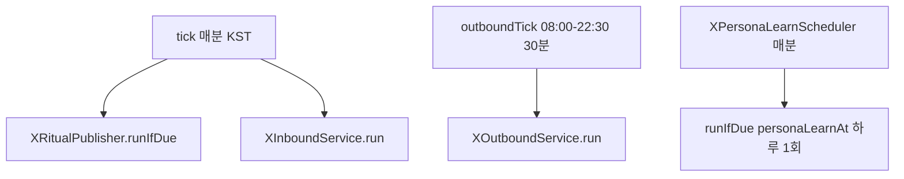

# Justant-Bot — X 성장 루프

> **권위본**: 이 문서. 런타임과 어긋나면 **코드를 따른다**.
> 사연 스크린샷 체인(`x_thread`, 게시 후 24h)은 [`x-thread-strategy.md`](x-thread-strategy.md)가 권위본이다. 두 시스템은 같은 `@againspring_net` 계정을 쓰지만 **파이프가 다르다**.
> 프롬프트 자산: [`x-outbound-reply.md`](../../prompts/marketing/x-outbound-reply.md) · [`x-outbound-donts.md`](../../prompts/marketing/x-outbound-donts.md).
> 어드민 REST: [`50-api.md`](../50-api.md) §4.1.1 · [`rest-spec.md`](../../50-api/rest-spec.md).
> 스키마: [`docs/backend/40-data.md`](../../../backend/40-data.md) `x_ops_action` · `x_persona_example`.

## 1. 무엇이 Justant-Bot인가

**Justant-Bot**은 운영자(Justant) 말투로 `@againspring_net`에 **선댓글(outbound)** · **우리 글 대댓글(inbound)** · **아침/밤 의식 글(ritual)** 을 다는 BE 루프다.

- 광장 **AI-user**(페르소나 봇이 사연·댓글·투표)와 **별개**다.
- 트윗/댓글 **본문에는** Justant-Bot, AI, 봇이라고 쓰지 않는다.
- 목소리 SSOT는 `system_setting` `marketing.x.persona_profile_json`.
- 작문 LLM은 **Haiku** (`llm.claude-code.model`, 기본 `claude-haiku-4-5-20251001`). 페르소나 **증류만 Sonnet** (`marketing.x.persona-learn-model` / `MARKETING_X_PERSONA_LEARN_MODEL`, 기본 `claude-sonnet-5`).
- 게시는 Again-Spring이 직접 X API를 치지 않는다. **ASM** (`AsmClient`)이 Playwright 세션으로 게시·후보 조회한다.

### 1.1 `x_thread`와 겹치지 않는 점

| | `x_thread` (사연 스레드) | Justant-Bot 성장 루프 |
|---|---|---|
| 트리거 | 사연 `createdAt` + 24h + 글 슬롯 | 어드민 킬스위치 + cron |
| 콘텐츠 | 스크린샷 체인 + 마스터 훅 | 한 줄 댓글 / 의식 사진+짧은 문장 |
| 원장 | `marketing_job` / publication | `x_ops_action` |
| 댓글 텔레그램 | 발행 후 N시간 **운영자 수동** 감시 | 선댓글·대댓글 **게시 성공 시** 알림 (`XOpsTelegramAlerts`) |

사연 스레드 감시 창이 같은 트윗에 이미 `x_ops_action` `POSTED`가 있으면 운영자를 미답글로 재촉하지 않는다.

### 1.2 부재 (되살리지 말 것)

- Telegram **페르소나 드릴** (`XPersonaDrillService`, `TelegramDrillCommands`, `POST /api/internal/telegram/webhook`, vault `telegram.webhook_secret`, `TELEGRAM_WEBHOOK_*`, `MARKETING_X_DRILL_DAILY_CAP`, WaggleBot `/drill`).
- `x_persona_example.source=DRILL` 행은 Flyway **V124**에서 삭제. enum 값 `DRILL`만 코드에 남을 수 있다.
- 학습은 **X 타임라인 + 원장**만. Telegram은 **게시 알림**만.

## 2. 스위치·한도·스케줄

어드민 `/admin/marketing` → 설정 → **X 운영**.  
`GET`/`PUT /api/admin/marketing/x-ops`. 키 `marketing.x.*`.

| 항목 | 기본 | 키 |
|---|---|---|
| 아침 시각 | 07:30 KST | `marketing.x.morning_time` |
| 밤 시각 | 22:00 KST | `marketing.x.night_time` |
| 사연 퍼오기 /일 | 2 | `marketing.x.story_scoops_per_day` (**아직 소비하지 않음**, Phase B) |
| 선댓글 /일 | 20 | `marketing.x.outbound_daily_cap` |
| 우리 글 대댓글 /일 | 40 | `marketing.x.inbound_daily_cap` |
| 우리 글당 대댓글 | 12 | `marketing.x.inbound_per_post_cap` |
| 불 난 글 최소 댓글 | 3 (`0`이면 댓글 0도 후보) | `marketing.x.hot_min_replies` |
| 불 난 글 최대 나이 | 6시간 | `marketing.x.hot_max_age_hours` |
| ritual / inbound / outbound | **false** | `marketing.x.{ritual,inbound,outbound}_enabled` |
| 페르소나 학습 | **true** · 04:30 KST | `marketing.x.persona_learning_enabled` · `persona_learn_at` |

코드 기본값이 꺼져 있어도 **prod DB의 `system_setting`이 켜져 있으면 실제로 게시한다.** 문서가 “prod는 꺼져 있다”고 가정하지 말 것. 현재 on/off는 어드민 GET 또는 DB를 본다.

켤 때 권장 순서: inbound → outbound → ritual.

### 2.1 스케줄러

<!-- last-verified: 2026-09-01 -->
<!-- code-ref: backend/src/main/java/com/againspring/marketing/XGrowthLoopScheduler.java -->

- `XGrowthLoopScheduler.tick`: `0 * * * * *` Asia/Seoul — ritual + inbound.
- `outboundTick`: `0 0,30 8-22 * * *` — 08:00, 08:30, … **22:30** KST. 틱당 **게시 성공 최대 1건**. 스킵은 다음 후보.
- `XPersonaLearnScheduler.tick`: 매분. 실제 학습은 `personaLearnAt` 그 시각에만 (`runIfDue`).
- `llm.enabled=false`(dev L3): 작문·발행 **no-op**. 새벽 학습은 돌아가되 증류는 `INGESTED_LLM_DISABLED`.

수동: `POST .../x-ops/learn`, `POST .../x-ops/outbound`. nginx `/api/admin/marketing/` 읽기 타임아웃 **300s**.

## 3. 세 파이프

원장 `x_ops_action`: kind `RITUAL` / `INBOUND` / `OUTBOUND`, status `POSTED` / `SKIPPED` / `FAILED`.  
`target_tweet_id`에 이미 처리 기록이 있으면 재시도하지 않는다 (`alreadyHandled`).  
성공 게시의 `posted_tweet_id`는 학습 때 자동 댓글 id 집합에 들어간다.

### 3.1 Outbound — 팔로우 타임라인 선댓글

코드: `XOutboundService`. ASM `GET /api/v1/x/outbound-candidates`.

- 후보 = **팔로우 중 원글**(맞팔 필수 아님). 필터 `hotMinReplies` / `hotMaxAgeHours`.
- 그 글에 우리 댓글이 없으면 **원글(root)** 에 달고, 있으면 `ourReplyTweetId` 아래로 스레드.
- `hasVideo` (네이티브 영상) → `VIDEO` 스킵 후 다음. GIF 배지는 영상이 아님.
- `hasPhoto`인데 `photoJpegBase64` 없음 → `VISION_FAIL`. AS는 x.com CDN을 직접 받지 않음(ASM Playwright JPEG, 첫 장·긴 변 ~768).
- 작문: `composeOutbound` — 프롬프트 + persona JSON + TIMELINE few-shot + DELETED_AUTO avoid + 선택 JPEG(`LlmImage`) + `peerReplies` 최대 10.
- 자신 없으면 게시하지 않음 (`UNSURE`). ㅋㅋ로 채우지 않음.
- 가드 `OutboundDraftGuard` + `marketing.x.outbound_guards`: `TOO_LONG`(기본 비공백 40자, 최대 2줄) / `LAUGH_SPAM` / `ECHO` / `LANG_MISMATCH`.
- 안전: `KeywordGuard`, 판결 벨트, LLM 오류 시그니처. 오류 문자열은 본문으로 게시 금지.
- 게시: ASM `POST /api/v1/x/publish`. 성공 시 Telegram (`XOpsTelegramAlerts.posted`).

### 3.2 Inbound — 우리 글에 달린 남 댓글에 답

코드: `XInboundService`. ASM `GET /api/v1/x/inbox?sinceMinutes=90`.

- 수신 후 **3–25분** 지터(`tweetId` 해시)부터 **30분** 창까지. UI에 없음.
- 틱당 처리 상한 **3** (`MAX_BATCH`). 일일/글당 cap은 설정.
- 스킵: URL만, 맞팔 미끼, 욕설 패턴 → `SAFETY`.
- 작문: `composeReply` — **인라인 프롬프트 + persona**. outbound JSON 프롬프트·few-shot·`OutboundDraftGuard`를 타지 않는다.
- 게시 성공 시 outbound와 같은 Telegram 알림.

### 3.3 Ritual — 아침/밤 사진 + 짧은 줄

코드: `XRitualPublisher`. 슬롯 센티널로 하루 슬롯당 1회.

- 작문: `composeRitual`.
- 게시: ASM `POST /api/v1/x/ritual` `{ slot: morning|night, text }`. 사진 = ASM `assets/x-ritual`.
- **Telegram 알림 없음** (댓글 알림 클래스만 선댓글/대댓글).

## 4. 작문 스택

`XCommentComposer` → `RemoteLlmProvider` (`againspring-llm:8090/v1/invoke`). 사용자/트윗 텍스트는 `PromptSanitizer` + `<user_input>`.

| 경로 | 모델 | 입력 |
|---|---|---|
| outbound | Haiku | `x-outbound-reply.md` + donts + persona + TIMELINE few-shot + DELETED_AUTO avoid + JPEG? |
| inbound | Haiku | 인라인 답글 프롬프트 + persona |
| ritual | Haiku | 의식 프롬프트 + persona |
| 프로필 증류 | Sonnet | gold TIMELINE + avoid DELETED_AUTO → `persona_profile_json` |

## 5. 페르소나 학습

코드: `XPersonaLearnService`. 타임라인: `FxTwitterXTimelineClient` (`https://api.fxtwitter.com`, handle `againspring_net`, 최대 6페이지). **게시에는 쓰지 않음.**

### 5.1 Gold `TIMELINE`

`XManualStatusClassifier.isManual(status, handle, autoPostedIds)`:

- 원장 `POSTED` outbound/inbound의 `posted_tweet_id` (최근 **14일**)에 있으면 **자동 댓글** → gold 아님.
- 자기 체인(`x_thread` 훅: `#다시봄` / `#againspring`), URL만, 자기 답글 등은 수동이 아님.
- 운영자가 **남에게** 단 댓글·인용만 gold.

한 런 신규 상한 **40**. 예시 보관 상한 **40**. ingested id 상한 **400**.

### 5.2 Avoid `DELETED_AUTO`

최근 **3일** POSTED outbound/inbound 중 `posted_tweet_id`가 방금 받은 타임라인 id 집합에 **없으면** 운영자가 지운 것으로 본다. 본문 = 원장 `body`. **Ritual은 삭제 신호가 아님.**

### 5.3 증류·상태

- prod: Sonnet으로 프로필 JSON 갱신. 상태 `OK`.
- `llm.enabled=false`: 예시만 적재, `INGESTED_LLM_DISABLED`.
- 그 외: `NEVER` / `NO_NEW` / `FETCH_FAILED`.
- GET 읽기 전용: `personaLastStatus` / `personaLastNewCount` / `personaLastLearnedAt` / `personaSummary`.

## 6. ASM 엔드포인트 (어드민 JWT 아님)

호스트 `justant@100.115.252.61` · `~/Data/Again-Spring-Marketing` · 포트 8200. AS는 thin client.

| 메서드 | 경로 | 용도 |
|---|---|---|
| POST | `/api/v1/x/publish` | 댓글/트윗 게시 |
| POST | `/api/v1/x/ritual` | 의식 사진+텍스트 |
| GET | `/api/v1/x/inbox` | 우리 글에 달린 남 댓글 |
| GET | `/api/v1/x/outbound-candidates` | 선댓글 후보 (stats 클라이언트, 타임아웃 기본 300s) |

후보 필드는 [`50-api.md`](../50-api.md) §4.1.1.

## 7. 코드 포인터

| 역할 | 클래스 |
|---|---|
| 분 틱 / 30분 틱 | `XGrowthLoopScheduler` |
| 선댓글 | `XOutboundService` |
| 대댓글 | `XInboundService` |
| 의식 | `XRitualPublisher` |
| 작문 | `XCommentComposer` |
| 길이·언어 가드 | `OutboundDraftGuard` |
| 원장 | `XOpsActionLedger` |
| 학습 | `XPersonaLearnService` · `XPersonaLearnScheduler` |
| 수동 vs 자동 | `XManualStatusClassifier` |
| 설정 | `MarketingXOpsSettingsService` |
| ASM HTTP | `AsmClient` |
| 타임라인 읽기 | `FxTwitterXTimelineClient` |
| Telegram 카피 | `XOpsTelegramAlerts` |
| 어드민 | `AdminMarketingController` · FE `XOpsSettingsSection.tsx` |

## 8. 운영 메모

- **dev**에서 자동 댓글 품질을 검증하지 않는다 (L3, LLM 없음). 학습 적재만 가능.
- e2e는 `POST /x-ops/learn` · `/outbound`를 호출하지 않는다.
- 운영자가 자동 댓글을 지우면 다음 새벽(또는 수동 learn)에 avoid로 들어간다. 지운 직후 즉시 학습하려면 `POST /x-ops/learn`.
