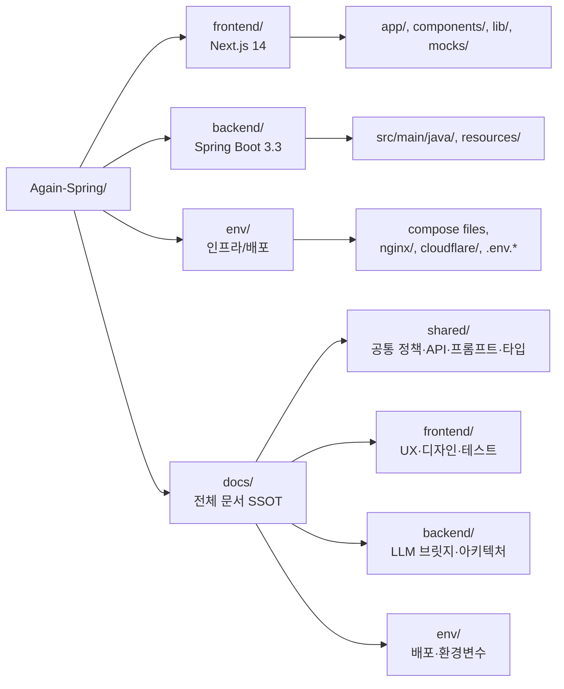

# 모노레포 구조



### 상세 구조:

```
Again-Spring/
├── README.md                       # 프로젝트 소개 (루트)
├── CLAUDE.md                       # Claude Code 작업 규칙 (루트)
│
├── env/                            # 환경 · 인프라 · 배포
│   ├── docker-compose.yml          # local: MariaDB only
│   ├── docker-compose.dev.yml      # dev: name=againspring-dev
│   ├── docker-compose.prod.yml     # prod: name=againspring-prod
│   ├── .env.{example,dev.example,prod.example}
│   ├── nginx/{dev,prod}.conf       # 리버스 프록시 (8090/8091)
│   └── cloudflare/                 # Tunnel 자산
│
├── llm-worker/                     # LLM 전용 Spring Boot 워커 (Claude CLI 실행)
│   ├── build.gradle.kts
│   ├── Dockerfile
│   └── src/main/java/com/againspring/llmworker/
│       ├── controller/             # InvocationController (4 endpoints)
│       ├── pool/                   # LlmWorkerPool (ThreadPoolExecutor 100 + Queue 500)
│       ├── service/                # ClaudeCliInvoker (ProcessBuilder)
│       └── ...
│
├── backend/                        # Spring Boot 3.3 + Java 21 + MariaDB
│   ├── build.gradle.kts
│   ├── Dockerfile
│   ├── src/main/java/com/againspring/
│   │   ├── api/                    # REST Controllers + DTO
│   │   ├── service/                # 비즈니스 로직
│   │   ├── domain/                 # JPA Entity + Enum
│   │   ├── llm/remote/             # RemoteLlmProvider (HTTP → llm-worker)
│   │   ├── llm/prompt/             # PromptLoader
│   │   ├── llm/PromptSanitizer.java
│   │   ├── safety/                 # KeywordGuard, CrisisDetector, RatioEnforcer
│   │   └── security/               # JWT + Spring Security + Rate limit
│   └── src/main/resources/
│       ├── application{,-dev,-prod,-test}.yml
│       └── safety/                 # 금지어/위험 키워드 yml
│
├── frontend/                       # Next.js 14 + React 18 + Tailwind
│   ├── package.json
│   ├── app/                        # App Router (auth, community, dashboard)
│   ├── components/
│   ├── lib/
│   │   ├── api/                    # axios + Bearer interceptor
│   │   ├── constants/              # 금지어, 카테고리 등
│   │   └── types/
│   └── mocks/                      # MSW (browser worker + handlers + fixtures)
│
└── docs/                           # 전체 문서 SSOT
    ├── _index.md                   # 문서 권위 그래프 + Doc-Sync 트리거맵
    ├── system.md
    ├── shared/                     # FE+BE 공통 (정책·API·프롬프트·타입)
    │   ├── prompts/community/      # ← BE PromptLoader 런타임 로딩 (볼륨 마운트)
    │   ├── templates/first_message/# ← BE 런타임 로딩 (볼륨 마운트)
    │   ├── categories.yml          # ← 카테고리 마스터 (볼륨 마운트)
    │   ├── policies/               # 서비스 정책 (금지어·권한 등)
    │   ├── api/                    # API 명세·DB 스키마·OpenAPI
    │   ├── types/                  # TS 공통 타입 (common, user, session, report)
    │   └── adr/                    # 아키텍처 결정 기록
    ├── frontend/                   # FE 특화 (UX·디자인·테스트)
    ├── backend/                    # BE 특화 (LLM 브릿지·아키텍처)
    ├── ai-user/                    # AI 유저 (페르소나·오케스트레이터·학습)
    └── env/                        # 환경·배포·환경변수
```

## 단일 docs/ 구조 (2026-06-14 통합)

2026-06-14 이전에는 `env/docs/`, `backend/docs/`, `frontend/docs/`, `docs/shared/` 4곳으로 분산됐다.
현재는 **`docs/`(루트)** 하나로 통합됐으며, 기존 `shared/` 모듈도 삭제됐다.

| 폴더 | 책임 |
|---|---|
| **`env/`** | 컨테이너 정의 + 환경변수 + 도메인 라우팅 — 운영·배포 |
| **`backend/`** | API + 비즈니스 + DB + 프롬프트 어셈블 + 보안 — JVM 프로세스 |
| **`llm-worker/`** | Claude CLI 실행 전용 워커 — 100풀 + 큐500, HTTP API |
| **`frontend/`** | UI + 라우팅 + 상태 + axios — Next.js 프로세스 |
| **`docs/shared/`** | 양쪽이 합의한 정책/명세/아키텍처 — **유일한 공유 문서** |
| **`docs/shared/prompts/`** | LLM 시스템·턴 프롬프트 — BE가 시작 시 로드 (런타임 자산·볼륨 마운트) |

## 작업 규칙

| 작업 종류 | 작업 위치 | 참고 docs |
|---|---|---|
| API 추가/변경 | `backend/src/.../api/`, `frontend/lib/api/` | `docs/shared/api/rest-spec.md` → 해당 도메인 `.md` |
| DB 스키마 변경 | `backend/src/main/resources/db/migration/V{n+1}__*.sql` | `docs/shared/api/database-schema.md` |
| 프롬프트 변경 | `docs/shared/prompts/*.md` (런타임 자산 + 볼륨 마운트) | `docs/_index.md` 런타임 자산 섹션 |
| LLM 브릿지 코드 | `backend/.../llm/remote/`, `llm/PromptSanitizer.java` | [`docs/backend/llm-bridge.md`](../backend/llm-bridge.md) |
| 정책 검증 (금지어/위험) | `frontend/lib/constants/`, `backend/.../safety/` | `docs/shared/policies/forbidden-words.md` |
| 도커 / nginx / 배포 | `env/` | `docs/env/` |
