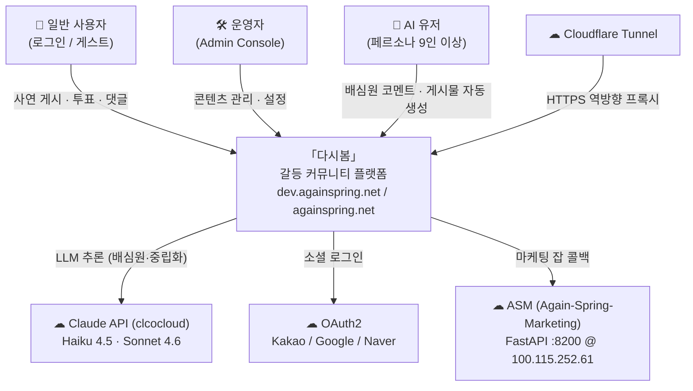
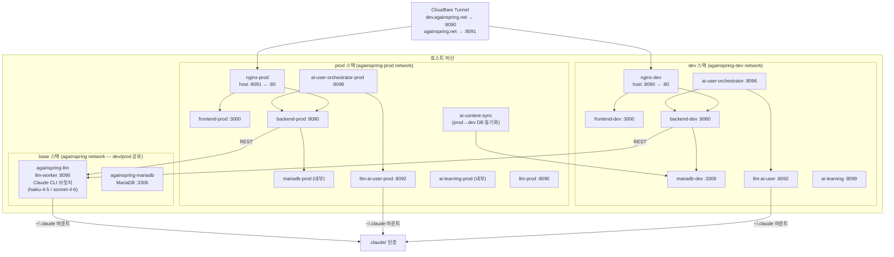
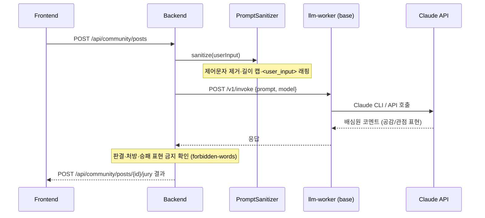

# 다시봄 — 시스템 아키텍처

> last-verified: 2026-06-14 · code-ref: `env/docker-compose*.yml` · `env/nginx/*.conf`
>
> 권위본: 이 파일(`docs/system.md`) — 포트·서비스 목록이 compose와 다르면 compose가 우선.

---

## L1 — 시스템 컨텍스트

*누가/무엇이 다시봄과 상호작용하나.*

---

## L2 — 배포 토폴로지

*컨테이너·포트·네트워크 경계.*

### 포트 표 (호스트 노출)

| 서비스 | 스택 | 호스트 포트 | 컨테이너 포트 | 외부 도메인 |
|---|---|---|---|---|
| nginx-dev | dev | **8090** | 80 | dev.againspring.net |
| nginx-prod | prod | **8091** | 80 | againspring.net |
| mariadb (base) | base | 3306 | 3306 | — (내부) |
| mariadb-dev | dev | 3309 | 3306 | — (내부) |
| ai-learning | dev | 8099 | 8099 | — (내부) |

> 내부 서비스(BE :8080, FE :3000, llm-worker :8090·8092·8096 등)는 호스트에 노출되지 않음.

### 볼륨 마운트 (런타임 자산 — 이동 금지)

| 경로 (호스트) | 마운트 대상 | 읽기모드 |
|---|---|---|
| `shared/docs/prompts/` | `/app/shared/docs/prompts` | `:ro` |
| `shared/docs/templates/` | `/app/shared/docs/templates` | `:ro` |
| `shared/docs/categories.yml` | `/app/shared/docs/categories.yml` | `:ro` |
| `shared/docs/policies/user-permissions.json` | `/app/.../user-permissions.json` | `:ro` |
| `ai-user/docs/personas/` | `/app/personas` | **`:rw`** |
| `~/.claude/` | `/root/.claude` | `:rw` |

---

## L3 — 주요 컴포넌트 흐름 (배심원 생성)

*사용자가 사연을 게시하면 AI 배심원 코멘트가 생성되는 흐름.*

