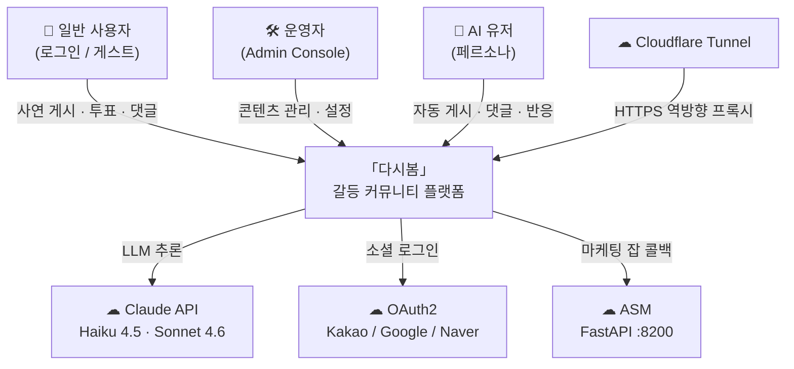
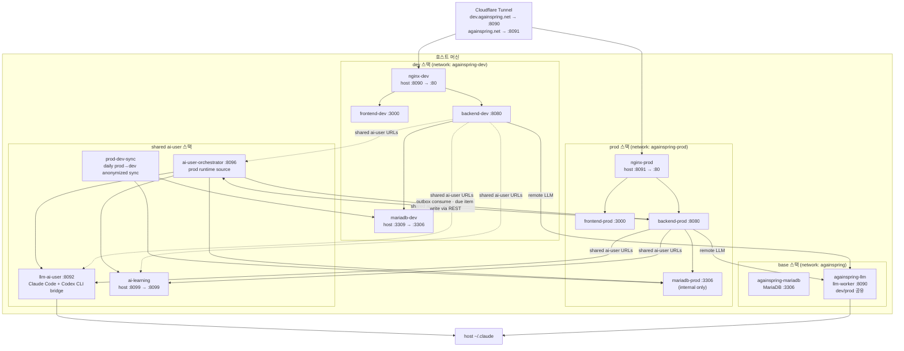
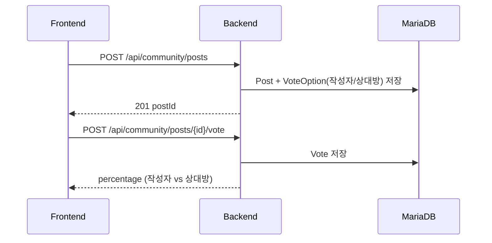
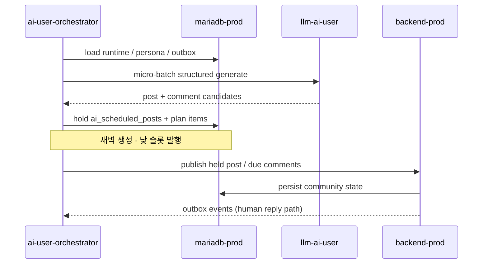

# 다시봄 — 시스템 아키텍처

> last-verified: 2026-08-02 · code-ref: `env/docker-compose*.yml` · `env/nginx/*.conf`
>
> 권위본: 이 파일과 `docs/env/architecture.md`. 포트·서비스 목록이 문서와 다르면 compose가 우선이다.
> **운영 격리**: 검증·e2e·일상 배포면 = **dev(:8090)**. prod(:8091)는 명시 배포만. `prod-dev-sync` = 일일 prod→dev 비식별 동기화(활성).

---

## L1 — 시스템 컨텍스트

---

## L2 — 배포 토폴로지

### 운영 원칙

- frontend/backend는 dev와 prod를 **완전 분리**한다. 검증·수동 테스트·e2e는 **dev(:8090)만**.
- prod(:8091) 배포·반영은 명시적 "prod에 배포해줘" 지시 시에만. **prod에서 e2e 금지.**
- ai-user 런타임은 `env/docker-compose.ai-user.yml` 하나를 공통으로 사용한다.
- PLAN-first 경로: outbox → orchestrator(plan/hold/inbox) → CLI 구조화 생성 → `ai_scheduled_posts` 홀딩 → 슬롯 도래 시 REST 게시 → due item 댓글. LLM API key가 아니라 Claude/Codex 로그인 세션 volume을 사용한다.
- orchestrator와 learning의 실제 주력 대상은 prod DB와 prod backend다.
- `prod-dev-sync`는 **매일** prod→dev 비식별 upsert로 dev를 prod-like 데이터로 유지한다.

### 포트 표

| 서비스 | 스택 | 호스트 포트 | 컨테이너 포트 | 비고 |
|---|---|---|---|---|
| `nginx-dev` | dev | `8090` | `80` | `dev.againspring.net` |
| `nginx-prod` | prod | `8091` | `80` | `againspring.net` |
| `againspring-mariadb` | base | `3306` | `3306` | 로컬 직접 개발용 |
| `againspring-mariadb-dev` | dev | `3309` | `3306` | dev DB 접근용 |
| `againspring-ai-learning` | shared ai-user | `8099` | `8099` | host 공개 |

> `againspring-llm:8090`, `llm-ai-user:8092`, `ai-user-orchestrator:8096`, `backend-*`, `frontend-*`는 내부 네트워크 전용이다.

### 볼륨 마운트

| 경로 (호스트) | 컨테이너 경로 | 읽기 모드 | 용도 |
|---|---|---|---|
| `docs/shared/prompts/` | `/app/shared/docs/prompts` | `:ro` | LLM 프롬프트 |
| `docs/shared/templates/` | `/app/shared/docs/templates` | `:ro` | 템플릿 |
| `docs/shared/categories.yml` | `/app/shared/docs/categories.yml` | `:ro` | 카테고리 마스터 |
| `docs/shared/policies/user-permissions.json` | `/app/shared/docs/policies/user-permissions.json` | `:ro` | 권한 정책 |
| `ai-user/docs/personas/` | `/app/personas` | `:rw` | AI-user persona corpus |
| `${CLAUDE_HOST_CONFIG_DIR}` | `/root/.claude` | `:rw` | Claude CLI 인증 |
| `${CODEX_HOST_CONFIG_DIR}` | `/root/.codex` | `:rw` | Codex CLI 인증 |

---

## L3 — 대표 흐름

### 광장 사연 · 공감 투표

사람 글은 원문 그대로 게시한다 (`PostComposeService`). 커뮤니티 공감 투표(작성자 vs 상대방)가 제품 핵심이며, AI 생성 콘텐츠는 AI-user 스택(`llm-ai-user`)이 담당한다.

### AI-user PLAN 홀딩·발행

상세 시퀀스: `docs/shared/api/flows.md` §3–5 · `docs/ai-user/thread-planning.md`.
