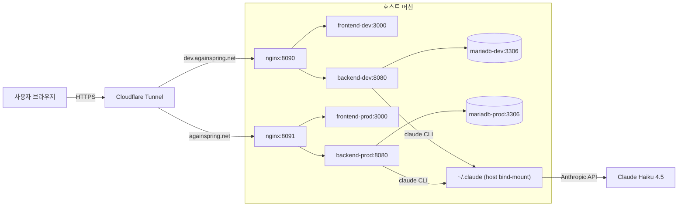

# 배포 아키텍처

다시봄 인프라의 전체 구조와 컴포넌트 간 통신을 설명합니다.

## 고수준 개요



### 이 다이어그램의 ASCII 버전은 아래 참조:

```
┌─────────────────────────────────────────────────────────────┐
│  브라우저 (사용자)                                              │
└────────────────────┬────────────────────────────────────────┘
                     │ HTTPS
                     ▼
┌─────────────────────────────────────────────────────────────┐
│  Cloudflare Tunnel                                           │
│  ├─ dev.againspring.net  → localhost:8090                  │
│  ├─ againspring.net      → localhost:8091                  │
│  └─ www.againspring.net  → localhost:8091                  │
└────────────────────┬────────────────────────────────────────┘
                     │ HTTP
                     ▼
┌─────────────────────────────────────────────────────────────┐
│  호스트 (Linux 서버)                                          │
│  ┌───────────────────────────────────────────────────────┐  │
│  │ nginx (docker)                                        │  │
│  │ ├─ :8090 (dev)     → backend:8080 + frontend:3000   │  │
│  │ └─ :8091 (prod)    → backend:8080 + frontend:3000   │  │
│  └───────────┬──────────────────────────┬───────────────┘  │
│              │                          │                   │
│  ┌───────────▼──────────┐  ┌───────────▼──────────┐        │
│  │ Backend Container    │  │ Frontend Container   │        │
│  │ (Spring Boot)        │  │ (Next.js)            │        │
│  │ :8080                │  │ :3000                │        │
│  └────────┬─────────────┘  └──────────────────────┘        │
│           │                                                 │
│           │ JDBC                                           │
│           ▼                                                 │
│  ┌──────────────────────┐                                  │
│  │ MariaDB Container    │                                  │
│  │ :3306 (internal)     │                                  │
│  └──────────────────────┘                                  │
│                                                             │
│  Claude Code CLI                                          │
│  └─ ~/.claude (host mount → /root/.claude)               │
│     (LLM 브릿지 인증, ProcessBuilder로 호출)               │
└─────────────────────────────────────────────────────────────┘
```

## 환경별 포트 매핑

### 로컬 개발 (`docker-compose.yml`)

- **목적**: 호스트에서 `./gradlew bootRun` + `npm run dev` 실행, DB만 컨테이너화
- **MariaDB**: localhost:3306

### dev 환경 (`docker-compose.dev.yml`)

전체 스택이 컨테이너화되어 `dev.againspring.net`에 노출:

| 포트 | 컨테이너 | 내부 | 비고 |
|---|---|---|---|
| 8090 | nginx-dev | :80 | Cloudflare Tunnel 진입점 |
| (3309) | mariadb-dev | :3306 | 필요시 외부 접근용 (운영용 아님) |

### prod 환경 (`docker-compose.prod.yml`)

운영 데이터베이스는 외부 포트 비노출:

| 포트 | 컨테이너 | 내부 | 비고 |
|---|---|---|---|
| 8091 | nginx-prod | :80 | Cloudflare Tunnel 진입점 (실 사용자 대면) |
| — | mariadb-prod | :3306 | Internal only (host 미노출) |

## 컨테이너 책임

### Frontend (Next.js)

- **이미지**: `node:20-alpine` (멀티 스테이지 빌드)
- **포트**: :3000 (내부)
- **역할**: 
  - 사용자 UI (React 컴포넌트)
  - MSW 통해 백엔드 API 모킹 (dev 모드)
  - 정적 빌드 아티팩트 (_next/)
- **빌드타임 주입**:
  - `NEXT_PUBLIC_APP_URL`
  - `NEXT_PUBLIC_GOOGLE_CLIENT_ID`, `KAKAO`, `NAVER`
  - 이들은 Next.js 빌드 시 정적으로 인라인됨

### Backend (Spring Boot)

- **이미지**: `eclipse-temurin:21-jre-alpine` + Node.js + Claude CLI
- **포트**: :8080 (내부)
- **역할**:
  - REST API 라우팅 (`/api/sessions`, `/api/conversations` 등)
  - JWT 인증 · 세션 관리
  - **LLM 호출** (Claude Haiku 4.5 via `claude` CLI)
  - 금지어 / 위기 감지 (PromptSanitizer, CrisisDetector)
  - 리포트 생성 (기여도, NVC 분석)
  - 이메일 인증 (Spring Mail)
- **DB 연결**: MariaDB :3306 (내부 네트워크)
- **Claude 인증**: 호스트 `~/.claude` bind mount → `/root/.claude` (ProcessBuilder 호출 시 자동 사용)

### MariaDB

- **이미지**: `mariadb:lts`
- **포트**: :3306 (내부 또는 호스트 포트 노출)
- **역할**:
  - 사용자 계정, 세션 데이터, 갈등 내용, 리포트 저장
  - Flyway 마이그레이션 (V1~V5)
- **healthcheck**: `healthcheck.sh --connect --innodb_initialized`
  - 백엔드는 `depends_on.condition: service_healthy`로 DB 준비 대기

### nginx

- **이미지**: `nginx:alpine`
- **포트**: :8090 (dev) / :8091 (prod)
- **역할**:
  - 리버스 프록시
  - 정적 파일 서빙 (frontend _next/)
  - API 라우팅 → backend :8080
  - 캐싱 (정적 자산)
  - prod: `set_real_ip_from` (Cloudflare IP 대역) + `real_ip_header CF-Connecting-IP`로 클라이언트 실 IP 복원

## 볼륨 & 마운트

### MariaDB 데이터 볼륨

| 환경 | 볼륨명 | 용도 |
|---|---|---|
| local | `againspring_mariadb_data` | 로컬 개발 DB |
| dev | `againspring-dev_mariadb_dev_data` | dev 환경 DB |
| prod | `againspring-prod_mariadb_prod_data` | prod 운영 DB (중요) |

각 볼륨은 **독립적** — dev와 prod 데이터는 절대 혼합되지 않음.

### Claude CLI 인증 마운트

```yaml
backend-{dev,prod}:
  volumes:
    - ${CLAUDE_HOST_CONFIG_DIR}:/root/.claude:ro  # bind mount (read-only)
```

- **호스트 경로**: `/home/<user>/.claude` (또는 env var `CLAUDE_HOST_CONFIG_DIR`)
- **컨테이너 경로**: `/root/.claude`
- **용도**: Claude Code CLI 로그인 세션 공유
  - API 키 불필요 — CLI 자체 인증 사용
  - 백엔드 ProcessBuilder가 `claude --print --model ... "<prompt>"` 호출 시 자동 사용

**전제 조건**: 호스트에서 미리 `claude` 명령으로 1회 로그인 완료.

## 네트워크 격리

### 로컬 개발

- **네트워크**: `againspring` (host 머신도 참여)
- 호스트에서 `localhost:3306`으로 DB 직접 접근 가능

### dev / prod

- **각각 독립 bridge 네트워크**: `againspring-dev`, `againspring-prod`
- 컨테이너 간 DNS는 서비스명 (예: `mariadb-dev`)
- 호스트 진입점은 **nginx only** (`:8090` / `:8091`)
  - backend, frontend, mariadb는 내부 네트워크에만 노출

## 통신 흐름

### 사용자 요청 (예: 갈등 분석 요청)

1. 브라우저 → Cloudflare Tunnel → nginx (:8090 or :8091)
2. nginx → backend :8080/api/sessions/{sessionId}/analyze (리버스 프록시)
3. backend 
   - JWT 검증
   - 세션/대화 데이터 조회 (MariaDB)
   - PromptSanitizer로 사용자 입력 정제
   - `ProcessBuilder`로 `claude --print ... "<sanitized-prompt>"` 호출
   - Claude CLI가 호스트의 `~/.claude` 세션 사용 (컨테이너 마운트)
   - Claude Haiku 4.5 응답 수신
   - 리포트 생성 (기여도 계산, NVC 재구성)
   - 결과를 MariaDB에 저장
4. backend → frontend (JSON 응답)
5. frontend → 브라우저 (렌더링)

### 위기 감지 흐름

1. backend: 사용자 입력 받음 (CrisisDetector.detect())
2. KeywordGuard: 금지어/위험 키워드 스캔
3. 위기 감지 시:
   - `CrisisGuardException` 발생
   - GlobalExceptionHandler에서 응답 구성
   - frontend: Crisis Resource 모달 표시 (긴급 연락처)

## 배포 단계별 검증 포인트

### 로컬 개발

```bash
cd env
docker compose up -d                    # DB
cd ../backend
./gradlew bootRun                       # BE :8080
cd ../frontend
npm run dev                             # FE :3000
```

### dev 배포

```bash
cd env
docker compose -f docker-compose.dev.yml --env-file .env.dev up -d --build
curl http://localhost:8090/api/health  # nginx → backend 라우팅 확인
```

### prod 배포 (명시적 지시 시에만)

```bash
# main 브랜치 기준으로만 빌드
docker compose -f docker-compose.prod.yml --env-file .env.prod up -d --build
curl http://localhost:8091/api/health
# Cloudflare: https://againspring.net 외부 접근 확인
```

## 상세 문서

- **Docker Compose 구성**: [docker.md](./docker.md)
- **환경 변수**: [environment-variables.md](./environment-variables.md)
- **배포 절차 (dev → main → prod)**: [deployment.md](./deployment.md)
- **Cloudflare Tunnel 설정**: [cloudflare.md](./cloudflare.md)
- **로컬 개발 실행**: [local-dev.md](./local-dev.md)
