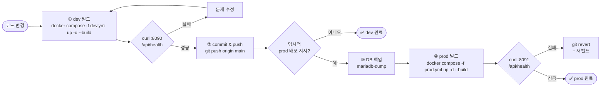

# 배포 절차

> ⚠️ **PROD 배포 절대 규칙**: 사용자가 명시적으로 "prod에 배포해줘" 지시한 경우에만 prod 배포. 그 외에는 dev까지만.

## 표준 흐름



prod 환경은 **반드시 main 브랜치 기준**으로만 빌드한다.

## 1단계: dev 배포

```bash
cd env

# 최초 1회: env 파일 준비
cp .env.dev.example .env.dev
$EDITOR .env.dev          # MARIADB_PASSWORD, JWT_SECRET 등 실제 값 채움

# 빌드 + 실행
docker compose -f docker-compose.dev.yml --env-file .env.dev up -d --build

# 상태
docker compose -f docker-compose.dev.yml ps
docker compose -f docker-compose.dev.yml logs -f --tail 100

# 헬스체크
curl http://localhost:8090/api/health
curl http://localhost:8090/actuator/health
```

dev 외부 도메인 (`https://dev.againspring.net`)으로도 동일 응답 확인.

## 2단계: 검증 후 commit & push

dev에서 변경사항이 의도대로 동작하는지 확인 후:

```bash
git status
git add -A
git commit -m "feat: <변경 요약>"
git push origin main
```

## 3단계: prod 배포 (명시적 지시 시에만)

```bash
cd env

# 최초 1회: env 파일 준비 (모든 값 필수)
cp .env.prod.example .env.prod
$EDITOR .env.prod

# 데이터 백업 (운영 데이터 있을 때 강력 권장)
docker exec againspring-mariadb-prod \
  mariadb-dump -uroot -p"${MARIADB_ROOT_PASSWORD}" --single-transaction --routines \
  againspring > /backups/prod-$(date +%Y%m%d-%H%M%S).sql

# 빌드 + 실행
docker compose -f docker-compose.prod.yml --env-file .env.prod up -d --build

# 상태
docker compose -f docker-compose.prod.yml ps

# 헬스체크
curl http://localhost:8091/api/health
curl http://localhost:8091/actuator/health
```

외부 도메인 (`https://againspring.net`, `https://www.againspring.net`)으로 라우팅 정상 확인.

## prod 사전 체크리스트

- [ ] dev에서 변경사항 검증 완료
- [ ] main 브랜치에 push 완료 (CI 미사용 → 수동 확인)
- [ ] `env/.env.prod` 모든 값 입력 (기본값 없음)
- [ ] MariaDB 볼륨 백업 (`mariadb-dump`)
- [ ] 호스트 `~/.claude` 세션 유효 (만료 시 재로그인 → `docker compose restart againspring-llm-prod`)
- [ ] Cloudflare Tunnel 가동 중 (`systemctl status cloudflared`)

## ⛔ prod 미지원 기능 — 절대 활성화 금지

아래 기능은 **prod에 포함하지 않는다**. Q1/Q2/Q3 답변 완료 + 명시적 prod 배포 지시 전까지 잠금.

| 기능 | 이유 |
|---|---|
| **마케팅 자동화 대시보드** (`/admin/marketing`) | 저작권·사이드프로젝트정책·익명운영 미결(Q1~Q3) |
| `marketing-renderer` 컨테이너 | 마케팅 대시보드 미지원이므로 불필요 |
| `MARKETING_ENABLED=true` | prod `.env.prod`에 추가 절대 금지 |

prod 배포 시 `docker-compose.prod.yml`에 `marketing-renderer` 서비스가 없으며, BE의 모든 마케팅 빈은 `@ConditionalOnProperty`로 미등록 상태. `/api/admin/marketing/**` 엔드포인트 없음.

상세 정책: `shared/docs/v15/marketing-dev-only-policy.md`

## 롤백

이전 빌드 이미지로 즉시 복귀:

```bash
# 1) 가장 최근 백업 식별
ls -lt /backups/prod-*.sql | head -3

# 2) 컨테이너 정지
docker compose -f docker-compose.prod.yml down

# 3) 코드 롤백 (직전 커밋으로)
git revert <bad-commit-sha>
git push origin main

# 4) 재빌드
docker compose -f docker-compose.prod.yml --env-file .env.prod up -d --build

# 5) DB 복원이 필요하면
docker exec -i againspring-mariadb-prod \
  mariadb -uroot -p"${MARIADB_ROOT_PASSWORD}" againspring < /backups/prod-XXXXXX.sql
```

## Cloudflare Tunnel

도메인 라우팅은 `cloudflare.md` 참조. 컨테이너 재시작 후에도 호스트 포트 (`8090` / `8091`)는 변하지 않으므로 Tunnel 설정 변경 불필요.

## 환경 격리 원칙

- dev 데이터베이스 ≠ prod 데이터베이스 (별도 볼륨, 별도 네트워크, 별도 컨테이너)
- compose `name:` 필드로 project name을 고정해 디렉토리명에 의존하지 않음
- `.env.prod`는 절대 git에 커밋 금지 — `.gitignore`로 보호 중
