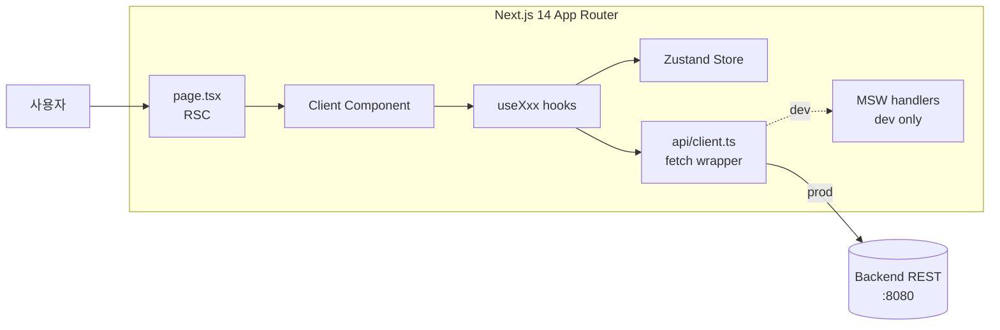
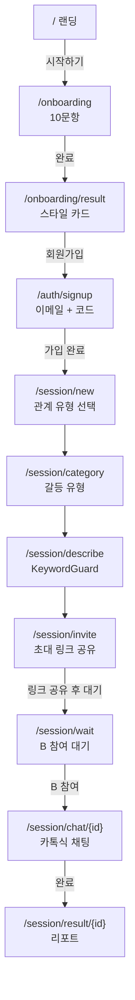
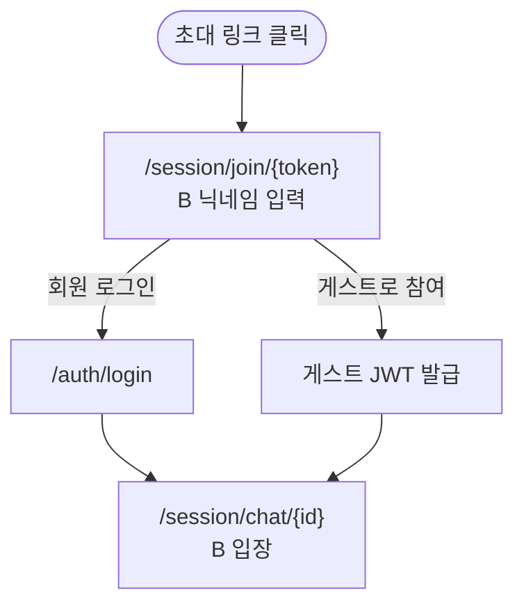
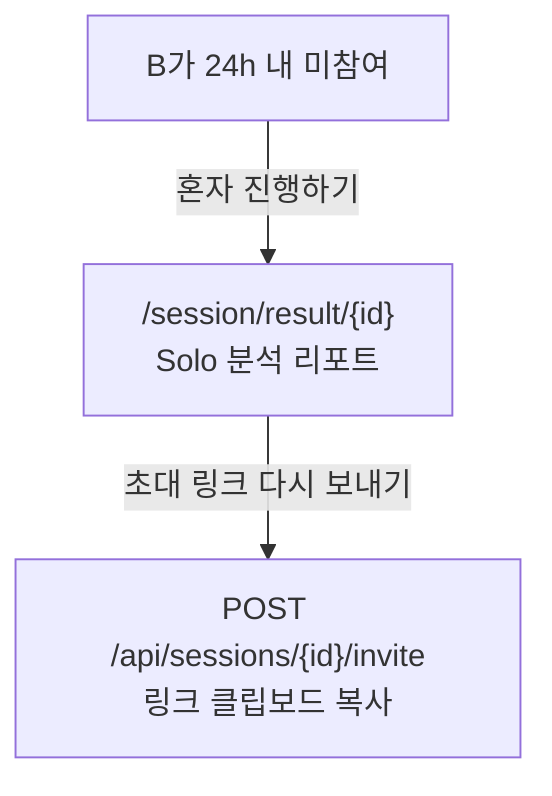

# 아키텍처

## 기술 스택

| 영역 | 기술 |
|---|---|
| 프레임워크 | Next.js 14.2.15 (App Router) |
| 언어 | TypeScript 5.6 (strict) |
| 런타임 | React 18.3 |
| 상태 | Zustand 5.0 + persist 미들웨어 |
| HTTP | axios 1.7 + Bearer 인터셉터 |
| 스타일 | Tailwind CSS 3.4 + Radix UI |
| 폼 | react-hook-form 7.53 + zod 3.23 |
| 차트 | Recharts 2.13 |
| 애니메이션 | framer-motion 11.11 |
| 아이콘 | lucide-react 0.454 |
| Mock | MSW 2.6 |

## 데이터 흐름



### 텍스트 버전:

```
[페이지/컴포넌트]
     │
     │ ① api.get/post/...
     ▼
[lib/api/client.ts] axios instance
     │ ② request interceptor:
     │    Authorization: Bearer ${localStorage.again-spring-token}
     ▼
[브라우저 fetch]
     │
     ├── (개발: MSW worker 활성)
     │      ↓
     │   mocks/handlers/* 가 가로채서 응답
     │
     └── (프로덕션 또는 MSW miss)
            ↓
         BE API (`/api/...`)
     │
     ▼
[응답]
     │ ③ 페이지/컴포넌트에서 useState 또는 store에 반영
     ▼
[Zustand store]
     │ persist 미들웨어 → localStorage 동기화
```

## 핵심 컴포넌트

### `lib/api/client.ts`

```typescript
import axios from 'axios';

export const api = axios.create({
  baseURL: '',                              // 상대 경로 — nginx가 BE로 라우팅
  headers: { 'Content-Type': 'application/json' },
});

api.interceptors.request.use((config) => {
  const token = typeof window !== 'undefined'
    ? localStorage.getItem('again-spring-token')
    : null;
  if (token) {
    config.headers.Authorization = `Bearer ${token}`;
  }
  return config;
});

export interface CreateSessionPayload { ... }
export interface TurnRequest { ... }
```

axios 인스턴스를 모든 곳에서 import — 토큰 주입 일관성. SSR에서는 `typeof window` 가드.

### `lib/store/userStore.ts` (Zustand)

```typescript
interface UserState {
  user: User | null;
  setUser: (u: User | null) => void;
  setStyle: (style: CommunicationStyle) => void;
  setOnboardingAnswers: (answers: number[]) => void;
  setOnboardingCompleted: (b: boolean) => void;
  setMbtiType: (mbti: string | null) => void;
  clear: () => void;            // 로그아웃 시 — token도 함께 제거
}
const useUserStore = create<UserState>()(
  persist(/* ... */, { name: 'again-spring-user' })
);
```

`clear()`는 store + `localStorage.again-spring-token` 둘 다 정리.

### `lib/store/sessionStore.ts`

세션 진행 중인 플로우 상태 (relationType, category, description, currentTurn, turns, partnerNickname 등). 새 세션 시작 시 `reset()`.

### MSW (`mocks/`)

`mocks/browser.ts`:
```typescript
import { setupWorker } from 'msw/browser';
import { handlers } from './handlers';
export const worker = setupWorker(...handlers);
```

`components/shared/MSWProvider.tsx`가 클라이언트에서 worker 시작:
```typescript
'use client';
useEffect(() => {
  if (process.env.NODE_ENV === 'development') {
    import('@/mocks/browser').then(({ worker }) => {
      worker.start({ onUnhandledRequest: 'bypass' });
    });
  }
}, []);
```

`onUnhandledRequest: 'bypass'` — MSW에 핸들러 없는 경로는 실 BE로 통과. → 일부 API만 mock + 일부는 BE 직접 호출 가능.

`public/mockServiceWorker.js`는 MSW가 자동 생성 (`.gitignored`).

### `components/shared/CrisisResourceModal.tsx`

위기 키워드 감지 시 풀스크린 모달. `lib/constants/crisisResources.ts`의 핫라인 카드 표시. `tel:` 링크로 즉시 전화 연결 + `sms:`로 문자 상담.

### `components/shared/KeywordGuard.tsx`

입력 필드(`<textarea>`) 옆에 인라인 경고. `lib/utils/keywordGuard.ts`의 `checkKeywords(text)` 결과에 따라:
- Level 1: 모달 띄우고 입력 차단
- Level 2: 인라인 배너 + 입력 허용

상세 정책: [docs/policies/forbidden-words-lint.md](./policies/forbidden-words-lint.md)

## 페이지 흐름

### 1) 신규 사용자



### 2) B (초대받은 쪽) 진입



### 3) Solo 모드



## 인증 흐름

| 시나리오 | 처리 |
|---|---|
| 로그인 후 보호 페이지 진입 | `useUserStore.user`가 null이면 `router.push('/auth/login')` |
| 토큰 만료 (401 응답) | axios 응답 인터셉터에서 catch — 현재 미구현, 향후 추가 검토 |
| OAuth callback | `app/auth/callback/[provider]/page.tsx`에서 code 추출 → `POST /api/auth/oauth2/{provider}` → 응답으로 token 저장 + `setUser` |

## 환경 변수 (build-time)

`NEXT_PUBLIC_*` prefix만 클라이언트 노출. `frontend/Dockerfile` 빌드 단계 ARG:

| 변수 | 사용처 |
|---|---|
| `NEXT_PUBLIC_APP_URL` | OAuth `redirect_uri` 베이스 |
| `NEXT_PUBLIC_GOOGLE_CLIENT_ID` | Google 로그인 버튼 |
| `NEXT_PUBLIC_KAKAO_CLIENT_ID` | Kakao 로그인 버튼 |
| `NEXT_PUBLIC_NAVER_CLIENT_ID` | Naver 로그인 버튼 |

빌드 시 정적 인라인 — runtime 변경 불가. 환경별 별도 빌드 필요.

## 디자인 시스템

`tailwind.config.ts`:

```typescript
{
  fontFamily: {
    sans: ['Pretendard', 'sans-serif'],
    serif: ['Noto Serif KR', 'serif'],
  },
  colors: {
    'tone-l': { ... },     // letter (글자 톤)
    'tone-p': { ... },     // pastel (배경 톤)
    'tone-q': { ... },     // quiet (강조 톤)
    canvas: '...',          // 베이스 배경
  },
  borderRadius: { letter, pastel, 'card-p' },
  boxShadow: { phone: '...' },
  animation: { blink, 'fade-in-up' },
}
```

`PhoneFrame` 컴포넌트로 모바일 우선 레이아웃 + 데스크톱에서 폰 프레임 안에 렌더 (디자인 컨셉).

## 빌드/실행

```bash
npm run dev         # next dev (localhost:3000, MSW 자동 활성)
npm run build       # 프로덕션 빌드 (.next/)
npm start           # 빌드 결과 실행
npm run lint        # ESLint
npm run lint:words  # 금지어 스캔 (docs/policies/forbidden-words-lint.md)
```

`next.config.mjs`에서 `eslint.dirs: ['app','components','lib','mocks']` — build 시 자동 검사.

## 주의사항

- **Server Component 기본** — 'use client' 명시한 컴포넌트만 클라이언트 렌더 (Zustand, 폼, 애니메이션 사용 시 필요)
- **`localStorage` 접근**은 항상 `typeof window !== 'undefined'` 가드
- **MSW는 dev 전용** — production 빌드는 MSWProvider가 worker 시작 안 함
- **금지어** — `forbiddenWords.ts`의 단어를 카피로 직접 사용 금지 (`lint:words`가 차단)
