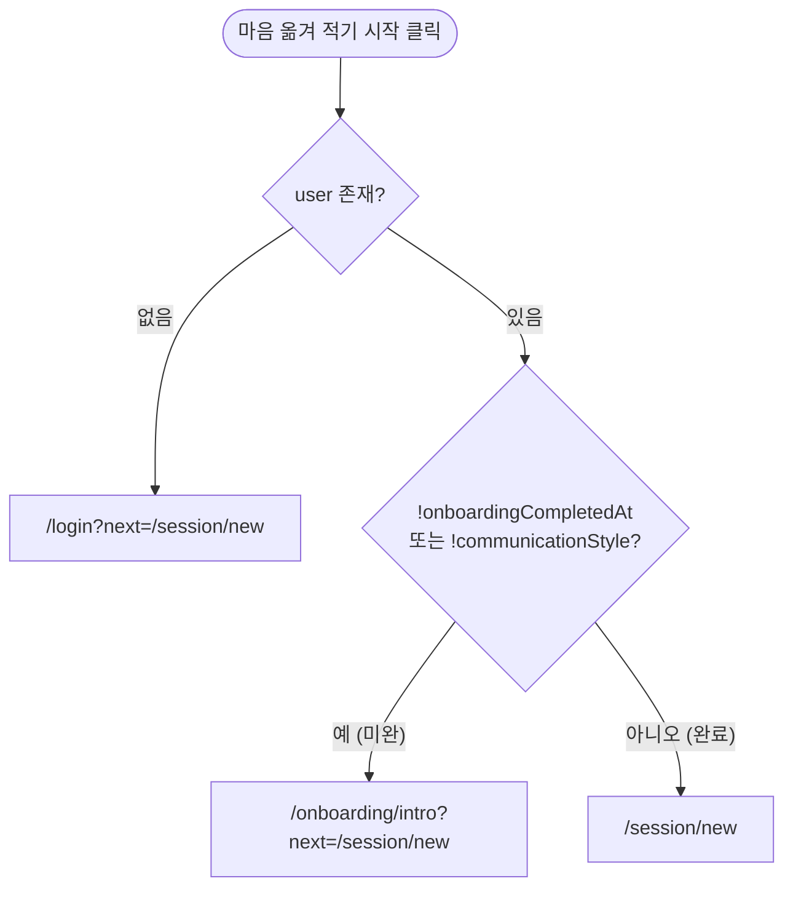
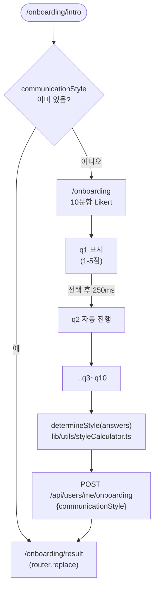
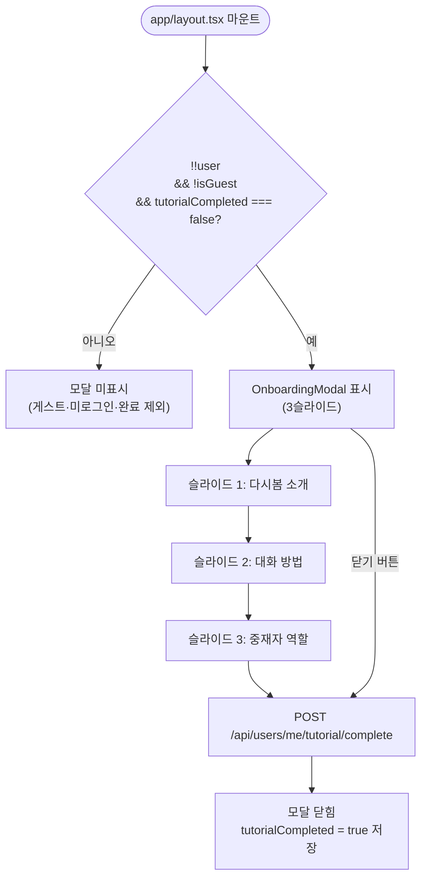

# 온보딩 흐름

**위치**: `frontend/docs/ux/flows/03-onboarding.md`  
**자매 문서**: [README.md](./README.md) · [04-mbti.md](./04-mbti.md) · [../principles.md](../principles.md)  
**기준일**: 2026-05-16  
**성격**: as-is 현행 기준

---

## 온보딩 게이트

`handleStartSession()` 내부에서 판별. 근거: `app/page.tsx:36-46`

게스트도 동일 게이트를 통과. `/guest` 페이지가 로그인 후 `/onboarding/intro`로 강제 이동시킴.  
`onboardingCompletedAt` · `communicationStyle` 둘 다 있어야 게이트 통과.

---

## 10문항 흐름

근거: `app/(onboarding)/onboarding/page.tsx`, `lib/constants/onboardingQuestions.ts`, `lib/utils/styleCalculator.ts`

**250ms 자동진행**: 답변 선택 즉시 타이머 → 다음 문항으로 이동. 사용자가 직접 넘기는 버튼 없음.

---

## 10문항 표

출처: `lib/constants/onboardingQuestions.ts`

| ID | 질문 요약 | 측정 축 |
|---|---|---|
| q1 | 갈등 시 시간을 두고 싶다 | withdrawal |
| q2 | 상대 격해지면 나도 올라온다 | emotional_flooding |
| q3 | 이유를 듣고 싶다 | logical_orientation |
| q4 | 감정 먼저 알아주면 풀린다 | empathy_priority |
| q5 | 서운함을 행동으로 보여준다 | expression_mode |
| q6 | 말투에 상처받는다 | tone_sensitivity |
| q7 | 구체적으로 잘못을 아는 게 중요하다 | apology_style |
| q8 | 갈등 중 농담이 도움된다 | repair_receptivity *(미사용)* |
| q9 | 중요한 이야기는 직접 만나야 한다 | channel_preference *(미사용)* |
| q10 | 말 안 해도 아는 것이 중요하다 | implicit_expectation |

**q8·q9 미사용**: `styleCalculator.ts` destructuring에서 해당 위치를 `,` 로 건너뜀.  
`const [q1, q2, q3, q4, q5, q6, q7, , , q10] = answers;`

---

## 6스타일 점수 산식

출처: `lib/utils/styleCalculator.ts:15-22`

| 스타일 | 산식 (answers 1-5 기반) |
|---|---|
| wave (파도형) | `(((6-q1) + q2 + (6-q5)) / 3) × 2` |
| mountain (산형) | `((q1 + (6-q2)) / 2) × 2` |
| flame (불꽃형) | `((q3 + (6-q5) + (6-q6)) / 3) × 2` |
| leaf (이파리형) | `((q4 + q6) / 2) × 2` |
| moon (달빛형) | `((q5 + q10) / 2) × 2` |
| star (별빛형) | `((q3 + q7) / 2) × 2` |

**동점 처리**: `Object.entries(axes).sort((a,b)=>b[1]-a[1])[0]` — 삽입 순서 기준.  
우선순위: wave > mountain > flame > leaf > moon > star.

---

## 6스타일 상세

출처: `lib/constants/communicationStyles.ts`

| ID | 한국어 | 색상 | 설명 |
|---|---|---|---|
| wave | 파도형 | #60A5FA | 감정 표현이 풍부하고 즉각적 |
| mountain | 산형 | #78716C | 차분하고 거리를 두고 생각 |
| flame | 불꽃형 | #F87171 | 직설적이고 명확함 선호 |
| leaf | 이파리형 | #4ADE80 | 조화와 공감 중시 |
| moon | 달빛형 | #A78BFA | 말보다 분위기·행동으로 표현 |
| star | 별빛형 | #FBBF24 | 논리와 이유 중시 |

**조합 인사이트**: `STYLE_COMBINATION_INSIGHTS` — 5개 키(wave-mountain, wave-flame, mountain-flame, leaf-star, moon-wave). 36조합 전부가 아님 (알려진 불일치 #2).

---

## 30초 튜토리얼 모달

근거: `components/onboarding/OnboardingModal.tsx`, `app/layout.tsx`

**조건**: 회원(`!isGuest`) 전용. 게스트 제외. `tutorialCompleted` 상태는 BE에 저장됨 (Flyway V24 `tutorial_completed_at`).  
3슬라이드 dot indicator 표시. 슬라이드 완료 또는 닫기 버튼 → `POST /api/users/me/tutorial/complete`.

---

## 근거 파일

- `app/page.tsx` — 온보딩 게이트 (`handleStartSession`)
- `app/(onboarding)/onboarding/intro/page.tsx` — intro 분기
- `app/(onboarding)/onboarding/page.tsx` — 10문항 Likert 화면
- `app/(onboarding)/onboarding/result/page.tsx` — 스타일 카드
- `lib/constants/onboardingQuestions.ts` — 10문항 정의
- `lib/constants/communicationStyles.ts` — 6스타일 정의
- `lib/utils/styleCalculator.ts` — `calculateStyleAxes()` · `determineStyle()`
- `components/onboarding/OnboardingModal.tsx` — 30초 튜토리얼 모달
