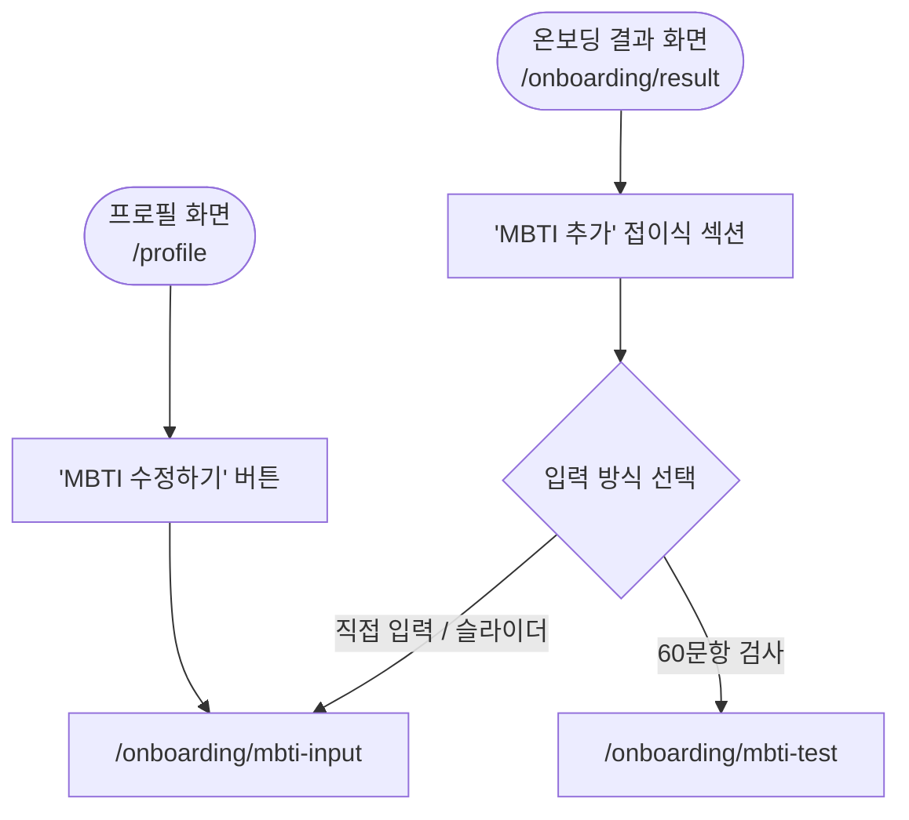
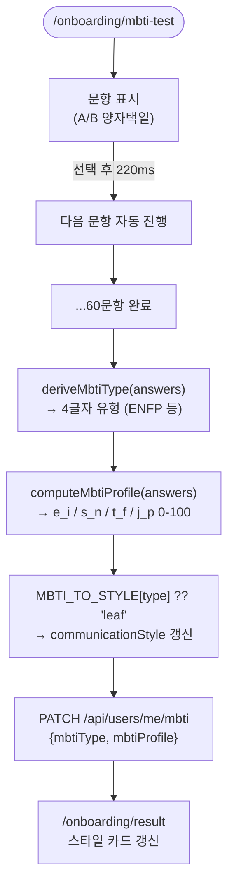
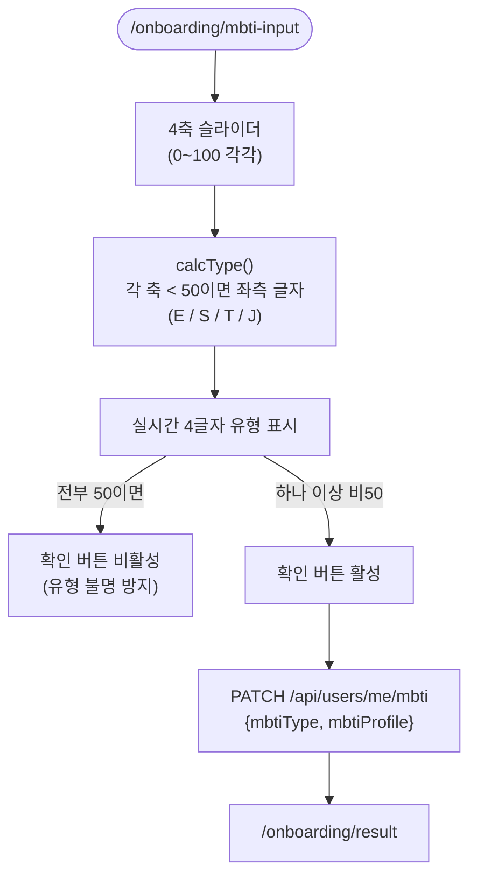

# MBTI 흐름

**위치**: `frontend/docs/ux/flows/04-mbti.md`  
**자매 문서**: [README.md](./README.md) · [03-onboarding.md](./03-onboarding.md) · [../principles.md](../principles.md)  
**기준일**: 2026-05-16  
**성격**: as-is 현행 기준

---

## 개요

MBTI 설정은 **항상 선택 사항**이다. 온보딩 10문항과 별개로 진행.  
결과는 `communicationStyle`을 보강하는 참고 데이터이며, 온보딩 게이트와는 별도 경로.

---

## 진입 경로

근거: `app/(onboarding)/onboarding/result/page.tsx`, `app/(dashboard)/profile/page.tsx`

`/onboarding/mbti-input`: 수동 슬라이더 입력 페이지.  
`/onboarding/mbti-test`: 60문항 자동 검사 페이지.

---

## 60문항 검사 흐름

근거: `app/(onboarding)/onboarding/mbti-test/page.tsx`, `lib/constants/mbtiMapping.ts`

**15×4축**: EI 15문항 · SN 15문항 · TF 15문항 · JP 15문항.  
**220ms 자동진행**: 답변 선택 즉시 타이머 → 다음 문항. 직접 넘기는 버튼 없음.  
**동점 처리** (`deriveMbtiType`): 동점이면 첫 번째 글자 우선 (E>=I → E, S>=N → S, T>=F → T, J>=P → J).

---

## 수동 슬라이더 흐름

근거: `app/(onboarding)/onboarding/mbti-input/page.tsx`, `components/onboarding/MbtiAxisSlider.tsx`

4축: `e_i` (0=E, 100=I) · `s_n` (0=S, 100=N) · `t_f` (0=T, 100=F) · `j_p` (0=J, 100=P).  
`calcType()`: 각 축 값 < 50이면 좌측 문자 반환.

---

## 16유형 → 6스타일 매핑

출처: `lib/constants/mbtiMapping.ts` `MBTI_TO_STYLE`

| 스타일 | MBTI 유형 |
|---|---|
| wave (파도형) | ENFP · ENFJ · ESFP |
| leaf (이파리형) | ESFJ · INFP · ISFJ |
| moon (달빛형) | INFJ · ISFP |
| flame (불꽃형) | ENTJ · ENTP · ESTP |
| star (별빛형) | ESTJ · INTP |
| mountain (산형) | INTJ · ISTJ · ISTP |

매핑에 없는 유형은 `'leaf'` 기본값 반환 (`MBTI_TO_STYLE[type] ?? 'leaf'`).  
모든 16유형이 위 표에 포함되어 있어 기본값 적용 케이스 없음.

---

## 60문항 축별 구성

출처: `lib/constants/mbtiMapping.ts` `MBTI_TEST_QUESTIONS`

| 축 | ID 범위 | 문항 수 | 내용 |
|---|---|---|---|
| EI (외향·내향) | ei1~ei15 | 15 | 에너지 방향, 사회성 |
| SN (감각·직관) | sn1~sn15 | 15 | 정보 처리 방식 |
| TF (사고·감정) | tf1~tf15 | 15 | 의사결정 기준 |
| JP (판단·인식) | jp1~jp15 | 15 | 생활 방식·계획성 |

옵션 A → 앞 글자 (E/S/T/J), 옵션 B → 뒷 글자 (I/N/F/P).

---

## 근거 파일

- `app/(onboarding)/onboarding/mbti-test/page.tsx` — 60문항 검사
- `app/(onboarding)/onboarding/mbti-input/page.tsx` — 수동 슬라이더
- `app/(onboarding)/onboarding/result/page.tsx` — MBTI 추가 접이식 섹션
- `lib/constants/mbtiMapping.ts` — `MBTI_TEST_QUESTIONS` · `MBTI_TO_STYLE` · `deriveMbtiType()` · `computeMbtiProfile()`
- `components/onboarding/MbtiAxisSlider.tsx` — 4축 슬라이더 컴포넌트
