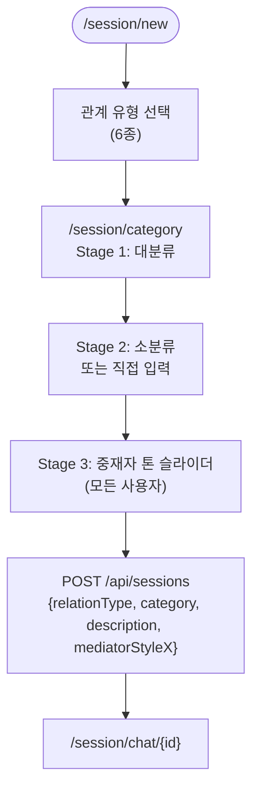
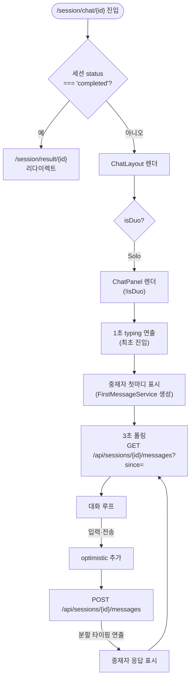
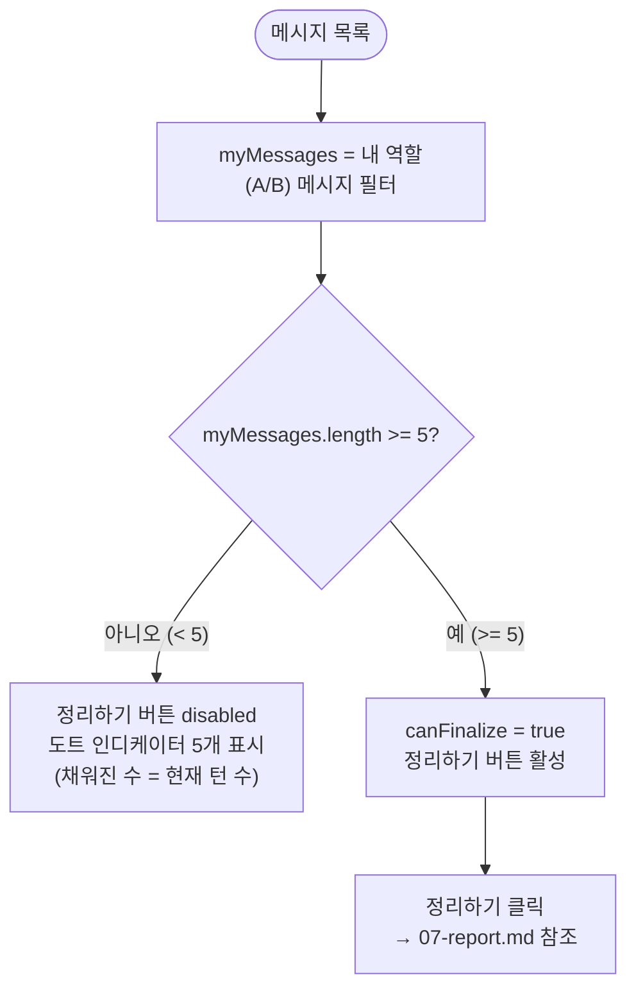

# 세션 생성 및 Solo 대화

**위치**: `frontend/docs/ux/flows/05-session-chat.md`  
**자매 문서**: [README.md](./README.md) · [06-duo.md](./06-duo.md) · [07-report.md](./07-report.md) · [08-crisis.md](./08-crisis.md)  
**기준일**: 2026-05-16  
**성격**: as-is 현행 기준

---

## 세션 생성 흐름

근거: `app/session/new/page.tsx`, `app/session/category/page.tsx`

**관계 유형 6종**: `romance`, `marriage`, `friend`, `coworker`, `parent_child`, `korean_specific`.

---

## 카테고리 선택 3단계 (Stage 머신)

근거: `app/session/category/page.tsx:19-252`, `lib/constants/categories.ts`

| Stage | 화면 | 내용 |
|---|---|---|
| 1 | 대분류 | relationType에 1:1 매핑된 주요 카테고리 목록 |
| 2 | 소분류 + 직접입력 | 대분류 하위 항목, "직접 입력" 옵션 포함 |
| 3 | 중재자 톤 슬라이더 | `stylePicksPerSession = perms.mediator.styleSource === 'per_session'` — 현행 모든 tier가 `per_session`이므로 항상 표시 |

**카테고리 구조**: `majorId` (대분류) · `middleId` (소분류) · `minorId` / `customText` (상세).  
`categories.ts`에 `hint` 필드 없음 — label 직접 노출 (알려진 불일치 #3).

---

## 중재자 톤 설정

- `user.mediatorDefaultX` 있으면 해당 값으로 슬라이더 초기화, 없으면 `perms.mediator.defaultStyleX` (50).
- Stage 3에서 사용자가 조정 → `POST /api/sessions`에 `mediatorStyleX` 포함.
- 모든 사용자 tier의 `styleSource === 'per_session'`이므로 Stage 3는 항상 표시됨.

---

## Solo 대화 흐름

근거: `components/chat/ChatLayout.tsx`, `components/chat/ChatPanel.tsx`, `components/chat/ChatInput.tsx`

**3초 폴링**: `GET /api/sessions/{id}/messages?since={lastMessageTimestamp}`. 새 메시지만 수신.  
**optimistic**: 전송 즉시 메시지를 로컬에 추가 후 BE 응답으로 확정.  
**분할 타이핑**: 중재자 응답이 도착하면 문자 단위로 타이핑 연출.

---

## 5턴 게이트

근거: `components/chat/ChatPanel.tsx:213`

`canFinalize = myMessages.length >= 5` (코드 확인: `ChatPanel.tsx:213`).  
도트 인디케이터: 5개 중 완료된 수만큼 채움. 5개 미만이면 "몇 번 더 이야기하면 정리할 수 있어요" 툴팁.

---

## 위기 감지 연동

대화 중 위기 키워드 감지 시 → [08-crisis.md](./08-crisis.md) 참조.

- **FE**: `ChatInput.tsx` — `checkKeywords(text)` level1 → 전송 차단 + `CrisisModal`
- **BE**: 서버 응답 `crisisLevel === 1` 또는 HTTP 409 → optimistic 제거 + `CrisisModal`

---

## 근거 파일

- `app/session/new/page.tsx` — 관계 유형 선택
- `app/session/category/page.tsx` — 3단계 카테고리 선택 + Stage 머신
- `components/chat/ChatLayout.tsx` — 레이아웃 + isDuo 분기
- `components/chat/ChatPanel.tsx` — 대화 루프 + 5턴 게이트 (`canFinalize`)
- `components/chat/ChatHeader.tsx` — 헤더 (SOS 버튼, 정리하기)
- `components/chat/ChatInput.tsx` — 입력 + 위기 감지
- `lib/constants/categories.ts` — 카테고리 트리
