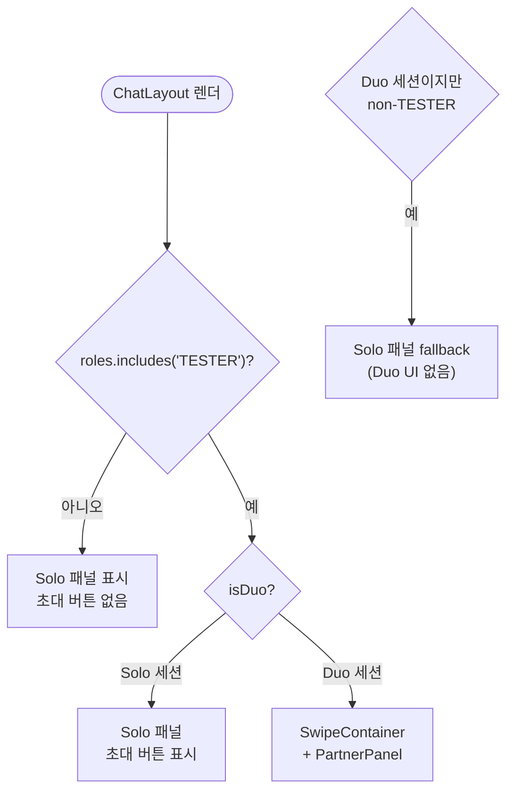
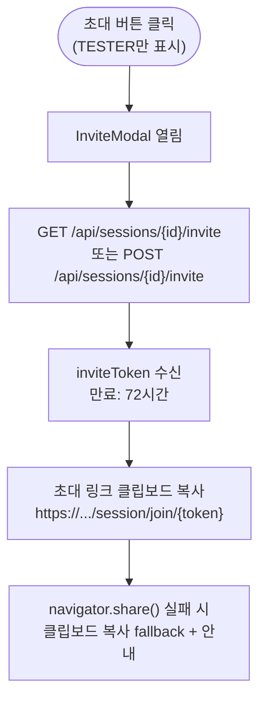
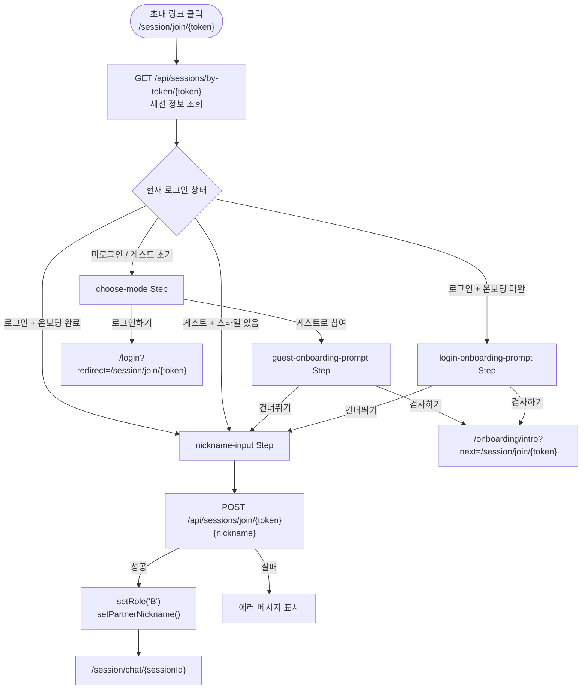
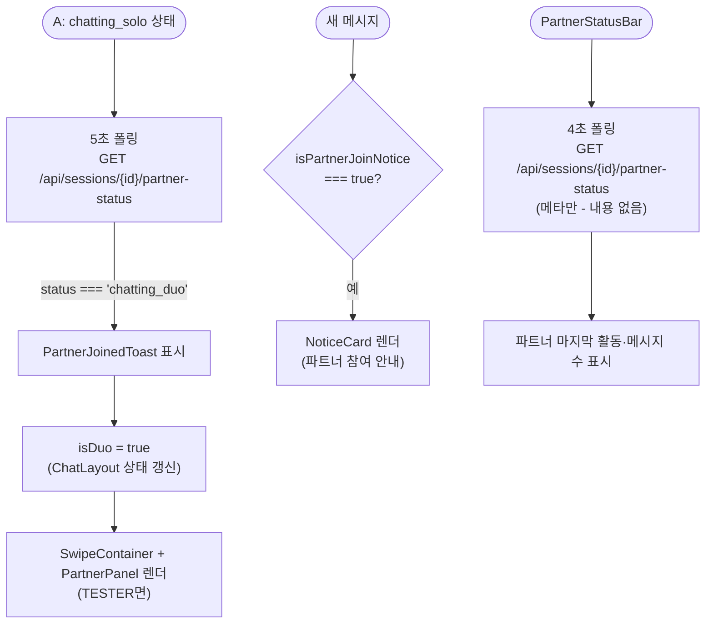

# Duo 흐름

**위치**: `frontend/docs/ux/flows/06-duo.md`  
**자매 문서**: [README.md](./README.md) · [05-session-chat.md](./05-session-chat.md) · [02-permissions.md](./02-permissions.md)  
**기준일**: 2026-05-16  
**성격**: as-is 현행 기준

---

## TESTER 게이팅

근거: `components/chat/ChatLayout.tsx:31-114`

**FE에 `app.features.duo-mode` flag 없음** — 알려진 불일치 #4.  
BE는 feature flag OR TESTER role 이중 검증. FE는 TESTER role 단독으로 판별.

`isDuo = session.status === 'chatting_duo'` (실제 세션 상태 기준).

---

## 초대 흐름

근거: `components/chat/InviteModal.tsx`, `components/chat/ChatLayout.tsx:114`

초대 링크: `/session/join/{inviteToken}`. 만료 72시간.

---

## 참여 흐름 (B측)

근거: `app/session/join/[token]/page.tsx`

**Step 타입**: `'landing' | 'choose-mode' | 'guest-onboarding-prompt' | 'login-onboarding-prompt' | 'nickname-input'`

---

## 참여 실패 코드

| 에러 코드 | 메시지 |
|---|---|
| `INVITE_TOKEN_INVALID` | 초대 링크가 유효하지 않아요. |
| `INVITE_TOKEN_EXPIRED` | 초대 링크가 만료됐어요. |
| `SESSION_ALREADY_JOINED` | 이미 다른 분이 참여한 대화예요. |
| `SESSION_INVALID_STATE` | 현재 참여할 수 없는 대화예요. |
| `SESSION_SELF_JOIN_FORBIDDEN` | 본인이 만든 대화에는 참여할 수 없어요. |

---

## Solo → Duo 전이

근거: `components/chat/ChatLayout.tsx`, `components/chat/PartnerStatusBar.tsx`

**A 측 5초 폴링**: `chatting_solo → chatting_duo` 상태 변화 감지.  
**PartnerStatusBar 4초 폴링**: 파트너 메타(마지막 활동 시각, 메시지 수)만 조회. 파트너 메시지 내용은 별도 폴링.

---

## 게스트 초대 참여 (inviteToken 재사용)

근거: `app/session/join/[token]/page.tsx:20-42`

동일 초대 링크로 여러 번 접속해도 동일한 Guest ID 반환 (재접속 일관성).  
`localStorage` `again-spring-guest-map` 에 `{ [inviteToken]: { guestId, jwtToken } }` 저장.  
서버도 동일 inviteToken → 동일 guestId 반환 (`mocks/handlers/user.ts` `GUEST_SESSIONS` 맵).

---

## 근거 파일

- `components/chat/ChatLayout.tsx` — TESTER 분기 + isDuo 상태 + PartnerStatusBar
- `components/chat/InviteModal.tsx` — 초대 모달
- `components/chat/SwipeContainer.tsx` — Duo 스와이프 UI
- `components/chat/PartnerPanel.tsx` — 파트너 패널
- `components/chat/PartnerStatusBar.tsx` — 파트너 상태 바 (4초 폴링)
- `app/session/join/[token]/page.tsx` — 참여 페이지 (Step 머신)
