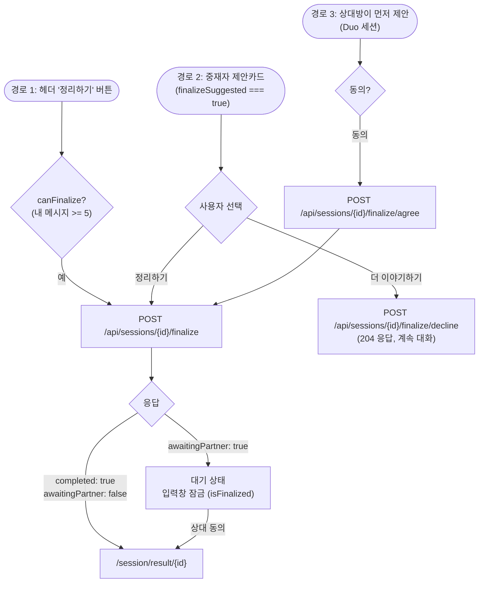
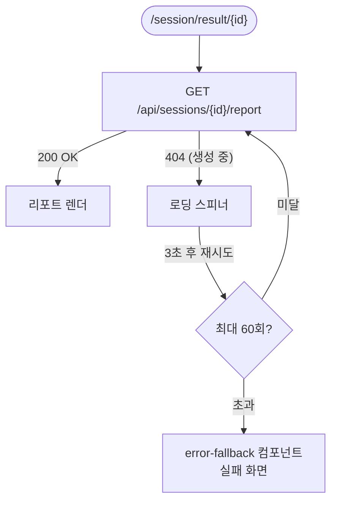
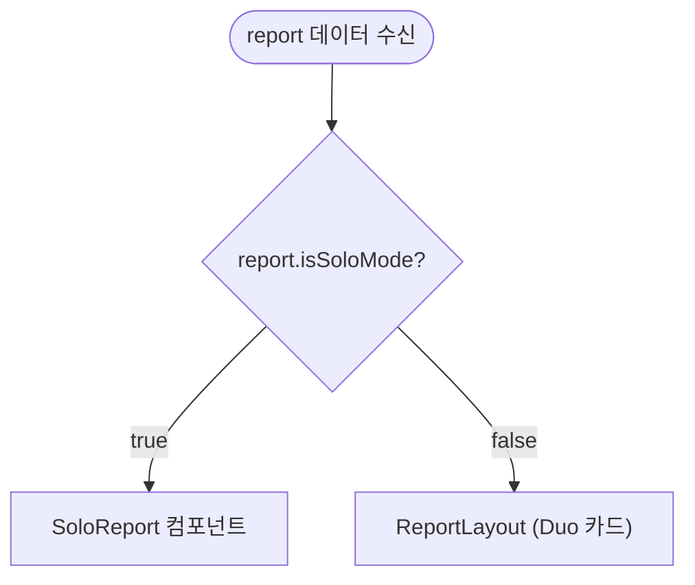
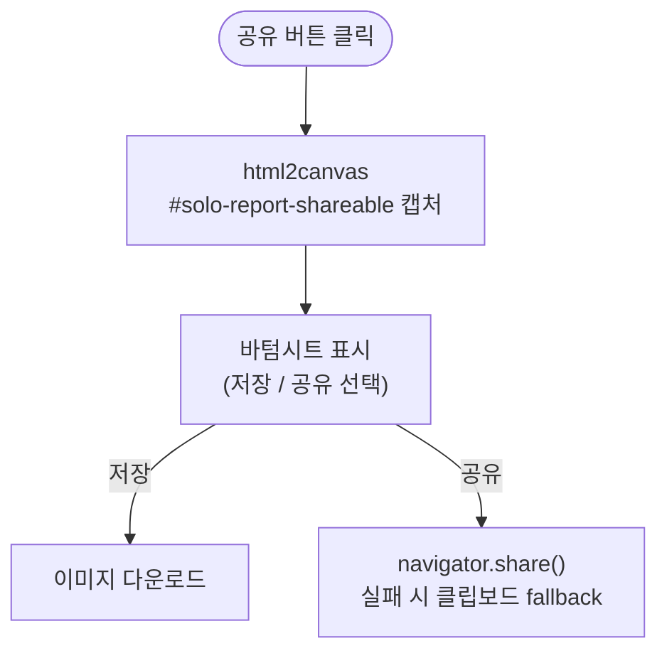

# 리포트 흐름

**위치**: `frontend/docs/ux/flows/07-report.md`  
**자매 문서**: [README.md](./README.md) · [05-session-chat.md](./05-session-chat.md) · [06-duo.md](./06-duo.md) · [08-crisis.md](./08-crisis.md)  
**기준일**: 2026-05-16  
**성격**: as-is 현행 기준

---

## finalize 트리거 3경로

근거: `components/chat/ChatPanel.tsx`, `components/chat/ChatHeader.tsx`

---

## 리포트 폴링

근거: `app/session/result/[id]/page.tsx`

최대 대기: 3초 × 60회 = 180초. 생성 실패 시 fallback 화면 표시.

---

## Solo / Duo 렌더 분기

근거: `app/session/result/[id]/page.tsx`, `components/result/ReportLayout.tsx`

---

## Solo 리포트 구성 (V12)

근거: `components/result/solo/SoloReport.tsx`

| 순서 | 섹션 | 내용 |
|---|---|---|
| 1 | 워터마크 | "다시봄 Solo 리포트" 로고 |
| 2 | coreSummary | 핵심 요약 텍스트 |
| 3 | SoloStageFlow | 갈등 4단계 흐름도 |
| 4 | metaphor | 중재자의 관계 비유 |
| 5 | NVC 4행 | 관찰·감정·욕구·요청 |
| 6 | 다음 행동 | 제안 행동 목록 |
| 7 | 외부 자원 | 위기 자원 핫라인 (항상 표시) |

---

## Duo 리포트 구성

근거: `components/result/ReportLayout.tsx`, `components/result/`

| 순서 | 섹션 | 내용 |
|---|---|---|
| 1 | NeedsMap + StatusDot | A·B 욕구 맵, 거리 수준 1-5 |
| 2 | Metaphor | 관계 비유 |
| 3 | ContributionRatio | 화해 기여도 (법적 안내 박스 항상 표시) |
| — | powerImbalanceDetected 시 | ContributionRatio 대신 위기 박스 대체 |
| 4 | NVC × 2 | A측 + B측 각각 4행 |
| 5 | RepairSuggestions | 회복 제안 |
| 6 | 푸터 | 위기 자원 핫라인 (항상 표시) |

**ContributionRatio 법적 안내 박스**: "과실비율과 무관합니다" 박스는 항상 표시 (UX 절대 불변 규칙).  
`powerImbalanceDetected === true`이면 ContributionRatio 컴포넌트 대신 위기 박스가 렌더됨.

---

## 공유 캡처 (V12)

근거: `components/result/solo/SoloReport.tsx`

Solo 캡처 대상: `#solo-report-shareable` div (워터마크 포함).  
Duo 변형탭: 일부 공유 기능은 `alert` placeholder 상태 (미완).

---

## 근거 파일

- `app/session/result/[id]/page.tsx` — 결과 페이지 진입 + 폴링
- `components/result/ReportLayout.tsx` — Duo 리포트 레이아웃
- `components/result/solo/SoloReport.tsx` — Solo 리포트 + 캡처
- `components/result/NeedsMap.tsx` — 욕구 맵
- `components/result/ContributionRatio.tsx` — 기여도 + 법적 안내 박스
- `components/result/RepairSuggestions.tsx` — 회복 제안
- `components/icons/StatusDot.tsx` — 거리 수준 SVG (1-5)
