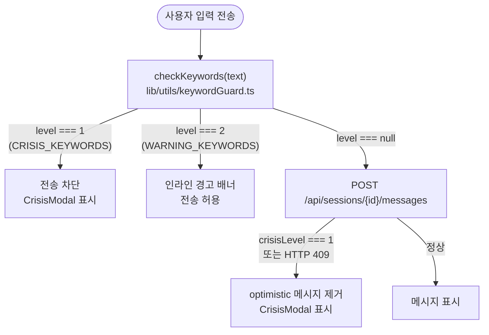
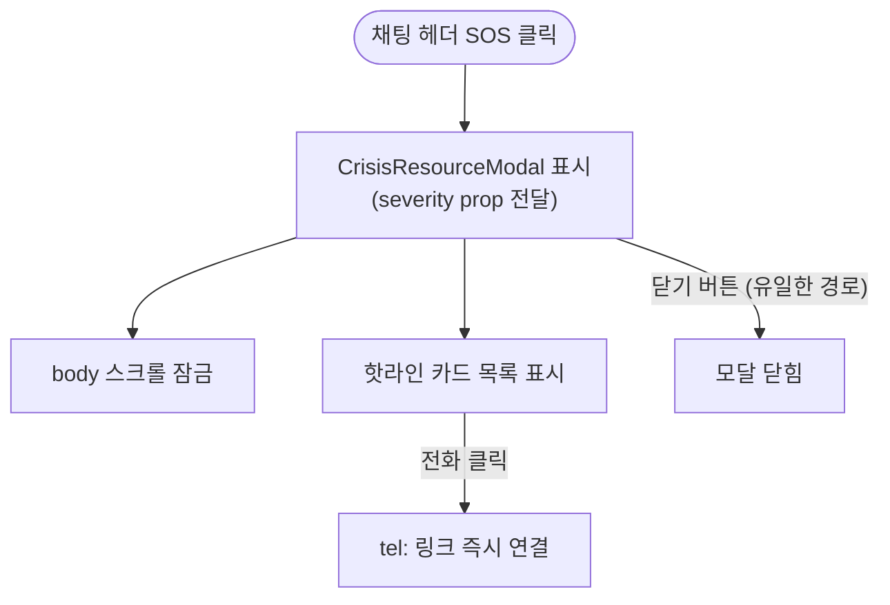

# 위기 감지 흐름

**위치**: `frontend/docs/ux/flows/08-crisis.md`  
**자매 문서**: [README.md](./README.md) · [05-session-chat.md](./05-session-chat.md) · [07-report.md](./07-report.md)  
**기준일**: 2026-05-16  
**성격**: as-is 현행 기준

---

## 절대 불변 규칙

아래 두 규칙은 코드에서 되돌리지 않는다 (UX 정책 — `docs/ux/principles.md`).

1. **CrisisModal · CrisisResourceModal 은 ESC·바깥클릭으로 닫히지 않는다.**  
   backdrop onClick·ESC keydown handler 추가 금지.

2. **FE(ChatInput) + BE(KeywordGuard) 이중 구현을 유지한다.**  
   클라이언트 우회 가능성을 가정. 어느 한쪽 제거 금지.

---

## (A) 입력 키워드 감지

근거: `components/chat/ChatInput.tsx`, `lib/utils/keywordGuard.ts`, `mocks/handlers/chat.ts`

`checkKeywords()`: 공백 제거 후 CRISIS_KEYWORDS → level 1, WARNING_KEYWORDS → level 2.  
BE 응답 `crisisLevel === 1` 또는 `status 409` → FE optimistic 롤백 + CrisisModal.

---

## 핫라인 목록

출처: `lib/constants/crisisResources.ts`

| 번호 | 기관 | 연결 |
|---|---|---|
| 1393 | 자살예방상담전화 | 24시간 |
| 1366 | 여성긴급전화 | 24시간 |
| 132 | 경찰 여성·청소년 상담 | — |
| 112 | 경찰 신고 | 24시간 |
| 1388 | 청소년 상담 | — |
| 1577-0199 | 학교폭력 신고 | — |

CrisisModal은 `tel:` 링크로 즉시 전화 연결. `sms:` 링크도 제공.

---

## (B) 헤더 SOS 버튼

근거: `components/chat/ChatHeader.tsx`, `components/shared/CrisisResourceModal.tsx`

ESC · 바깥 클릭 없음. 닫기 버튼 단일 경로.

---

## (C) 리포트 위기 박스

근거: `components/result/ReportLayout.tsx`, `components/result/ContributionRatio.tsx`

- `report.powerImbalanceDetected === true` → ContributionRatio 컴포넌트 대신 위기 박스 렌더
- 리포트 푸터: 위기 자원 핫라인 항상 표시 (Solo · Duo 공통)

---

## 이중 구현 명시

| 계층 | 구현체 | 감지 대상 |
|---|---|---|
| FE | `lib/utils/keywordGuard.ts` `checkKeywords()` | CRISIS_KEYWORDS (level 1) · WARNING_KEYWORDS (level 2) |
| BE | `KeywordGuard` (Java `safety/` 패키지) | 동일 정책 기준 (`shared/docs/policies/crisis-detection.md`) |

두 계층 모두 `shared/docs/policies/crisis-detection.md` 기준 적용.  
FE는 즉시 차단(전송 전), BE는 서버 측 검증(전송 후). 양쪽 모두 CrisisModal 트리거 가능.

---

## 근거 파일

- `components/chat/ChatInput.tsx` — FE 키워드 감지 + 전송 차단
- `components/chat/CrisisModal.tsx` — 위기 모달 (ESC/바깥클릭 없음)
- `components/shared/CrisisResourceModal.tsx` — SOS 모달 (ESC/바깥클릭 없음)
- `lib/utils/keywordGuard.ts` — `checkKeywords()` 구현
- `lib/constants/crisisResources.ts` — 핫라인 데이터
- `lib/constants/forbiddenWords.ts` — CRISIS_KEYWORDS · WARNING_KEYWORDS
- `shared/docs/policies/crisis-detection.md` — 위기 키워드 정책 권위본
