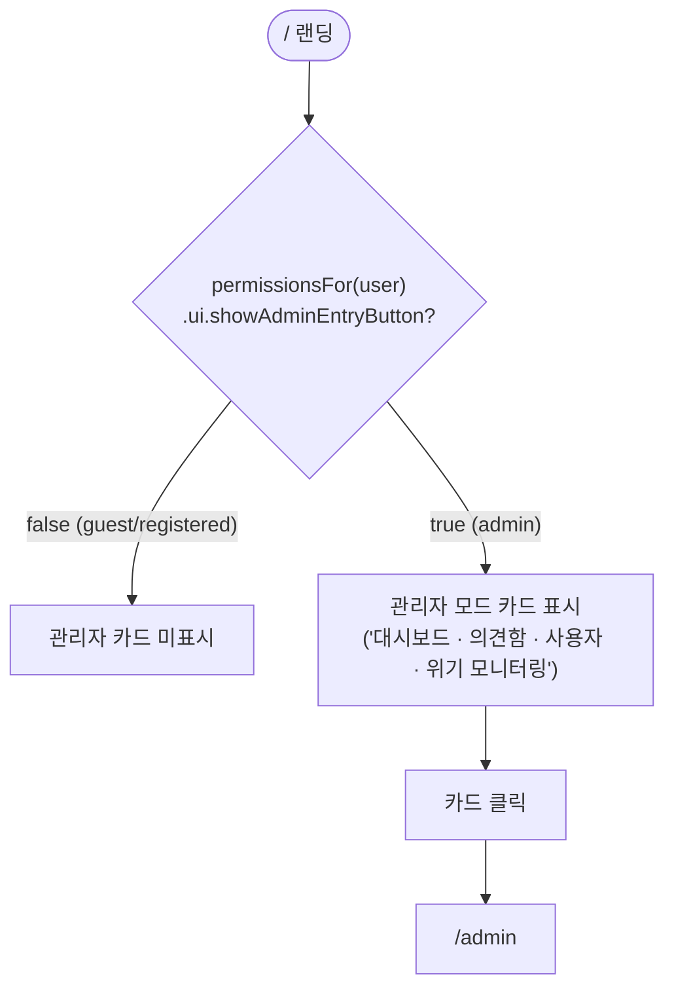
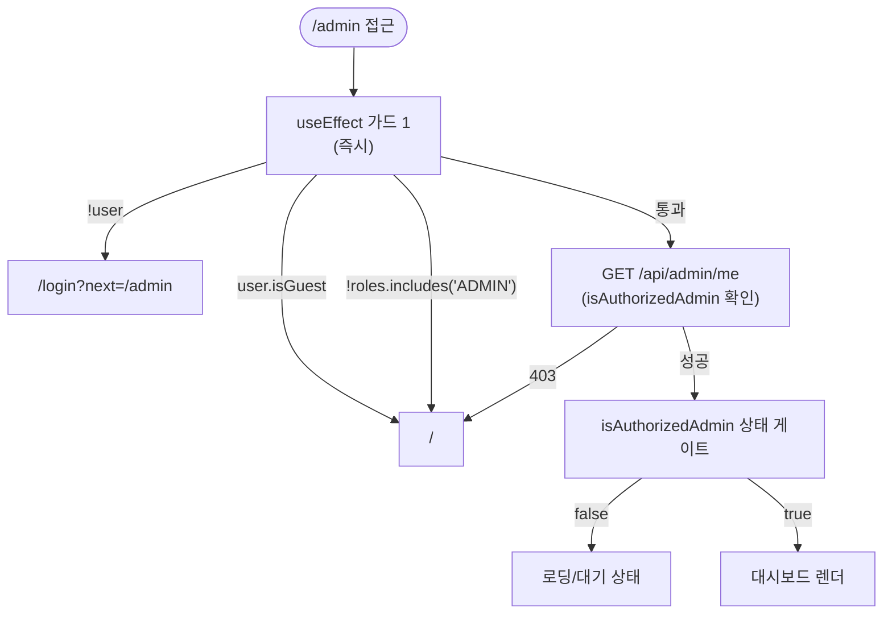
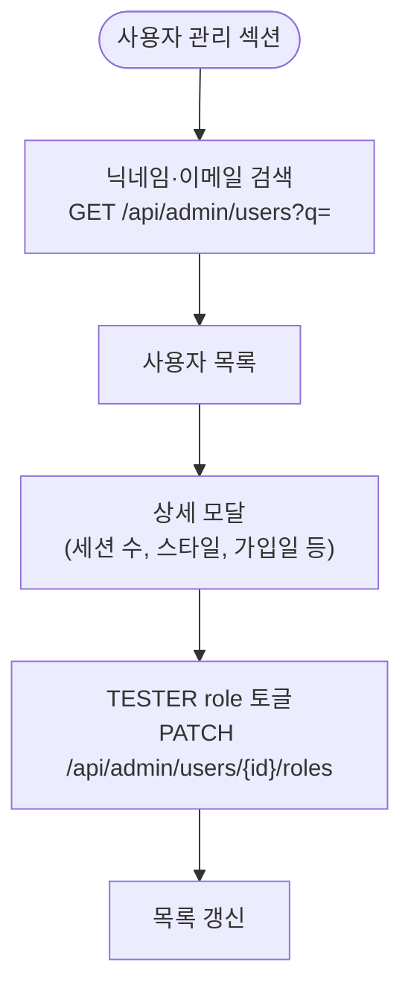

# 관리자 흐름

**위치**: `frontend/docs/ux/flows/09-admin.md`  
**자매 문서**: [README.md](./README.md) · [02-permissions.md](./02-permissions.md) · [../principles.md](../principles.md)  
**기준일**: 2026-05-16  
**성격**: as-is 현행 기준

---

## 진입

근거: `app/page.tsx:49,80-108`, `lib/constants/userPermissions.ts`

`showLandingChatEntry`: admin tier는 `false` → 일반 채팅 진입 버튼 미표시. 관리자 카드만 표시.

---

## 3중 가드

근거: `app/(admin)/admin/page.tsx`

가드 1 (useEffect): 클라이언트 상태 기반 즉시 리다이렉트.  
가드 2 (데이터): BE `/api/admin/me` 응답으로 실제 admin 권한 확인.  
가드 3 (렌더): `isAuthorizedAdmin === false`이면 대시보드 렌더 차단 (빈 화면 또는 `/` 리다이렉트).

---

## 대시보드 5섹션

근거: `app/(admin)/admin/page.tsx`

| 섹션 | 내용 | 폴링 |
|---|---|---|
| SystemHealth | CPU·메모리·DB·LLM 헬스 | — |
| 오늘 요약 | 오늘 세션 수·사용자 수·위기 건수 | — |
| 추세 차트 | 일별 세션·사용자 추이 (Recharts) | — |
| 위기 모니터 | 위기 감지 이벤트 목록 (본문 비노출) | 30초 |
| 의견함 | 사용자 피드백 목록, 상태 필터 (received/reviewed/closed) | — |
| 사용자 관리 | 검색 + TESTER role 토글 + 상세 모달 | — |

**위기 모니터 본문 비노출**: 위기 이벤트 메시지 내용은 노출하지 않음 (프라이버시 정책).  
**TESTER 토글**: `PATCH /api/admin/users/{id}/roles` — roles 배열에 'TESTER' 추가/제거.

---

## 사용자 관리 흐름

---

## 근거 파일

- `app/(admin)/admin/page.tsx` — 대시보드 전체 (3중 가드 + 5섹션)
- `app/page.tsx` — 관리자 진입 카드 (`showAdminEntryButton`)
- `lib/constants/userPermissions.ts` — admin tier 권한 정의
- `shared/docs/admin-dashboard.md` — 관리자 대시보드 기능·운영 가이드 (14개 API)
