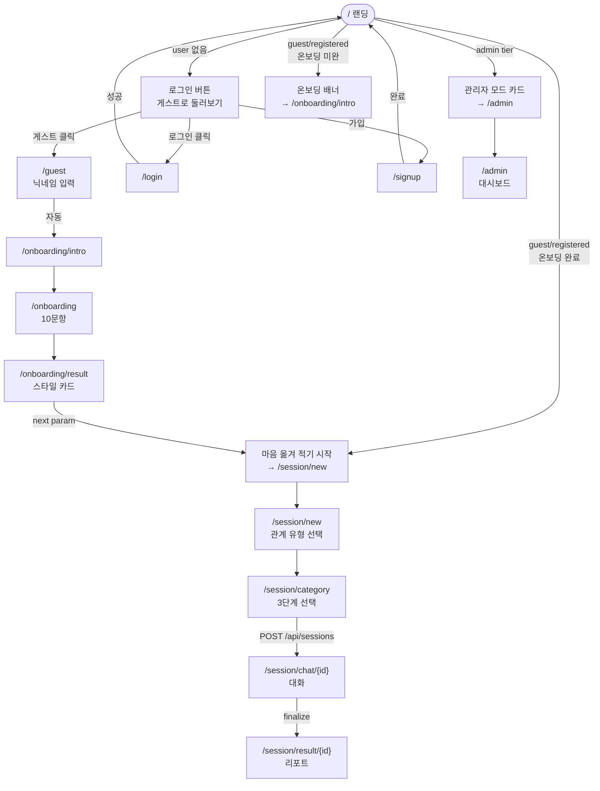

# UX 흐름 인덱스

**위치**: `frontend/docs/ux/flows/README.md`  
**자매 문서**: [../principles.md](../principles.md) · [../../architecture.md](../../architecture.md)  
**기준일**: 2026-05-16  
**성격**: as-is 현행 기준 — 실제 코드 동작 기준으로 서술. 개선 제안 없음.

---

## 파일 목록

| 파일 | 주제 |
|---|---|
| [01-auth.md](./01-auth.md) | 가입·로그인·게스트 진입·OAuth·비밀번호 |
| [02-permissions.md](./02-permissions.md) | guest/registered/admin 권한 + TESTER role + 라우트 가드 |
| [03-onboarding.md](./03-onboarding.md) | 10문항 Likert + 6스타일 매핑 + 30초 튜토리얼 모달 |
| [04-mbti.md](./04-mbti.md) | MBTI 수동 슬라이더 + 60문항 검사 + 진입 경로 |
| [05-session-chat.md](./05-session-chat.md) | 세션 생성·카테고리 선택·Solo 대화·5턴 게이트 |
| [06-duo.md](./06-duo.md) | 초대·참여·TESTER 게이팅·Solo→Duo 전이 |
| [07-report.md](./07-report.md) | finalize·Solo/Duo 리포트 구성·공유 캡처 |
| [08-crisis.md](./08-crisis.md) | 입력 키워드 감지·헤더 SOS·리포트 위기 박스 |
| [09-admin.md](./09-admin.md) | ADMIN 3중 가드·대시보드 5섹션 |

---

## 전체 진입 지도

---

## 권한 매트릭스

출처: `lib/constants/userPermissions.ts`

| 항목 | guest | registered | admin |
|---|---|---|---|
| **토큰 만료** | 2시간 | 24시간 | 24시간 |
| **이메일 인증 필요** | X | O | O |
| **온보딩 필수** | X | O | X |
| **일일 세션 한도** | 3 (IP 기준) | 5 (계정 기준) | 5 (계정 기준) |
| **메시지 턴 제한** | 3턴 | 없음 | 없음 |
| **Duo 모드 허용** | X | O | O |
| **파트너 초대** | X | O | O |
| **대화 이력 조회** | X | O | O |
| **메시지 보존** | 7일 | 30일 | 30일 |
| **세션 보존** | 30일 | 180일 | 180일 |
| **게스트 배지** | O | X | X |
| **한도 도달 업그레이드 모달** | O | X | X |
| **관리자 진입 버튼** | X | X | O |
| **랜딩 채팅 진입 버튼** | O | O | X |
| **이력 메뉴** | X | O | X |
| **동의 재확인 모달** | X | O | O |
| **중재자 톤 설정** | per_session | per_session | per_session |
| **관리자 대시보드** | X | X | O |

**TESTER role**: tier가 아님. `user.roles` 배열 값. `permissionsFor()`로 판단되는 tier와 독립적.  
사용처: ChatLayout.tsx (Duo UI 게이팅) · admin 사용자 관리 토글.  
TESTER를 가진 registered 사용자는 registered 권한이지만 Duo 초대·SwipeContainer UI를 사용할 수 있음.

---

## 알려진 불일치

아래 4건은 기존 정책 문서와 실제 코드가 다른 지점이다. 본 flows/ 문서는 **실제 코드 기준**으로 서술하며, 기존 정책 문서(`shared/docs/policies/` 등)는 변경하지 않는다.

| # | 항목 | 기존 문서 | 실제 코드 | 본 문서 기준 |
|---|---|---|---|---|
| 1 | MBTI 문항 수 | `shared/docs/policies/onboarding.md` — 4문항 | `lib/constants/mbtiMapping.ts` — 60문항 (15×4축) | **60문항** |
| 2 | 스타일 조합 인사이트 | 36조합 (6×6) 가정 | `lib/constants/communicationStyles.ts` — 5개 키 (STYLE_COMBINATION_INSIGHTS) | **5개 조합** |
| 3 | V13 카테고리 힌트화 | 카테고리별 hint 메타데이터 존재 가정 | `lib/constants/categories.ts` — hint 필드 없음, label 직접 노출 | **hint 메타 없음** |
| 4 | Duo 게이팅 방식 | `app.features.duo-mode` flag | FE에 feature flag 없음. `user.roles.includes('TESTER')` 단독 판별 | **TESTER role** |
