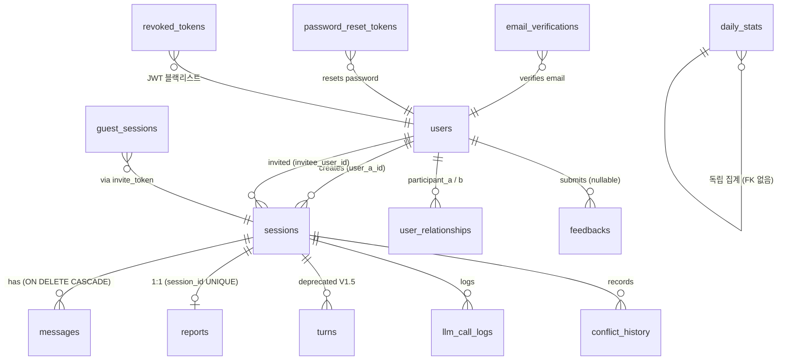

# 데이터베이스 스키마 (MariaDB 11)

## Source of truth

| 항목 | 위치 |
|---|---|
| Flyway 마이그레이션 | `backend/src/main/resources/db/migration/V*.sql` |
| JPA 엔티티 | `backend/src/main/java/com/againspring/domain/**` |
| Repository | `backend/src/main/java/com/againspring/repository/**` |

코드와 문서가 충돌하면 **마이그레이션 SQL이 옳습니다**.

## 환경

| 환경 | 호스트 | DB 이름 | 컨테이너 |
|---|---|---|---|
| local | localhost:3306 | `againspring` | `againspring-mariadb` |
| dev | dev 서버 internal + 호스트:3309 | `againspring_dev` | `againspring-mariadb-dev` |
| prod | prod 서버 internal only | `againspring` | `againspring-mariadb-prod` |

설정: `backend/src/main/resources/application*.yml` + `env/.env.{dev,prod}.example`
CHARSET: `utf8mb4` / COLLATION: `utf8mb4_unicode_ci` / TIMEZONE: `UTC`

> **프로파일 차이**: dev 프로파일은 Flyway disabled (Hibernate ddl-auto=update). prod 프로파일은 Flyway 적용 + ddl-auto=validate.

## Flyway 마이그레이션 흐름

```mermaid
flowchart LR
    V1["V1\n초기 스키마\nusers·sessions\nturns·reports"] -->
    V2["V2\nOAuth·게스트"] -->
    V3["V3\nemail_verifications"] -->
    V4["V4\npwd_reset\nrevoked_tokens"] -->
    V5["V5\ntemperature 제거"] -->
    V6["V6\nsolo_mode\nDEFAULT TRUE"] -->
    V7["V7\nmessages 신규\nV1.5 카톡식"] -->
    V8["V8\nhorsemen_history\nnvc_history"] -->
    V9["V9\nDuo 감정 강도"] -->
    V10["V10\nPhase D\nuser_state·issue·queue"] -->
    V11["V11\nmbti_type"] -->
    V12["V12\ndismissed_at\ninvite 인덱스"] -->
    V13["V13\nmbti_profile JSON"] -->
    V14["V14\nmediator_style x/y"]

    V14 -->
    V15["V15\ncrisis_level\nTINYINT→INT"] -->
    V16["V16\nfeedbacks 신규"] -->
    V17["V17\nuser 동의 시각\n4컬럼"] -->
    V18["V18\nADMIN 시드"] -->
    V19["V19\ndaily_stats 신규"] -->
    V20["V20\nmust_change\n_password"] -->
    V21["V21\nis_guest·onboarding\n_completed_at 보강"] -->
    V22["V22\nmediator_default_x"] -->
    V23["V23\nreports V12\n필드 11개"] -->
    V24["V24\ntutorial\n_completed_at"]

    style V7 fill:#e8f4f8
    style V10 fill:#fff3e0
    style V16 fill:#e8ffe8
    style V19 fill:#e8ffe8
```



| 버전 | 파일 | 핵심 변경 |
|---|---|---|
| V1 | `V1__init.sql` | 초기 스키마: users, sessions, turns, reports, user_relationships, conflict_history, llm_call_logs |
| V2 | `V2__add_oauth_and_guest.sql` | users에 `provider`, `provider_id` + email/password nullable + guest_sessions 신규 |
| V3 | `V3__add_email_verification.sql` | email_verifications 신규 |
| V4 | `V4__add_security_tables.sql` | password_reset_tokens, revoked_tokens 신규 |
| V5 | `V5__remove_temperature.sql` | temperature 컬럼 제거 + temperature_history 삭제 |
| V6 | `V6__solo_mode_default_true.sql` | sessions.solo_mode NOT NULL DEFAULT TRUE (V1.5 솔로-퍼스트 전환) |
| V7 | `V7__chat_messages.sql` | **V1.5**: messages 테이블 신규 + sessions 컬럼 6개 + turns deprecated |
| V8 | `V8__add_session_psychology_tracking.sql` | sessions에 `horsemen_history`, `nvc_completion_history`, `current_focus` |
| V9 | `V9__add_duo_balance_tracking.sql` | sessions에 `user_a/b_emotion_intensity` DECIMAL(3,2) |
| V10 | `V10__phase_d_context_algorithm.sql` | **Phase D**: sessions에 `user_state_history`, `issue_context`, `question_queue_a/b` |
| V11 | `V11__add_user_mbti_type.sql` | users에 `mbti_type` VARCHAR(8) NULL |
| V12 | `V12__finalize_dismiss_and_invite_index.sql` | messages에 `dismissed_at` + 인덱스 |
| V13 | `V13__add_user_mbti_profile.sql` | users에 `mbti_profile` JSON |
| V14 | `V14__add_mediator_style_to_sessions.sql` | sessions에 `mediator_style_x/y` TINYINT |
| V15 | `V15__fix_crisis_level_column_type.sql` | messages.crisis_level TINYINT → INT |
| V16 | `V16__add_feedbacks.sql` | **feedbacks 테이블 신규** (V10 베타 의견 수집) |
| V17 | `V17__add_user_consent.sql` | users에 `terms/privacy/disclaimer/marketing_agreed_at` 4컬럼 |
| V18 | `V18__seed_admin_role.sql` | 초기 ADMIN 계정 역할 시드 (멱등) |
| V19 | `V19__add_daily_stats.sql` | **daily_stats 테이블 신규** (PMF 지표 집계) |
| V20 | `V20__add_must_change_password.sql` | users에 `must_change_password` BOOLEAN |
| V21 | `V21__ensure_user_columns.sql` | `is_guest`, `onboarding_completed_at` idempotent 보강 |
| V22 | `V22__add_user_mediator_default_x.sql` | users에 `mediator_default_x` INT NULL |
| V23 | `V23__add_report_v12_fields.sql` | reports에 V12 Solo 리포트 필드 11개 추가 |
| V24 | `V24__add_tutorial_completed_at.sql` | users에 `tutorial_completed_at` TIMESTAMP NULL |

## 테이블 관계도 (ERD)



| 테이블 | 역할 | PK | Flyway |
|---|---|---|---|
| `users` | 회원/게스트 계정 | VARCHAR(32) | V1~V24 |
| `sessions` | 중재 세션 메타 | VARCHAR(32) | V1~V14 |
| `messages` | 카톡 메시지 | BIGINT auto | V7,V12,V15 |
| `turns` | **[DEPRECATED V1.5]** 구 턴 구조 | BIGINT auto | V1 |
| `reports` | 분석 리포트 | VARCHAR(32) | V1,V5,V23 |
| `feedbacks` | 사용자 의견 | BIGINT auto | **V16** |
| `daily_stats` | 일별 PMF 집계 | BIGINT auto | **V19** |
| `user_relationships` | A-B 관계 집계 | BIGINT auto | V1,V5 |
| `conflict_history` | 세션 이력 | BIGINT auto | V1,V5 |
| `llm_call_logs` | LLM 감사 로그 | BIGINT auto | V1 |
| `guest_sessions` | 초대 게스트 ID 지속성 | BIGINT auto | V2 |
| `email_verifications` | 이메일 인증 코드 | BIGINT auto | V3 |
| `password_reset_tokens` | 비밀번호 재설정 | BIGINT auto | V4 |
| `revoked_tokens` | JWT 블랙리스트 | BIGINT auto | V4 |

## 핵심 테이블 상세

### `users` (V1 + V2 + V11 + V13 + V17 + V20~V24)

| 컬럼 | 타입 | Flyway | 비고 |
|---|---|---|---|
| `id` | VARCHAR(32) PK | V1 | ULID-style |
| `email` | VARCHAR(255) | V1/V2 | nullable (소셜 가입 시) |
| `password_hash` | VARCHAR(255) | V1/V2 | nullable (소셜/게스트) |
| `nickname` | VARCHAR(100) | V1 | 필수 |
| `provider` | VARCHAR(50) | V2 | google/kakao/naver/null |
| `provider_id` | VARCHAR(255) | V2 | OAuth provider user id |
| `is_guest` | BIT(1) | V21 | 게스트 계정 여부 |
| `roles` | JSON | V1 | `["USER"]` 기본. 가능 값: USER/TESTER/ADMIN |
| `communication_style` | VARCHAR(50) | V1 | wave/mountain/flame/leaf/moon/star |
| `onboarding_answers` | JSON | V1 | List<Integer> |
| `onboarding_completed_at` | DATETIME(6) | V21 | NULL이면 온보딩 미완료 |
| `mbti_type` | VARCHAR(8) | **V11** | 16유형 (선택, nullable) |
| `mbti_profile` | JSON | **V13** | 4축 비율 `{e_i,s_n,t_f,j_p}` 0~100 |
| `mediator_default_x` | INT | **V22** | 사용자 중재 스타일 X축 기본값 NULL=미설정 |
| `terms_agreed_at` | DATETIME(6) | **V17** | 이용약관 동의 시각 |
| `privacy_agreed_at` | DATETIME(6) | **V17** | 개인정보 처리방침 동의 시각 |
| `disclaimer_agreed_at` | DATETIME(6) | **V17** | 면책 고지 동의 시각 |
| `marketing_agreed_at` | DATETIME(6) | **V17** | 마케팅 수신 동의 (선택) |
| `must_change_password` | BOOLEAN | **V20** | 임시 비밀번호 강제 변경 플래그 |
| `tutorial_completed_at` | TIMESTAMP | **V24** | 30초 튜토리얼 완료 시각. NULL=미완료 |
| `deleted_at` | TIMESTAMP(3) | V1 | 소프트 삭제 |
| `created_at`, `updated_at` | TIMESTAMP(3) | V1 | |

### `sessions` (V1 + V7~V14)

| 컬럼 | 타입 | Flyway | 비고 |
|---|---|---|---|
| `id` | VARCHAR(32) PK | V1 | |
| `created_by_user_id` | VARCHAR(32) | V1 | A (세션 생성자) |
| `invitee_user_id` | VARCHAR(32) | V1 | B (회원이면) |
| `invitee_guest_name` | VARCHAR(100) | V1 | B가 게스트면 표시명 |
| `invite_token` | VARCHAR(64) UNIQUE | V1 | nullable |
| `invite_expires_at` | TIMESTAMP(3) | V1 | 24h |
| `relationship_type` | VARCHAR(32) | V1 | RelationType enum |
| `conflict_type` | VARCHAR(32) | V1 | factual/difference/mixed |
| `category` | JSON | V1 | `{major, middle, minor, customMinor?}` |
| `status` | VARCHAR(32) | V7 | chatting_solo/chatting_duo/awaiting_finalization/completed/terminated |
| `solo_mode` | BOOLEAN | V6/V7 | DEFAULT TRUE |
| `user_a_message_count` | INT | V7 | DEFAULT 0 |
| `user_b_message_count` | INT | V7 | DEFAULT 0 |
| `partner_joined_at` | TIMESTAMP(3) | V7 | Solo→Duo 전이 시각 |
| `finalize_agreed_by_a/b` | BOOLEAN | V7 | 정리 동의 여부 |
| `horsemen_history` | JSON | V8 | 턴별 4 Horsemen 강도 누적 |
| `nvc_completion_history` | JSON | V8 | 턴별 NVC 4단계 이력 |
| `current_focus` | VARCHAR(50) | V8 | early_grounding/deepen/perspective/solution |
| `user_a/b_emotion_intensity` | DECIMAL(3,2) | V9 | Duo 균형 0.00~1.00 |
| `user_state_history` | JSON | V10 | Phase D UserState 전이 이력 |
| `issue_context` | JSON | V10 | 누적 이슈 컨텍스트 4슬롯 |
| `question_queue_a/b` | JSON | V10 | A/B별 질문 우선순위 큐 |
| `mediator_style_x/y` | TINYINT UNSIGNED | V14 | 중재 스타일 0~100, DEFAULT 50 |
| `content_expires_at` | TIMESTAMP(3) | V1 | now+30일 (RetentionScheduler) |
| `crisis_flags` | JSON | V1 | List<String> |
| `completed_at` | TIMESTAMP(3) | V1 | |
| `created_at`, `updated_at` | TIMESTAMP(3) | V1 | |

### `messages` (V7, V12, V15 — 카톡식 대화)

| 컬럼 | 타입 | Flyway | 비고 |
|---|---|---|---|
| `id` | BIGINT auto PK | V7 | |
| `session_id` | VARCHAR(32) | V7 | FK → sessions ON DELETE CASCADE |
| `sender` | VARCHAR(32) | V7 | USER_A / USER_B / MEDIATOR_TO_A / MEDIATOR_TO_B |
| `content` | LONGTEXT | V7 | **30일 후 NULL** |
| `char_count` | INT | V7 | |
| `is_finalize_suggestion` | BOOLEAN | V7 | 종료 권유 메시지 표시 |
| `is_partner_join_notice` | BOOLEAN | V7 | Solo→Duo 전이 알림 |
| `dismissed_at` | TIMESTAMP | **V12** | 종료 권유 dismiss 시각 |
| `crisis_level` | INT | V7/V15 | NULL / 1(경고) / 2(위험) / 3(긴급) |
| `llm_model` | VARCHAR(50) | V7 | |
| `tokens_used` | INT | V7 | |
| `llm_latency_ms` | BIGINT | V7 | |
| `created_at` | TIMESTAMP(3) | V7 | |

### `turns` (V1 — **DEPRECATED V1.5 이후**)

V1.5 카톡식 전환 이후 신규 데이터는 `messages` 테이블에 저장됩니다.
`turns` 테이블은 기존 운영 데이터 보존용으로만 유지됩니다.

| 컬럼 | 타입 | 비고 |
|---|---|---|
| `id` | BIGINT auto PK | |
| `session_id` | VARCHAR(32) | FK → sessions ON DELETE CASCADE |
| `turn_number` | INT | 1~6 |
| `role` | VARCHAR(32) | A/B/MEDIATOR |
| `user_id` | VARCHAR(32) | nullable |
| `content` | LONGTEXT | **30일 후 NULL** |
| `mediator_message` | LONGTEXT | **30일 후 NULL** |
| `mediator_summary_for_opponent` | LONGTEXT | **30일 후 NULL** |
| `is_perspective_taking` | BOOLEAN | Turn 5,6 |
| `skipped` | BOOLEAN | |
| `tokens_used` | INT | |
| `llm_latency_ms` | BIGINT | |
| `created_at` | TIMESTAMP(3) | |

### `reports` (V1, V5, V23)

| 컬럼 | 타입 | Flyway | 비고 |
|---|---|---|---|
| `id` | VARCHAR(32) PK | V1 | |
| `session_id` | VARCHAR(32) UNIQUE | V1 | 1:1 |
| `participant_a`, `participant_b` | JSON | V1 | 닉네임 스냅샷 |
| `conflict_type` | VARCHAR(32) | V1 | |
| `solo_mode` | BOOLEAN | V1 | |
| `contribution_ratio` | JSON | V1 | `{a, b, label: {a, b}, rationale}` |
| `needs_map` | JSON | V1 | 욕구 차이 지도 |
| `four_horsemen` | JSON | V1 | 내부 점수 (UI 노출 없음) |
| `nvc_scripts` | JSON | V1 | aToB / bToA |
| `repair_suggestions` | JSON | V1 | List<String> |
| `a_pattern_feedback`, `suggested_approach`, `invite_again_cta` | LONGTEXT | V1 | Solo 모드 전용 |
| `status` | VARCHAR(20) | **V23** | OK / GENERATING / ERROR |
| `core_summary` | LONGTEXT | **V23** | 핵심 요약 문장 |
| `four_stage_flow` | JSON | **V23** | 갈등 전개 4단계 `[{stage, stageName, userQuote, interpretation}]` |
| `metaphor_id` | VARCHAR(100) | **V23** | 갈등 유형 비유 ID |
| `metaphor_display_name` | VARCHAR(100) | **V23** | 비유 표시명 |
| `metaphor_reason` | LONGTEXT | **V23** | 비유 선택 이유 |
| `nvc_observation` | LONGTEXT | **V23** | NVC 관찰 문장 |
| `nvc_feeling` | LONGTEXT | **V23** | NVC 감정 문장 |
| `nvc_need` | LONGTEXT | **V23** | NVC 욕구 문장 |
| `nvc_request` | LONGTEXT | **V23** | NVC 요청 문장 |
| `recommended_actions` | JSON | **V23** | `[{action, rationale, isUserChosen}]` |
| `external_resource_guidance` | JSON | **V23** | `{domain, resource, rationale}` |
| `created_at` | TIMESTAMP(3) | V1 | |

### `feedbacks` (V16 — 신규)

| 컬럼 | 타입 | 비고 |
|---|---|---|
| `id` | BIGINT auto PK | |
| `user_id` | VARCHAR(32) NULL | 게스트 제출 시 NULL |
| `session_id` | VARCHAR(32) NULL | 세션 연동 (선택) |
| `category` | VARCHAR(50) | ui_bug / feature / content / crisis / praise / other |
| `content` | TEXT | 피드백 본문 (최소 10자) |
| `contact_consent` | BOOLEAN | 연락 동의 여부 |
| `contact_email` | VARCHAR(255) NULL | consent=true 시만 저장 |
| `page_url` | VARCHAR(500) NULL | |
| `user_agent` | VARCHAR(500) NULL | |
| `metadata` | JSON NULL | 추가 자동 수집 정보 |
| `status` | VARCHAR(20) | pending / reviewed / resolved |
| `admin_note` | TEXT NULL | 관리자 처리 메모 |
| `created_at`, `updated_at` | DATETIME(6) | |

인덱스: `idx_feedbacks_user_id`, `idx_feedbacks_category`, `idx_feedbacks_status`, `idx_feedbacks_created_at`

### `daily_stats` (V19 — 신규)

| 컬럼 | 타입 | 비고 |
|---|---|---|
| `id` | BIGINT auto PK | |
| `stat_date` | DATE UNIQUE | KST 기준 날짜 |
| `dau` | INT | 일별 활성 사용자 |
| `new_users` | INT | 신규 가입자 |
| `guest_sessions` | INT | 게스트 세션 수 |
| `member_sessions` | INT | 회원 세션 수 |
| `completed_sessions` | INT | finalize 완료 세션 |
| `avg_turns` | DECIMAL(5,2) | 평균 턴 수 |
| `crisis_triggers` | INT | 위기 감지 횟수 |
| `feedback_count` | INT | 의견 제출 수 |
| `metadata` | JSON NULL | 추가 집계 데이터 |
| `created_at` | DATETIME(6) | |

`DailyStatsScheduler`(매일 01:00 UTC)가 전날 집계를 삽입합니다. `stat_date` UNIQUE 제약으로 중복 집계 방지.

### 나머지 테이블 (구조 변경 없음)

`user_relationships`·`conflict_history`·`llm_call_logs`·`guest_sessions`·`email_verifications`·`password_reset_tokens`·`revoked_tokens` — 구조는 이전 버전과 동일. 각 테이블 컬럼 상세는 V1~V4 SQL 참조.

## 마이그레이션 추가 절차

```bash
# 다음 버전 번호 확인 (현재 V24 → 다음 V25)
ls backend/src/main/resources/db/migration/

# V25__<descriptive_name>.sql 작성
$EDITOR backend/src/main/resources/db/migration/V25__add_xxx.sql

# dev에서 검증
cd env
docker compose -f docker-compose.dev.yml up -d --build
docker logs againspring-backend-dev | grep -i flyway
```

규칙:
- 파일명: `V<n>__<snake_case>.sql` (밑줄 두 개)
- ROLLBACK은 별도 마이그레이션으로 (Flyway Community는 undo 미지원)
- ALTER TABLE 시 `IF EXISTS` / `IF NOT EXISTS` 또는 idempotent 패턴 사용 (V21·V22 참조)
- **dev 프로파일은 Flyway 비활성** — dev에서 테이블 확인 후 prod 배포 전 반드시 Flyway 실행 검증

## 데이터 보존

자세한 정책은 [`../policies/data-retention.md`](../policies/data-retention.md). 핵심:

- `messages.content` → 30일 후 NULL (RetentionScheduler)
- `turns.{content, mediator_message, mediator_summary_for_opponent}` → 30일 후 NULL
- `reports` → 영구 보관
- `daily_stats` → 영구 보관 (집계 데이터)
- `users.deleted_at` → 소프트 삭제 (PII 즉시 익명화, GDPR 준수)
