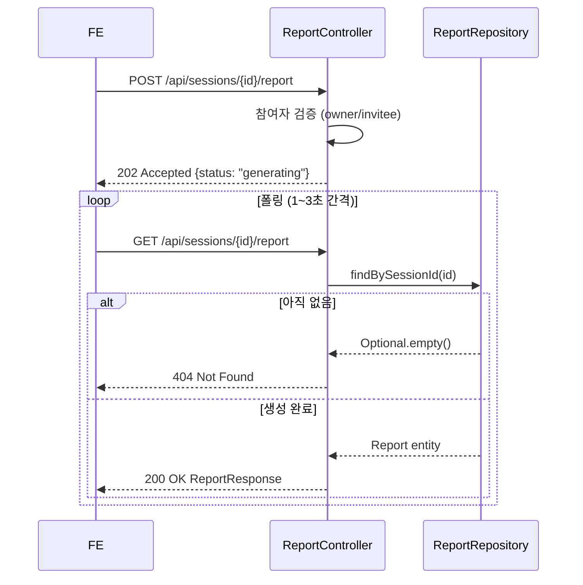

# Report API — 갈등 분석 리포트 생성·조회

> 대화가 완료된 세션에 대해 AI 분석 리포트를 생성하고 조회하는 API.
> 리포트 생성은 비동기(202 Accepted) — FE는 GET으로 폴링.

## Source of truth

| 항목 | 위치 |
|---|---|
| 컨트롤러 | `backend/src/main/java/com/againspring/api/ReportController.java` |
| 응답 DTO | `backend/src/main/java/com/againspring/api/dto/response/ReportResponse.java` |
| 도메인 | `backend/src/main/java/com/againspring/domain/Report.java` |
| DB 테이블 | `reports` (V1, V12/V23 필드 추가) |

## 엔드포인트

| Method | Path | Auth | 요청 | 응답 | 상태코드 |
|---|---|---|---|---|---|
| `POST` | `/api/sessions/{sessionId}/report` | JWT 필수 (세션 owner) | — | `{ reportId, status, estimatedSeconds }` | 202 / 400 / 403 |
| `GET` | `/api/sessions/{sessionId}/report` | JWT 필수 (참여자) | — | `ReportResponse` | 200 / 403 / 404 |
| `GET` | `/api/reports/{reportId}` | JWT 필수 (참여자) | — | `ReportResponse` | 200 / 403 / 404 |

### POST /api/sessions/{sessionId}/report — 리포트 생성 요청

```json
// 응답 (202 Accepted)
{
  "reportId": "generating",
  "status": "generating",
  "estimatedSeconds": 15
}
```

- 세션 참여자(owner/invitee) 만 호출 가능. 그 외 403.
- V1.5 현재 비동기 생성 로직은 TODO 상태 — 202 반환 후 GET 폴링.

### GET /api/sessions/{sessionId}/report — 세션 ID로 조회 (FE 주요 사용)

```json
// 응답 (200 OK) — ReportResponse 필드 요약
{
  "id": "rpt_xxxxx",
  "sessionId": "ses_xxxxx",
  "conflictType": "communication",
  "isSoloMode": false,
  "participantA": { "userId": "...", "nicknameSnapshot": "..." },
  "participantB": { "userId": "...", "nicknameSnapshot": "..." },
  "contributionRatio": { "a": 55, "b": 45, "rationale": "..." },
  "needsMap": { ... },
  "nvcScripts": { "aToB": { "observation": "...", "feeling": "...", "need": "...", "request": "..." }, ... },
  "repairSuggestions": [...],
  "coreSummary": "...",
  "fourStageFlow": [...],
  "metaphorId": "...",
  "recommendedActions": [...],
  "externalResourceGuidance": { ... },
  "status": "OK",
  "createdAt": "2026-05-01T10:00:00Z"
}
```

- 리포트 미생성 시 **404** — FE는 폴링 필요
- 세션 참여자 아닌 사용자 → **403**

## 리포트 생성 · 폴링 흐름



## 응답 특이사항

- `contributionRatio.a + b` 합계는 항상 100. 단순 수치이며 **법적 과실비율과 무관** (FE에서 안내 박스 필수 표시).
- `needsMap` 좌표 (axisX/Y, positionA/B): NVC 기반 욕구 시각화 — 0~100 범위.
- `fourStageFlow`: Solo 리포트에 적용. 갈등 전개 4단계 분석.
- `metaphorId` + `metaphorDisplayName`: 갈등 유형을 비유로 표현 (UI 카드형 표시용).
- `externalResourceGuidance`: 외부 전문 리소스 추천 (도메인별 상담 안내).

## 변경 시 절차

- 리포트 필드 추가: `Report.java` 엔티티 + Flyway 마이그레이션 + `ReportResponse.java` + 이 문서 동시 수정
- 생성 로직 구현: `ReportService` TODO 완료 후 컨트롤러의 "generating" 분기 교체
