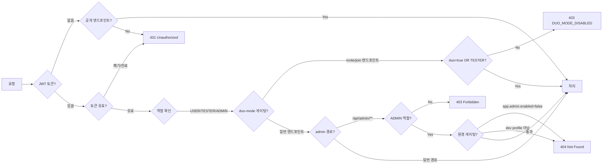

# REST API 전체 명세 — 다시봄

> 공통 규약, 에러코드, 전체 마스터 표, 인증 매트릭스를 기술합니다.
> 도메인별 상세(시퀀스 다이어그램·요청/응답 예시)는 각 도메인 문서를 참조하세요.
> 
> **주의**: 2026-06-02 커뮤니티 광장 피벗. 구 Session/Turn/Message 모델 삭제 (ADR-0001 참조).

## Source of truth

| 항목 | 위치 |
|---|---|
| 컨트롤러 | `backend/src/main/java/com/againspring/api/**/*Controller.java` |
| DTO | `backend/src/main/java/com/againspring/api/dto/{request,response}/` |
| 에러 처리 | `backend/src/main/java/com/againspring/common/exception/GlobalExceptionHandler.java` |
| Swagger UI (dev) | `http://localhost:8080/swagger-ui.html` |
| Swagger UI (서버 dev) | `https://dev.againspring.net/swagger-ui/` |
| OpenAPI JSON (dev) | `http://localhost:8080/v3/api-docs` |

코드와 문서가 충돌하면 **코드가 옳습니다**. Swagger 자동생성 스펙이 이 문서보다 항상 우선합니다.

---

## 공통 규약

| 항목 | 값 |
|---|---|
| Base URL | `/api/...` (nginx → backend 라우팅) |
| Content-Type | `application/json` |
| 시간 형식 | ISO-8601 UTC (`2026-04-26T10:30:00Z`) |
| 인증 헤더 | `Authorization: Bearer {JWT}` |
| 에러 형식 | `{ "code": "...", "message": "..." }` |

---

## 에러코드 (`GlobalExceptionHandler`)

| 코드 | HTTP | 설명 |
|---|---|---|
| `VALIDATION_ERROR` | 400 | Bean Validation 실패 (`@Valid`) |
| `INVALID_ROLE` | 400 | 허용되지 않는 역할 (admin 역할 변경 시도) |
| `UNAUTHORIZED` | 401 | 인증 실패 / 토큰 만료 / 폐기된 토큰 |
| `FORBIDDEN` | 403 | 권한 없음 (비ADMIN 등) |
| `NOT_FOUND` | 404 | 리소스 없음 |
| `EMAIL_ALREADY_EXISTS` | 409 | 이메일 중복 (회원가입) |
| `FORBIDDEN_WORD_DETECTED` | 422 | 금지어 감지 (게시글/댓글 작성) |
| `USER_NOT_FOUND` | 404 | 사용자 없음 (admin 조회) |
| `LLM_UNAVAILABLE` | 503 | Claude CLI 불가 (fallback 응답 반환) |
| `INTERNAL_ERROR` | 500 | 서버 내부 오류 |

---

## 인증 · 권한 매트릭스



---

## 전체 엔드포인트 마스터 표

### 1. Auth / OAuth2

| Method | Path | Auth | 상태코드 | 상세 문서 |
|---|---|---|---|---|
| POST | `/api/auth/send-verification` | 공개 | 200 | [auth.md](auth.md) |
| POST | `/api/auth/signup` | 공개 | 201 / 400 / 409 | [auth.md](auth.md) |
| POST | `/api/auth/login` | 공개 | 200 / 401 | [auth.md](auth.md) |
| POST | `/api/auth/guest` | 공개 | 200 | [auth.md](auth.md) |
| POST | `/api/auth/logout` | 공개 | 204 | [auth.md](auth.md) |
| POST | `/api/auth/forgot-password` | 공개 | 200 | [auth.md](auth.md) |
| POST | `/api/auth/reset-password` | 공개 | 200 / 400 | [auth.md](auth.md) |
| GET | `/api/auth/check-nickname` | 공개 | 200 | [auth.md](auth.md) |
| POST | `/api/auth/agree` | **JWT** | 200 / 400 | [auth.md](auth.md) |
| POST | `/api/auth/oauth2/{provider}` | 공개 | 200 / 400 / 401 | [auth.md](auth.md) |

### 2. Community — Posts · Comments · Voting · Jury

| Method | Path | Auth | 상태코드 | 설명 |
|---|---|---|---|---|
| POST | `/api/community/posts` | **JWT** | 201 / 422 | 게시글 작성 |
| GET | `/api/community/posts` | 공개 | 200 | 게시글 목록 |
| GET | `/api/community/posts/{id}` | 공개 | 200 / 404 | 게시글 상세 |
| PATCH | `/api/community/posts/{id}` | **JWT** | 200 / 403 / 404 | 게시글 수정 (작성자만) |
| DELETE | `/api/community/posts/{id}` | **JWT** | 204 / 403 / 404 | 게시글 삭제 (작성자만) |
| POST | `/api/community/posts/{id}/comments` | **JWT** | 201 / 422 | 댓글 작성 |
| GET | `/api/community/posts/{id}/comments` | 공개 | 200 | 댓글 목록 |
| PATCH | `/api/community/posts/{postId}/comments/{id}` | **JWT** | 200 / 403 / 404 | 댓글 수정 (작성자만) |
| DELETE | `/api/community/posts/{postId}/comments/{id}` | **JWT** | 204 / 403 / 404 | 댓글 삭제 (작성자만) |
| GET | `/api/community/posts/{id}/jury` | 공개 | 200 / 404 | AI 배심원 조회 |
| POST | `/api/community/posts/{id}/vote` | **JWT** | 200 / 403 | 투표 생성 |
| DELETE | `/api/community/posts/{id}/vote` | **JWT** | 200 / 403 | 투표 취소 |
| POST | `/api/community/posts/{postId}/comments/{id}/like` | **JWT** | 201 / 204 | 댓글 좋아요 |
| POST | `/api/community/posts/{id}/like` | **JWT** | 201 / 204 | 게시글 좋아요 |
| POST | `/api/community/posts/{postId}/comments/{id}/report` | **JWT** | 202 | 댓글 신고 |
| POST | `/api/community/posts/{id}/view` | 공개 | 200 / 400 | 조회수 기록 (deviceId 기준 중복 방지) |

### 2.1. Partner Invite API

| Method | Path | Auth | 상태코드 | 설명 |
|---|---|---|---|---|
| POST | `/api/community/posts/{id}/invite` | **JWT** | 201 / 403 / 404 | 초대 토큰 생성. 응답: {inviteToken, inviteUrl} |
| GET | `/api/s/{token}` | 공개 | 200 / 400 / 404 | 토큰으로 포스트 프리뷰 조회. 응답: {postId, userTitle, authorBodyPublished, category} |
| POST | `/api/s/{token}/answer` | 공개 | 201 / 400 / 404 | 파트너 답변 제출. 본문: {userTitle?, bodyRaw}. WAIT_FOR_PARTNER 모드면 자동 PUBLIC 발행 |
| PATCH | `/api/community/posts/{id}/publish-mode` | **JWT(author)** | 200 / 403 / 404 | 발행 모드 설정. 본문: {mode: PUBLISH_NOW\|WAIT_FOR_PARTNER, voteDurationHours: 24\|72\|168\|null} |
| POST | `/api/community/posts/{id}/publish-now` | **JWT(author)** | 200 / 403 / 404 | 즉시 광장 공개(visibility=PUBLIC, voteCloseAt 설정) |

**GET /api/community/posts/{id} 응답에 추가된 필드:**
- `paired` (Boolean): 파트너 답변 도착 여부
- `partnerAnsweredAt` (String, nullable): 파트너 답변 도착 시각 (ISO-8601 UTC)
- `partnerBodyPublished` (String, nullable): 파트너 본문
- `inviteToken` (String, nullable): 초대 토큰 (작성자 본인만 조회 가능)

### 3. User

| Method | Path | Auth | 상태코드 | 상세 문서 |
|---|---|---|---|---|
| GET | `/api/users/me` | **JWT** | 200 / 404 | [user.md](user.md) |
| PATCH | `/api/users/me` | **JWT** | 200 | [user.md](user.md) |
| POST | `/api/users/me/password` | **JWT** | 200 / 401 | [user.md](user.md) |
| DELETE | `/api/users/me` | **JWT** | 204 / 401 | [user.md](user.md) |
| POST | `/api/users/me/tutorial/complete` | **JWT** | 204 | [user.md](user.md) |

### 4. Feedback

| Method | Path | Auth | 상태코드 | 상세 문서 |
|---|---|---|---|---|
| POST | `/api/feedbacks` | 공개 | 201 / 400 | [feedback.md](feedback.md) |

### 5. Health

| Method | Path | Auth | 상태코드 | 설명 |
|---|---|---|---|---|
| GET | `/api/health` | 공개 | 200 | Liveness probe (status=UP) |

### 6. Admin — Dashboard

| Method | Path | Auth | 상태코드 | 상세 문서 |
|---|---|---|---|---|
| GET | `/api/admin/dashboard/summary` | **JWT + ADMIN** | 200 | [admin.md](admin.md) |
| GET | `/api/admin/dashboard/daily-stats` | **JWT + ADMIN** | 200 | [admin.md](admin.md) |
| GET | `/api/admin/dashboard/retention` | **JWT + ADMIN** | 200 | [admin.md](admin.md) |
| GET | `/api/admin/dashboard/crisis-recent` | **JWT + ADMIN** | 200 | [admin.md](admin.md) |
| GET | `/api/admin/dashboard/llm-failure-rate` | **JWT + ADMIN** | 200 | [admin.md](admin.md) |

### 7. Admin — Users

| Method | Path | Auth | 상태코드 | 상세 문서 |
|---|---|---|---|---|
| GET | `/api/admin/users/search` | **JWT + ADMIN** | 200 | [admin.md](admin.md) |
| GET | `/api/admin/users` | **JWT + ADMIN** | 200 | [admin.md](admin.md) |
| GET | `/api/admin/users/{id}` | **JWT + ADMIN** | 200 / 404 | [admin.md](admin.md) |
| DELETE | `/api/admin/users/{id}/data` | **JWT + ADMIN** | 200 | [admin.md](admin.md) |
| PATCH | `/api/admin/users/{id}/roles` | **JWT + ADMIN** | 200 / 400 / 404 | [admin.md](admin.md) |

### 8. Admin — Health

| Method | Path | Auth | 상태코드 | 상세 문서 |
|---|---|---|---|---|
| GET | `/api/admin/health/system` | **JWT + ADMIN** | 200 | [admin.md](admin.md) |

### 9. Admin — Feedbacks

| Method | Path | Auth | 상태코드 | 상세 문서 |
|---|---|---|---|---|
| GET | `/api/admin/feedbacks` | **JWT + ADMIN** | 200 | [admin.md](admin.md) |
| PATCH | `/api/admin/feedbacks/{id}` | **JWT + ADMIN** | 200 / 400 / 404 | [admin.md](admin.md) |

### 10. Admin — Prompts (app.admin.enabled=true)

| Method | Path | Auth | 상태코드 | 상세 문서 |
|---|---|---|---|---|
| POST | `/api/admin/prompts/reload` | **JWT + ADMIN** | 200 / 500 | [admin.md](admin.md) |

### 11. Admin — Content Management (AI 콘텐츠 조회·첨삭)

| Method | Path | Auth | 상태코드 | 설명 |
|---|---|---|---|---|
| GET | `/api/admin/content/posts` | **JWT + ADMIN** | 200 | AI 게시글 목록 (`?status=VOTING&page=&size=`) — `synthetic` 필드 포함 |
| GET | `/api/admin/content/comments` | **JWT + ADMIN** | 200 | AI 댓글 목록 (`?status=ACTIVE&page=&size=`) — `synthetic` 필드 포함 |
| POST | `/api/admin/content/corrections/save` | **JWT + ADMIN** | 201 / 404 | LLM 없이 즉시 PENDING 저장. `applyLive=true`이면 본문도 교체. Body: `{targetType, targetId, correctedText, applyLive, adminOpinion?}` |
| POST | `/api/admin/content/corrections/analyze` | **JWT + ADMIN** | 200 / 404 | 단건 LLM 분석 (DB 미변경). Body: `{targetType, targetId, correctedText}` |
| POST | `/api/admin/content/corrections/commit` | **JWT + ADMIN** | 200 / 404 | 분석 결과 확정 저장. Body: `{targetType, targetId, correctedText, personaCaution?, globalRules[], applyLive}` |

> `adminOpinion` (TEXT, nullable): 관리자가 첨삭 시 남긴 수정 의도·방향. 일괄 분석 MAP 프롬프트에 입력 신호로 사용됨 (V74 추가, 2026-06-08).

### 12. Admin — AI Rules (전역 금지 규칙·페르소나 주의사항·첨삭 이력·일괄 분석)

#### 12-A. 전역 금지 규칙

| Method | Path | Auth | 상태코드 | 설명 |
|---|---|---|---|---|
| GET | `/api/admin/ai-rules/global` | **JWT + ADMIN** | 200 | 목록 (`?page=&size=&active=`) |
| POST | `/api/admin/ai-rules/global` | **JWT + ADMIN** | 201 | 추가. Body: `{ruleText, scope: ALL\|POST\|COMMENT}` |
| PATCH | `/api/admin/ai-rules/global/{id}` | **JWT + ADMIN** | 200 / 404 | 활성/비활성 토글. Body: `{active}` |
| DELETE | `/api/admin/ai-rules/global/{id}` | **JWT + ADMIN** | 204 / 404 | 삭제 |

#### 12-B. 페르소나 주의사항

| Method | Path | Auth | 상태코드 | 설명 |
|---|---|---|---|---|
| GET | `/api/admin/ai-rules/cautions` | **JWT + ADMIN** | 200 | 목록 (`?page=&size=&personaId=`) |
| PATCH | `/api/admin/ai-rules/cautions/{corrId}` | **JWT + ADMIN** | 200 | 토글. Body: `{active}` |
| DELETE | `/api/admin/ai-rules/cautions/{corrId}` | **JWT + ADMIN** | 204 | 삭제 |

#### 12-C. 첨삭 이력

| Method | Path | Auth | 상태코드 | 설명 |
|---|---|---|---|---|
| GET | `/api/admin/ai-rules/history` | **JWT + ADMIN** | 200 | 목록 (`?page=&size=&status=PENDING\|PROCESSED\|SKIPPED`). 응답 항목에 `adminOpinion` 포함 |
| POST | `/api/admin/ai-rules/history/{id}/analyze` | **JWT + ADMIN** | 200 / 404 | 단건 Sonnet 분석 (저장 미변경) |
| POST | `/api/admin/ai-rules/history/{id}/apply` | **JWT + ADMIN** | 200 / 404 | 단건 분석 결과 적용. Body: `{scope, personaCaution?, globalRules[], pushToBank}` |
| PATCH | `/api/admin/ai-rules/history/{id}/skip` | **JWT + ADMIN** | 204 / 404 | SKIPPED 처리 |

#### 12-D. 일괄 분석 map-reduce (비동기 job)

> MAP=Sonnet(청크별 패턴 추출) + REDUCE=Opus(통합·scope 판정). CLI 전용(API 키 미사용). (2026-06-08 추가)

| Method | Path | Auth | 상태코드 | 설명 |
|---|---|---|---|---|
| POST | `/api/admin/ai-rules/history/analyze-batch` | **JWT + ADMIN** | 202 | PENDING 전체 일괄 분석 시작. 응답: `{jobId, queued, message}`. LLM 트리거(no-llm 가드레일 대상) |
| GET | `/api/admin/ai-rules/history/analyze-batch/{jobId}` | **JWT + ADMIN** | 200 / 404 | 작업 상태 폴링. 응답: `{jobId, status: RUNNING\|READY\|FAILED, pendingCount, chunksDone, chunksTotal, plan?, error?}` |
| POST | `/api/admin/ai-rules/history/apply-batch-plan` | **JWT + ADMIN** | 200 / 400 | 관리자 승인 플랜 적용(LLM 없음). Body: `{globalRules[], personaCautions[], pushToBank}`. 응답: `{rulesCreated, cautionsApplied, corrProcessed}` |

**BatchPlan 스키마:**
```json
{
  "globalRules":    [{"ruleText":"…","scope":"ALL|POST|COMMENT","sourceCorrIds":[…],"rationale":"…"}],
  "personaCautions":[{"personaId":"…","cautionText":"…","sourceCorrIds":[…],"rationale":"…"}],
  "allSourceCorrIds":[…]
}
```

**job TTL**: 30분(인메모리). 백엔드 재시작 시 유실 → 재실행으로 복구.

#### 12-E. 프롬프트 템플릿

| Method | Path | Auth | 상태코드 | 설명 |
|---|---|---|---|---|
| GET | `/api/admin/ai-rules/prompts` | **JWT + ADMIN** | 200 | 전체 목록 |
| GET | `/api/admin/ai-rules/prompts/{key}` | **JWT + ADMIN** | 200 / 404 | 단건 조회 |
| PUT | `/api/admin/ai-rules/prompts/{key}` | **JWT + ADMIN** | 200 / 404 | 내용 수정. Body: `{content}` |

---

### 13. Admin — Test (@Profile dev only)

| Method | Path | Auth | 상태코드 | 상세 문서 |
|---|---|---|---|---|
| POST | `/api/admin/test/reset` | JWT | 200 | [admin.md](admin.md) |

### Marketing API

마케팅 API는 ASM 서비스(`/api/v1/jobs`)로 이전됨. Again-Spring-Marketing 프로젝트 문서 참조.

---

## 변경 시 절차

1. 컨트롤러에 엔드포인트 추가/변경
2. 해당 도메인 `.md` 파일 업데이트 (예: `auth.md`, `session-chat.md`)
3. 이 문서(rest-spec.md) 마스터 표 및 에러코드 업데이트
4. `admin.md` 또는 `shared/docs/admin-dashboard.md` (admin 엔드포인트인 경우)
5. `database-schema.md` (스키마 변경 있는 경우)
6. Swagger 어노테이션(`@Operation`, `@ApiResponse`) 컨트롤러에 반영
