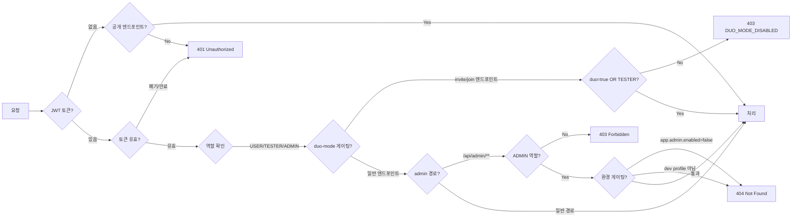

# REST API 전체 명세 — 다시봄

> 15개 컨트롤러·약 57개 엔드포인트의 공통 규약, 에러코드, 전체 마스터 표, 인증 매트릭스를 기술합니다.
> 도메인별 상세(시퀀스 다이어그램·요청/응답 예시)는 각 도메인 문서를 참조하세요.

## Source of truth

| 항목 | 위치 |
|---|---|
| 컨트롤러 | `backend/src/main/java/com/againspring/api/**/*Controller.java` |
| DTO | `backend/src/main/java/com/againspring/api/dto/{request,response}/` |
| 에러 처리 | `backend/src/main/java/com/againspring/common/exception/GlobalExceptionHandler.java` |
| Swagger UI (dev) | `http://localhost:8080/swagger-ui.html` |
| Swagger UI (서버 dev) | `https://dev.againspring.net/swagger-ui/` |
| OpenAPI JSON (dev) | `http://localhost:8080/v3/api-docs` |

코드와 문서가 충돌하면 **코드가 옳습니다**. Swagger 자동생성 스펙이 이 문서보다 항상 우선합니다.

---

## 공통 규약

| 항목 | 값 |
|---|---|
| Base URL | `/api/...` (nginx → backend 라우팅) |
| Content-Type | `application/json` |
| 시간 형식 | ISO-8601 UTC (`2026-04-26T10:30:00Z`) |
| 인증 헤더 | `Authorization: Bearer {JWT}` |
| 에러 형식 | `{ "code": "...", "message": "..." }` |

---

## 에러코드 (`GlobalExceptionHandler`)

| 코드 | HTTP | 설명 |
|---|---|---|
| `VALIDATION_ERROR` | 400 | Bean Validation 실패 (`@Valid`) |
| `INVALID_ROLE` | 400 | 허용되지 않는 역할 (admin 역할 변경 시도) |
| `UNAUTHORIZED` | 401 | 인증 실패 / 토큰 만료 / 폐기된 토큰 |
| `FORBIDDEN` | 403 | 권한 없음 (세션 비참여자, 비ADMIN 등) |
| `DUO_MODE_DISABLED` | 403 | Duo 모드 미활성 + TESTER 역할 없음 |
| `NOT_FOUND` | 404 | 리소스 없음 |
| `EMAIL_ALREADY_EXISTS` | 409 | 이메일 중복 (회원가입) |
| `CRISIS_DETECTED` | 409 | 채팅 중 위기 키워드 감지 (세션 중단) |
| `SESSION_ALREADY_HAS_PARTNER` | 409 | 초대 참여 시 이미 참여자 존재 |
| `INVITE_EXPIRED` | 410 | 초대 토큰 만료 |
| `CRISIS_IN_DESCRIPTION` | 422 | 세션 생성 시 설명에 위기 키워드 |
| `FORBIDDEN_WORD_DETECTED` | 422 | 금지어 감지 |
| `USER_NOT_FOUND` | 404 | 사용자 없음 (admin 조회) |
| `LLM_UNAVAILABLE` | 503 | Claude CLI 불가 (fallback 응답 반환) |
| `INTERNAL_ERROR` | 500 | 서버 내부 오류 |

---

## 인증 · 권한 매트릭스

---

## 전체 엔드포인트 마스터 표

### 1. Auth / OAuth2

| Method | Path | Auth | 상태코드 | 상세 문서 |
|---|---|---|---|---|
| POST | `/api/auth/send-verification` | 공개 | 200 | [auth.md](auth.md) |
| POST | `/api/auth/signup` | 공개 | 201 / 400 / 409 | [auth.md](auth.md) |
| POST | `/api/auth/login` | 공개 | 200 / 401 | [auth.md](auth.md) |
| POST | `/api/auth/guest` | 공개 | 200 | [auth.md](auth.md) |
| POST | `/api/auth/logout` | 공개 | 204 | [auth.md](auth.md) |
| POST | `/api/auth/forgot-password` | 공개 | 200 | [auth.md](auth.md) |
| POST | `/api/auth/reset-password` | 공개 | 200 / 400 | [auth.md](auth.md) |
| GET | `/api/auth/check-nickname` | 공개 | 200 | [auth.md](auth.md) |
| POST | `/api/auth/agree` | **JWT** | 200 / 400 | [auth.md](auth.md) |
| POST | `/api/auth/oauth2/{provider}` | 공개 | 200 / 400 / 401 | [auth.md](auth.md) |

### 2. Session

| Method | Path | Auth | 상태코드 | 상세 문서 |
|---|---|---|---|---|
| POST | `/api/sessions` | **JWT** | 201 / 422 | [session-chat.md](session-chat.md) |
| GET | `/api/sessions/me` | **JWT** | 200 | [session-chat.md](session-chat.md) |
| GET | `/api/sessions/{id}` | **JWT** | 200 / 403 / 404 | [session-chat.md](session-chat.md) |
| POST | `/api/sessions/join/{token}` | 공개 | 200 / 403 / 409 / 410 | [session-chat.md](session-chat.md) |
| GET | `/api/sessions/{id}/status` | 공개 | 200 / 404 | [session-chat.md](session-chat.md) |
| DELETE | `/api/sessions/{id}` | **JWT** | 204 / 403 / 404 | [session-chat.md](session-chat.md) |

### 3. Chat (Message)

| Method | Path | Auth | 상태코드 | 상세 문서 |
|---|---|---|---|---|
| POST | `/api/sessions/{id}/messages` | **JWT** | 200 / 409 | [session-chat.md](session-chat.md) |
| GET | `/api/sessions/{id}/messages` | **JWT** | 200 | [session-chat.md](session-chat.md) |
| GET | `/api/sessions/{id}/partner-messages` | **JWT** | 200 | [session-chat.md](session-chat.md) |
| GET | `/api/sessions/{id}/partner-status` | **JWT** | 200 | [session-chat.md](session-chat.md) |
| GET | `/api/sessions/{id}/invocation-status` | **JWT** | 200 | [session-chat.md](session-chat.md) |
| POST | `/api/sessions/{id}/finalize` | **JWT** | 200 | [session-chat.md](session-chat.md) |
| POST | `/api/sessions/{id}/finalize/agree` | **JWT** | 200 | [session-chat.md](session-chat.md) |
| POST | `/api/sessions/{id}/finalize/decline` | **JWT** | 200 | [session-chat.md](session-chat.md) |
| GET | `/api/sessions/{id}/invite` | **JWT** + Duo게이팅 | 200 / 403 | [session-chat.md](session-chat.md) |
| POST | `/api/sessions/{id}/invite` | **JWT** + Duo게이팅 | 200 / 403 | [session-chat.md](session-chat.md) |

### 4. Report

| Method | Path | Auth | 상태코드 | 상세 문서 |
|---|---|---|---|---|
| POST | `/api/sessions/{id}/report` | **JWT** | 202 / 400 / 403 | [report.md](report.md) |
| GET | `/api/sessions/{id}/report` | **JWT** | 200 / 403 / 404 | [report.md](report.md) |
| GET | `/api/reports/{reportId}` | **JWT** | 200 / 403 / 404 | [report.md](report.md) |

### 5. User

| Method | Path | Auth | 상태코드 | 상세 문서 |
|---|---|---|---|---|
| GET | `/api/users/me` | **JWT** | 200 / 404 | [user.md](user.md) |
| PATCH | `/api/users/me` | **JWT** | 200 | [user.md](user.md) |
| POST | `/api/users/me/password` | **JWT** | 200 / 401 | [user.md](user.md) |
| DELETE | `/api/users/me` | **JWT** | 204 / 401 | [user.md](user.md) |
| POST | `/api/users/me/tutorial/complete` | **JWT** | 204 | [user.md](user.md) |
| POST | `/api/users/me/onboarding` | **JWT** | 200 | [user.md](user.md) |
| GET | `/api/users/me/history` | **JWT** | 200 | [user.md](user.md) |

### 6. Feedback

| Method | Path | Auth | 상태코드 | 상세 문서 |
|---|---|---|---|---|
| POST | `/api/feedbacks` | 공개 | 201 / 400 | [feedback.md](feedback.md) |

### 7. Health

| Method | Path | Auth | 상태코드 | 설명 |
|---|---|---|---|---|
| GET | `/api/health` | 공개 | 200 | Liveness probe (status=UP) |

### 8. Admin — Dashboard

| Method | Path | Auth | 상태코드 | 상세 문서 |
|---|---|---|---|---|
| GET | `/api/admin/dashboard/summary` | **JWT + ADMIN** | 200 | [admin.md](admin.md) |
| GET | `/api/admin/dashboard/daily-stats` | **JWT + ADMIN** | 200 | [admin.md](admin.md) |
| GET | `/api/admin/dashboard/retention` | **JWT + ADMIN** | 200 | [admin.md](admin.md) |
| GET | `/api/admin/dashboard/crisis-recent` | **JWT + ADMIN** | 200 | [admin.md](admin.md) |
| GET | `/api/admin/dashboard/llm-failure-rate` | **JWT + ADMIN** | 200 | [admin.md](admin.md) |

### 9. Admin — Users

| Method | Path | Auth | 상태코드 | 상세 문서 |
|---|---|---|---|---|
| GET | `/api/admin/users/search` | **JWT + ADMIN** | 200 | [admin.md](admin.md) |
| GET | `/api/admin/users` | **JWT + ADMIN** | 200 | [admin.md](admin.md) |
| GET | `/api/admin/users/{id}` | **JWT + ADMIN** | 200 / 404 | [admin.md](admin.md) |
| DELETE | `/api/admin/users/{id}/data` | **JWT + ADMIN** | 200 | [admin.md](admin.md) |
| PATCH | `/api/admin/users/{id}/roles` | **JWT + ADMIN** | 200 / 400 / 404 | [admin.md](admin.md) |

### 10. Admin — Health

| Method | Path | Auth | 상태코드 | 상세 문서 |
|---|---|---|---|---|
| GET | `/api/admin/health/system` | **JWT + ADMIN** | 200 | [admin.md](admin.md) |

### 11. Admin — Feedbacks

| Method | Path | Auth | 상태코드 | 상세 문서 |
|---|---|---|---|---|
| GET | `/api/admin/feedbacks` | **JWT + ADMIN** | 200 | [admin.md](admin.md) |
| PATCH | `/api/admin/feedbacks/{id}` | **JWT + ADMIN** | 200 / 400 / 404 | [admin.md](admin.md) |

### 12. Admin — Prompts (app.admin.enabled=true)

| Method | Path | Auth | 상태코드 | 상세 문서 |
|---|---|---|---|---|
| POST | `/api/admin/prompts/reload` | **JWT + ADMIN** | 200 / 500 | [admin.md](admin.md) |

### 13. Admin — Test (@Profile dev only)

| Method | Path | Auth | 상태코드 | 상세 문서 |
|---|---|---|---|---|
| POST | `/api/admin/test/reset` | JWT | 200 | [admin.md](admin.md) |
| POST | `/api/admin/test/sessions/{id}/terminate` | JWT | 200 | [admin.md](admin.md) |

### 14. Admin — Debug (app.admin.enabled=true)

| Method | Path | Auth | 상태코드 | 상세 문서 |
|---|---|---|---|---|
| GET | `/api/admin/sessions/{id}/context` | **JWT + ADMIN** | 200 / 400 | [admin.md](admin.md) |

---

## 변경 시 절차

1. 컨트롤러에 엔드포인트 추가/변경
2. 해당 도메인 `.md` 파일 업데이트 (예: `auth.md`, `session-chat.md`)
3. 이 문서(rest-spec.md) 마스터 표 및 에러코드 업데이트
4. `admin.md` 또는 `shared/docs/admin-dashboard.md` (admin 엔드포인트인 경우)
5. `database-schema.md` (스키마 변경 있는 경우)
6. Swagger 어노테이션(`@Operation`, `@ApiResponse`) 컨트롤러에 반영
