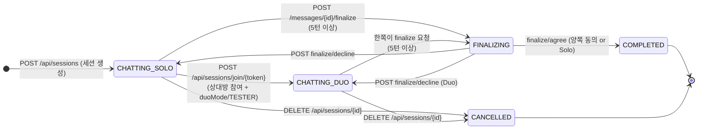
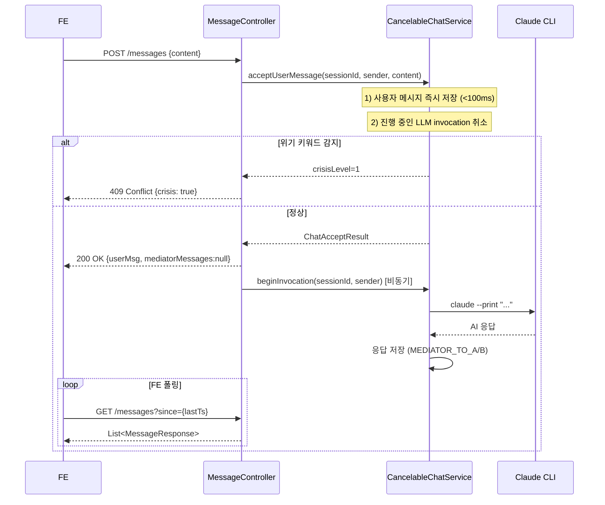
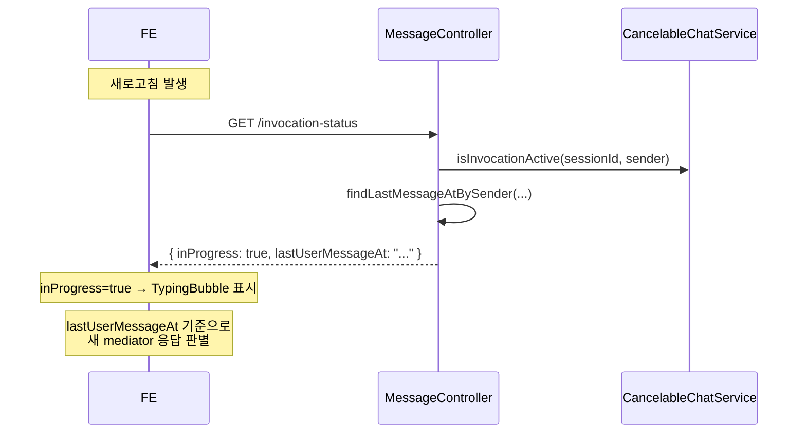
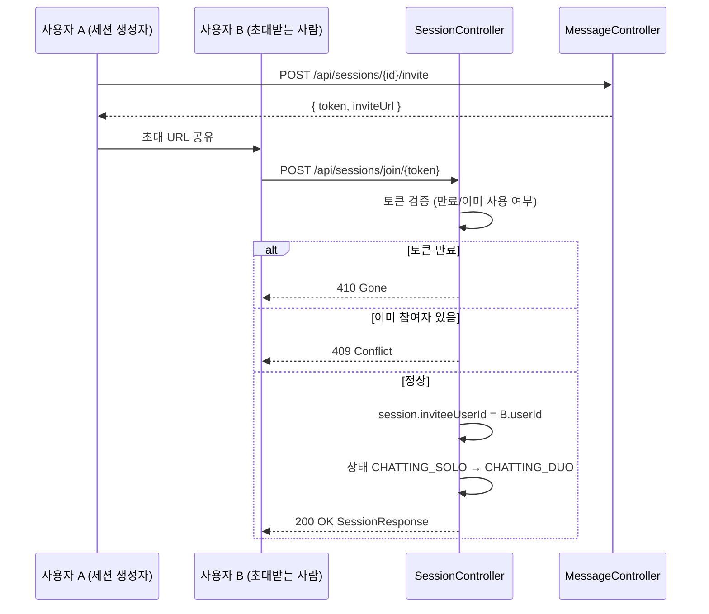
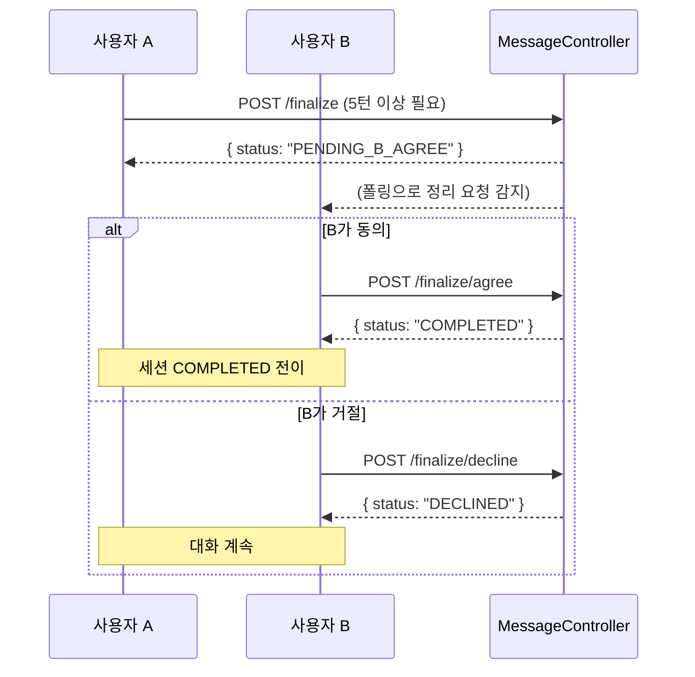

# Session & Chat API — 세션 생성 · 채팅 · 초대 · 정리

> 상담 세션의 전체 생명주기(생성 → 대화 → 초대 → 정리)를 담당하는 API.
> Solo 모드와 Duo 모드(app.features.duo-mode=true 또는 TESTER 역할)를 지원합니다.

## Source of truth

| 항목 | 위치 |
|---|---|
| 세션 컨트롤러 | `backend/src/main/java/com/againspring/api/SessionController.java` |
| 메시지 컨트롤러 | `backend/src/main/java/com/againspring/api/MessageController.java` |
| 세션 서비스 | `backend/src/main/java/com/againspring/service/SessionService.java` |
| 채팅 서비스 | `backend/src/main/java/com/againspring/service/CancelableChatService.java` |
| 상태 머신 | `backend/src/main/java/com/againspring/service/SessionStateMachine.java` |
| DB 테이블 | `sessions`, `messages`, `turns` |

## 세션 API 엔드포인트

| Method | Path | Auth | 요청 | 응답 | 상태코드 |
|---|---|---|---|---|---|
| `POST` | `/api/sessions` | JWT 필수 | `CreateSessionRequest` | `CreateSessionResponse` | 201 / 422 (위기) |
| `GET` | `/api/sessions/me` | JWT 필수 | — | `List<SessionListItemResponse>` | 200 |
| `GET` | `/api/sessions/{id}` | JWT 필수 | — | `SessionResponse` | 200 / 403 / 404 |
| `POST` | `/api/sessions/join/{token}` | 공개 (principal 선택) | `JoinSessionRequest` | `SessionResponse` | 200 / 403 / 409 / 410 |
| `GET` | `/api/sessions/{id}/status` | 공개 | — | `SessionStatusResponse` | 200 / 404 |
| `DELETE` | `/api/sessions/{id}` | JWT 필수 | — | — | 204 / 403 / 404 |

## 메시지(채팅) API 엔드포인트

| Method | Path | Auth | 요청 | 응답 | 상태코드 |
|---|---|---|---|---|---|
| `POST` | `/api/sessions/{id}/messages` | JWT 필수 | `SendMessageRequest` | `ChatTurnResponse` | 200 / 409 (위기) |
| `GET` | `/api/sessions/{id}/messages` | JWT 필수 | `?since=epochMs` | `List<MessageResponse>` | 200 |
| `GET` | `/api/sessions/{id}/partner-messages` | JWT 필수 | — | `List<MessageMetadataResponse>` | 200 |
| `GET` | `/api/sessions/{id}/partner-status` | JWT 필수 | — | `PartnerStatusResponse` | 200 |
| `GET` | `/api/sessions/{id}/invocation-status` | JWT 필수 | — | `{ inProgress, sender, lastUserMessageAt }` | 200 |
| `POST` | `/api/sessions/{id}/finalize` | JWT 필수 | — | `FinalizationResponse` | 200 |
| `POST` | `/api/sessions/{id}/finalize/agree` | JWT 필수 | — | `FinalizationResponse` | 200 |
| `POST` | `/api/sessions/{id}/finalize/decline` | JWT 필수 | — | — | 200 |
| `GET` | `/api/sessions/{id}/invite` | JWT 필수 (Duo 게이팅) | — | `InviteTokenResponse` | 200 / 403 |
| `POST` | `/api/sessions/{id}/invite` | JWT 필수 (Duo 게이팅) | — | `InviteTokenResponse` | 200 / 403 |

## 세션 상태 머신

## 메시지 전송 · 취소(Cancelable) 흐름

## 새로고침 후 타이핑 상태 복원

## Duo 초대 · 참여 흐름

> 초대/참여 엔드포인트는 `app.features.duo-mode=true` 또는 `ROLE_TESTER` 가 있어야 접근 가능.
> 그 외 403 DUO_MODE_DISABLED 반환.

## 정리(Finalize) 흐름

## 특수 상태코드

| 코드 | 경로 | 의미 |
|---|---|---|
| 409 | `POST /messages` | 위기 키워드 감지 — FE는 CrisisModal 즉시 표시 |
| 410 | `POST /sessions/join/{token}` | 초대 토큰 만료 |
| 409 | `POST /sessions/join/{token}` | 세션에 이미 참여자 존재 |
| 422 | `POST /sessions` | 세션 설명에 위기 키워드 포함 |
| 403 | `GET/POST /invite`, `POST /join` | duo-mode 비활성 (DUO_MODE_DISABLED) |

## 변경 시 절차

- 세션 상태 추가: `SessionStatus` enum + `SessionStateMachine` + 이 문서 stateDiagram 동시 수정
- Duo 게이팅 해제: `app.features.duo-mode=true` 설정 or TESTER 역할 부여 (`PATCH /api/admin/users/{id}/roles`)
