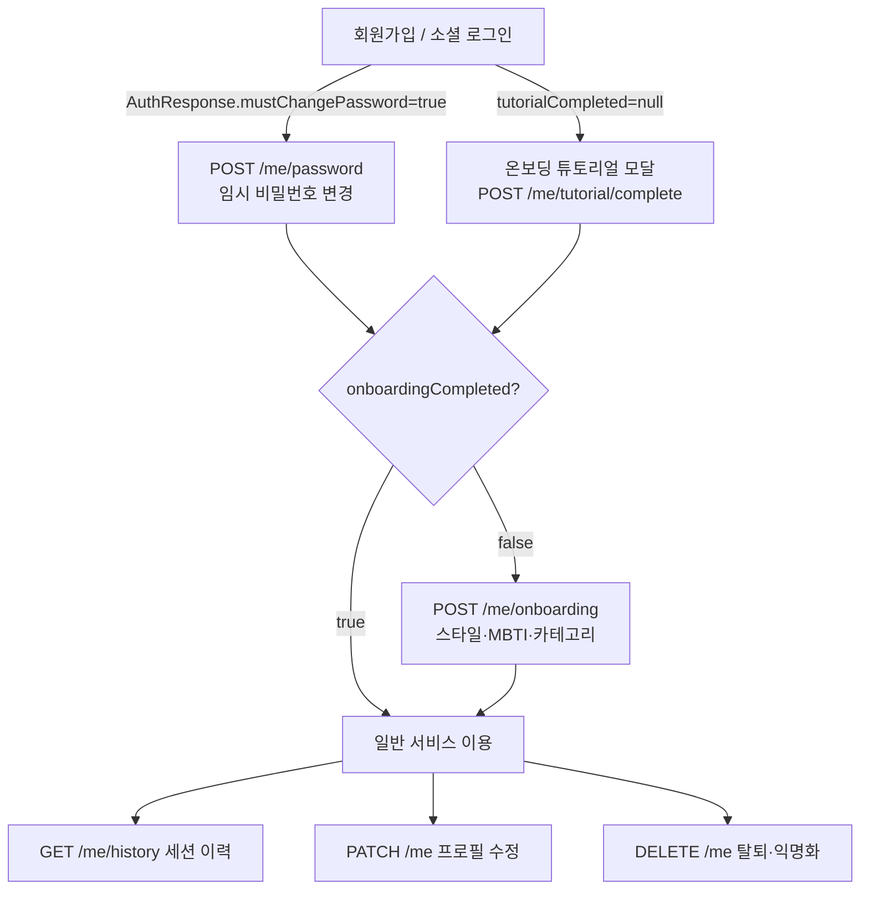
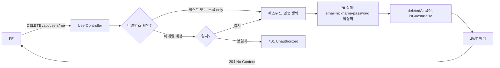

# User API — 사용자 프로필 · 온보딩 · 탈퇴

> 로그인한 사용자 자신의 프로필 조회·수정, 온보딩 완료, 튜토리얼 완료, 탈퇴 등을 담당하는 API.
> 전 엔드포인트 JWT 필수.

## Source of truth

| 항목 | 위치 |
|---|---|
| 컨트롤러 | `backend/src/main/java/com/againspring/api/UserController.java` |
| 요청 DTO | `UpdateUserRequest`, `ChangePasswordRequest`, `DeleteAccountRequest`, `OnboardingRequest` |
| 응답 DTO | `UserResponse`, `OnboardingResponse`, `SessionHistoryResponse` |
| 도메인 | `backend/src/main/java/com/againspring/domain/User.java` |
| DB 테이블 | `users` (V1 + V11 MBTI + V17 user_consent + V20 must_change_password + V24 tutorial_completed_at) |

## 엔드포인트

| Method | Path | Auth | 요청 | 응답 | 상태코드 |
|---|---|---|---|---|---|
| `GET` | `/api/users/me` | JWT 필수 | — | `UserResponse` | 200 / 401 / 404 |
| `PATCH` | `/api/users/me` | JWT 필수 | `UpdateUserRequest` | `UserResponse` | 200 |
| `POST` | `/api/users/me/password` | JWT 필수 | `ChangePasswordRequest` | `UserResponse` | 200 / 401 |
| `DELETE` | `/api/users/me` | JWT 필수 | `DeleteAccountRequest?` | — | 204 / 401 |
| `POST` | `/api/users/me/tutorial/complete` | JWT 필수 | — | — | 204 |
| `POST` | `/api/users/me/onboarding` | JWT 필수 | `OnboardingRequest` | `OnboardingResponse` | 200 |
| `GET` | `/api/users/me/history` | JWT 필수 | — | `List<SessionHistoryResponse>` | 200 |

### UserResponse 형식 (주요 필드)

```json
{
  "id": "usr_xxxxx",
  "email": "user@example.com",
  "nickname": "홍길동",
  "isGuest": false,
  "roles": ["USER"],
  "mbti": "ENFJ",
  "onboardingCompleted": true,
  "tutorialCompletedAt": "2026-05-01T10:00:00Z",
  "mustChangePassword": false,
  "createdAt": "2026-04-01T09:00:00Z"
}
```

### OnboardingRequest 형식

```json
{
  "communicationStyleX": 60,
  "communicationStyleY": 40,
  "relationshipCategory": "couple",
  "mbti": "INFP"
}
```

## 사용자 생애주기 흐름



## 탈퇴 흐름 (PII 익명화)



## 세션 이력 조회

`GET /api/users/me/history` 는 사용자가 참여한 **완료 + 진행 중** 세션을 최신순으로 반환합니다.

```json
// List<SessionHistoryResponse> 항목 예시
{
  "sessionId": "ses_xxxxx",
  "category": "couple",
  "status": "COMPLETED",
  "soloMode": false,
  "partnerNickname": "김철수",
  "createdAt": "2026-05-01T09:00:00Z",
  "completedAt": "2026-05-01T10:30:00Z",
  "hasReport": true
}
```

## 변경 시 절차

- 필드 추가 시: `User` 엔티티 + Flyway 마이그레이션 + `UserResponse` DTO + 이 문서 동시 수정
- 온보딩 스타일 옵션 변경: `shared/docs/policies/onboarding.md` 권위본 참조
