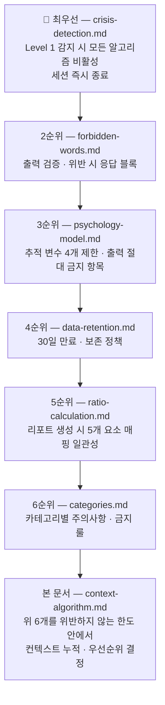
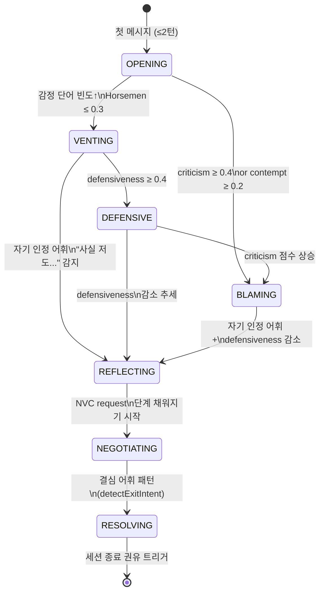
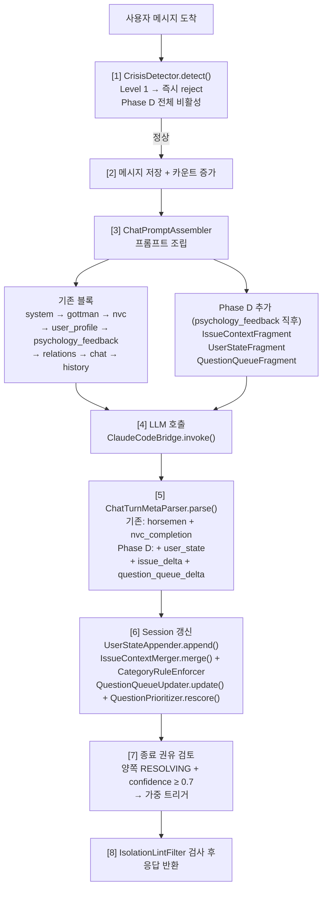
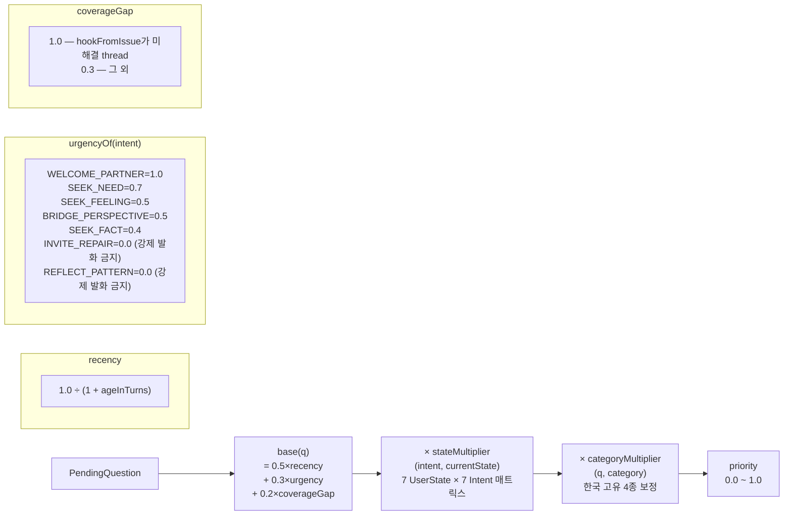
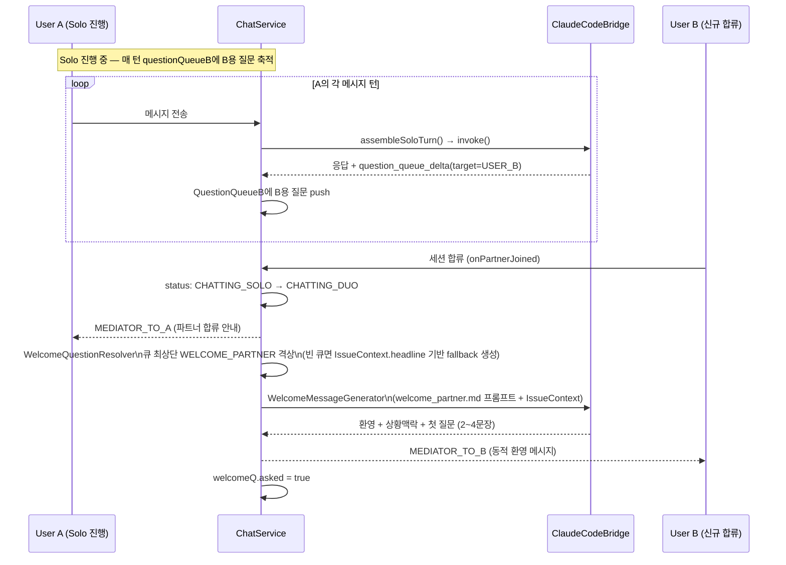

# 중재 컨텍스트 알고리즘 정책 (Phase D)

> **권위본 분류**: 본 문서는 `shared/docs/policies/`에 속하는 **서비스 정책 권위본**입니다. 다시봄의 다른 정책 권위본([`psychology-model.md`](./psychology-model.md), [`categories.md`](./categories.md), [`forbidden-words.md`](./forbidden-words.md), [`crisis-detection.md`](./crisis-detection.md), [`ratio-calculation.md`](./ratio-calculation.md), [`data-retention.md`](./data-retention.md), [`onboarding.md`](./onboarding.md))을 *직접 인용 및 준수*합니다. 본 문서가 다른 권위본과 충돌하면 **다른 권위본이 우선**합니다 — 본 문서를 갱신해야 합니다.
>
> **문서 목적**: 대화가 진행될수록 LLM이 (a) 사용자 상태, (b) 이슈 컨텍스트, (c) 다음 질문 후보를 점진적으로 구체화하여 더 깊이 있는 중재가 가능하도록, 백엔드가 그 *축적과 우선순위*를 알고리즘으로 관리하는 정책입니다. 이는 다시봄의 *추적 변수 4개 제한* 원칙 안에서, 새 변수를 추가하는 것이 아니라 **기존 변수에서 도출되는 보조 표현**을 표준화하는 작업입니다.
>
> **구현 단계**: Phase D. 기존 Phase A(`UserProfileFragment`), Phase B(`PsychologyFeedbackFormatter`, `ChatTurnMetaParser`), Phase C(`DuoBalanceFormatter`) 위에 얹습니다.
>
> **현재 기준일**: 2026-04-27

---

## 0. 정책 위계와 충돌 해결

이 알고리즘이 작동할 때 의사결정의 우선순위:



본 문서의 어떤 항목도 위 6개를 *완화*시키지 않습니다. 의심되는 경우 위 6개로 회귀합니다.

---

## 1. 문제 정의

### 1.1 기존 시스템 (Phase A/B/C)이 풀고 있는 것

| 측면 | 컴포넌트 | 무엇을 추적 |
|---|---|---|
| 사용자 정체성 | `UserProfileFragment` | 6스타일 + (선택) MBTI — 톤 미세조정 |
| 정신역동 신호 | `PsychologyFeedbackFormatter` + `ChatTurnMetaParser` | 4 Horsemen 점수 + NVC 4단계 완성 여부 (턴별) |
| 양방 균형 | `DuoBalanceFormatter` | 양쪽 발화량 + 누적 감정 강도 |
| 텍스트 누적 | `Session.currentFocus` (50자) | 현재 focus의 한 줄 요약 |

### 1.2 이 시스템이 못 하는 것

대화가 5턴, 10턴 이어지면서 다음과 같은 일이 발생합니다.

**시나리오**: A가 부부 갈등을 Solo로 풀어내는 중

```
T+0  A: "남편이랑 또 싸웠어요. 늘 이런 식이에요."
T+1  A: "어제 저녁에 제가 늦게 들어왔는데 인사도 안 하고…"
T+2  A: "무시당한 느낌이었어요. 사실 며칠 전부터 그런 분위기였거든요."
T+3  A: "근데 사실 저도 요즘 일이 바빠서 잘 못 챙겼던 것 같아요."
T+4  A: "그래도 너무 서운하긴 해요."
```

이 시점에 LLM이 알아야 할 것:

1. *T+2의 "며칠 전부터 그런 분위기"*가 미해결 갈래로 남아 있음 — 이걸 또 묻는 게 좋을지, 지금은 T+3의 자기 인정 신호를 따라가는 게 좋을지
2. T+3에서 `REFLECTING` 신호 — 자기 인정 단서 ("사실 저도…"). 이때 비난 재구성을 또 들이미는 건 무의미하고, 이미 시작된 자기 성찰을 *이어가게* 해야 함
3. T+4의 "그래도" — 자기 인정 후 *다시 감정으로 회귀*. 이건 양가감정의 정상 패턴 (NVC의 욕구가 아직 명시되지 않음)

현재 시스템은 매 턴 LLM이 이 모든 것을 *원시 메시지 이력*에서 다시 읽어 추론합니다. 이 과정에서:
- LLM이 T+2의 미해결 갈래를 *잊어버릴 수 있음*
- 같은 질문을 두 번 묻거나 (LLM 컨텍스트 길이 한계)
- T+3의 자기 인정 신호를 *놓치고* 다시 비난 재구성을 시도

### 1.3 본 알고리즘의 위치

본 알고리즘은 **새 추적 변수를 추가하지 않습니다**. psychology-model.md §"추적 변수 4개" 제한을 준수합니다. 대신:

- **상태(UserState)**: 4 Horsemen 점수에서 *유도되는* 라벨 (새 변수가 아님)
- **이슈 컨텍스트(IssueContext)**: 메시지 본문에서 *추출되는* 구조화된 표현 (새 변수가 아님)
- **질문 큐(QuestionQueue)**: 다음 발화 후보의 *우선순위 정렬* (새 변수가 아님)

세 가지 모두 *기존 4 Horsemen + NVC 신호의 재가공*입니다. 이것은 psychology-model.md의 **"단호한 모델, 부드러운 서비스"** 1원칙 — *내부 로직은 학술적으로 명확하되 사용자 출력은 관찰형* — 의 직접 적용입니다.

---

## 2. 학술적 근거 매핑

본 알고리즘의 모든 요소는 다음 권위본의 학술 근거에 명시적으로 매핑됩니다.

### 2.1 UserState 7종의 학술 근거



본 정책은 사용자 상태를 7개 라벨로 표현합니다. 각 라벨은 **psychology-model.md의 추적 변수**에서 유도됩니다.

| UserState | 유도 근거 | 학술 출처 |
|---|---|---|
| `OPENING` | `userMessageCount ≤ 2` 단순 카운트 | (구조적, 학술 무관) |
| `VENTING` | 감정 단어 빈도 ≥ 임계, 4 Horsemen 점수 ≤ 0.3 | NVC §느낌 단계 (Rosenberg) |
| `DEFENSIVE` | `defensiveness` 점수 ≥ 0.4 (현재 PsychologyFeedbackFormatter 임계와 동일) | Gottman 4 Horsemen |
| `BLAMING` | `criticism` 점수 ≥ 0.4 또는 `contempt` ≥ 0.2 | Gottman 4 Horsemen |
| `REFLECTING` | 자기 인정 어휘 패턴 ("사실 저도", "근데 제가", "제 입장에서도") + `defensiveness` 감소 추세 | Gottman *Self-Awareness* (Sound Relationship House §1) |
| `NEGOTIATING` | NVC `request` 단계 채워지기 시작 (4단계 중 4번째) | NVC §부탁 단계 (Rosenberg) |
| `RESOLVING` | 결심 어휘 패턴 (현재 `detectExitIntent` 정규식과 정확히 동일) | (휴리스틱) |

**중요**: 이 7개는 **새 변수가 아닙니다**. 모두 기존 `Session.horsemenHistory` + `Session.nvcCompletionHistory` + 메시지 본문에서 *유도*됩니다. 새 컬럼은 *유도 결과의 캐시* 입니다 — 매 턴 다시 계산하지 않기 위함.

**psychology-model.md §"출력 절대 금지" 준수**:
- UserState는 LLM에게는 노출되지만 **사용자에게는 절대 노출되지 않습니다**. "당신은 지금 자기방어 모드입니다" 같은 발화 절대 금지.
- LLM 프롬프트 내부 라벨이며, 사용자 출력에서는 행동 기술로만 — "지금 마음을 풀어내고 계신 것 같아요" (행동 관찰형).

### 2.2 IssueContext 4슬롯의 학술 근거

이슈 컨텍스트는 4개 슬롯으로 구성됩니다.

| 슬롯 | 학술 근거 | 권위본 |
|---|---|---|
| `headline` | "갈등 카테고리 + 핵심 사건"의 한 줄 요약 | categories.md §"LLM 프롬프트 주입 형식" |
| `facts` | NVC §관찰 단계의 누적 (판단 아닌 사실) | NVC `four_steps.md` §관찰 |
| `namedNeeds` | NVC §욕구 단계의 누적 (보편적 욕구) | NVC `four_steps.md` §욕구 |
| `threads` | 미해결 갈래 — Gottman의 *unaddressed bid* 개념의 응용 | Gottman *Bids for Connection* (psychology-model 추적 변수 #3) |

**ratio-calculation.md와의 정합성**: 리포트 생성 시 5개 요소 스코어링(`boundaryViolation`, `fourHorsemenUsage`, `repairAttemptLack`, `perspectiveTakingLack`, `escalationContribution`)이 IssueContext에서 *재료를 가져갑니다*.

```
boundaryViolation       ← facts (특히 약속 파기·신뢰 사건)
fourHorsemenUsage       ← 기존 horsemenHistory (그대로)
repairAttemptLack       ← namedNeeds + threads의 addressedByQueue 비율
perspectiveTakingLack   ← namedNeeds 중 owner=opposite의 *가설형* 등장 횟수
escalationContribution  ← UserState 전이 패턴 (BLAMING → DEFENSIVE 빈도)
```

이 매핑은 본 정책에 명시되며, `IssueFact`/`NeedSlot` 데이터 모델에 `contributesTo` 필드를 두어 *어느 요소에 기여하는지* 태깅합니다 (§4.2).

### 2.3 QuestionQueue Intent 7종의 학술 근거

각 Intent는 Gottman의 *4 Antidotes* 또는 NVC 4단계와 1:1 대응되어야 합니다.

| Intent | 대응 학술 도구 | 권위본 |
|---|---|---|
| `SEEK_FACT` | NVC §관찰 (판단 아닌 사실 묻기) | NVC `four_steps.md` |
| `SEEK_FEELING` | NVC §느낌 (감정 단어 유도) | NVC `four_steps.md` |
| `SEEK_NEED` | NVC §욕구 (보편적 욕구 명시) | NVC `four_steps.md` |
| `BRIDGE_PERSPECTIVE` | Gottman *Love Maps* — 상대 내면 지도 이해 | psychology-model 추적 변수 #3, relations/couple.md |
| `REFLECT_PATTERN` | Gottman *Self-Awareness* (Sound Relationship House §1) | psychology-model.md |
| `INVITE_REPAIR` | Gottman *Repair Attempt* | psychology-model 추적 변수 #2 (핵심 사용) |
| `WELCOME_PARTNER` | Gottman *Bid for Connection* (B 진입 시 첫 bid) | psychology-model 추적 변수 #3 |

**psychology-model.md §"출력 절대 금지" 준수**:
- "한 응답에 행동 제안 1개" 원칙 — `INVITE_REPAIR` Intent는 **세션당 최대 1회 발화**됨 (현재 EFT 환기와 동일한 제약을 본 정책으로 일반화).
- LLM은 PQ에서 *가장 위* 한 개만 다루며, 두세 개를 한 턴에 몰아 묻지 않음.

---

## 3. 카테고리별 알고리즘 보정

categories.md의 **6개 메이저 + 한국 고유 4종**은 각각 *주의사항*과 *AI 금지 행동*이 다릅니다. 본 알고리즘은 이를 컨텍스트 누적·질문 생성 모든 단계에서 준수합니다.

### 3.1 한국 고유 4종 별 보정 룰

categories.md §"한국 고유" 표를 그대로 알고리즘에 옮긴 것입니다.

#### 3.1.1 `in_law` (시댁/처가 관련)

- **금지**: IssueContext.facts에 *제3자(시어머니/장모)에 대한 판단형 표현 저장 금지*. "시어머니가 부엌일을 시켰다"는 가능 (사실), "시어머니가 차별했다"는 금지 (판단).
- **금지 Intent**: 어느 사용자에게도 SEEK_FACT 중 *제3자 행동 평가* 질문 금지. 부부 사이 *대처*에만 집중.
- **권장 Intent 가중치**: `BRIDGE_PERSPECTIVE` (배우자 시점) +0.2, `SEEK_NEED` (제3자가 아닌 본인 욕구) +0.2.

#### 3.1.2 `face` (다른 사람 앞에서의 무시)

- **구별**: 일반 contempt(경멸)과 다름. *제3자 존재 맥락*이 핵심.
- **IssueContext.facts**: *언제·어디서·누구 앞에서* 일어났는지 사실 슬롯에 명시. 제3자가 누구인지는 익명화 ("친지 앞", "직장 동료 앞").
- **권장 Intent 가중치**: `SEEK_FEELING` (체면 손상의 감정) +0.3.

#### 3.1.3 `lingered` (오래 묵힌 서운함)

- **금지**: 단일 사건 인터뷰 패턴 적용 금지 (categories.md 명시). "그날 정확히 어떤 일이?" 같은 SEEK_FACT 질문 비활성화.
- **데이터 구조**: IssueContext.facts에 *단일 사건*이 아닌 *누적 패턴* 저장. `IssueFact.text`는 "비슷한 일이 반복된 시기"처럼 시간 폭을 가짐.
- **권장 Intent 가중치**: `SEEK_NEED` +0.3, `REFLECT_PATTERN` +0.3, `SEEK_FACT` ×0 (비활성화).

#### 3.1.4 `generation` (세대차/원가족 영향)

- **금지**: 어느 한쪽 가치관이 우월하다는 뉘앙스의 facts/needs 저장 금지. "전통적 가치관" / "현대적 가치관" 같은 라벨링 금지.
- **표현 강제**: facts는 *행동 기술만* — "명절 관련 의례 방식이 다름" (가능), "구식이라서 받아들이지 못함" (금지).
- **권장 Intent 가중치**: `BRIDGE_PERSPECTIVE` +0.2, `SEEK_NEED` +0.2.

### 3.2 일반 카테고리(`couple`/`marriage`/`friend`/`family`/`parent_child`)

각 메이저별 prompts(`shared/docs/prompts/relations/{...}.md`)를 PromptLoader가 이미 주입합니다. 본 알고리즘은 **그 위에 카테고리 보정 가중치만** 더합니다 — 새 룰을 만들지 않습니다.

---

## 4. 데이터 모델

### 4.1 신규 Session JSON 컬럼 4개

**Flyway 마이그레이션** `V10__phase_d_context_algorithm.sql`:

```sql
ALTER TABLE sessions
    ADD COLUMN user_state_history JSON NULL COMMENT 'Phase D - UserState 전이 이력',
    ADD COLUMN issue_context JSON NULL COMMENT 'Phase D - 누적 이슈 컨텍스트',
    ADD COLUMN question_queue_a JSON NULL COMMENT 'Phase D - A에게 물을 질문 PQ',
    ADD COLUMN question_queue_b JSON NULL COMMENT 'Phase D - B에게 물을 질문 PQ';
```

**기존 `current_focus VARCHAR(50)` 컬럼 처리**:
- 즉시 제거하지 않습니다. `issue_context.headline`이 새 권위본이 되며 기존 코드(`Session.currentFocus` getter/setter)는 *호환 레이어*로 유지.
- `IssueContextMerger.merge()`가 `issue_context.headline`을 갱신할 때 동시에 `Session.setCurrentFocus(...)`도 갱신.
- 운영 안정화 후 별도 PR(`V11__drop_current_focus.sql`)에서 제거.

### 4.2 IssueContext 데이터 클래스 (Session 내부)

```java
public static class IssueContext {
    public String headline;                    // 50자 — currentFocus 대체
    public List<IssueFact> facts;
    public List<NeedSlot> namedNeeds;
    public List<UnresolvedThread> threads;
    public Integer revision;                   // 매 갱신 시 +1
    public Instant lastUpdatedAt;
}

public static class IssueFact {
    public String text;                        // 80자 이내
    public String source;                      // "USER_A_T3" 형식
    public Boolean confirmedByOther;           // Duo 모드에서만 의미. Solo는 항상 false
    public RatioElement contributesTo;         // 어느 ratio 5요소에 기여하는지 (NULL 허용)
    public String categoryRule;                // "in_law", "lingered" 등 — categoryById에 등록된 룰 ID
}

public static class NeedSlot {
    public String text;                        // 60자 이내
    public String owner;                       // USER_A | USER_B
    public Integer firstMentionedTurn;
    public RatioElement contributesTo;         // perspectiveTakingLack 등
}

public static class UnresolvedThread {
    public String text;                        // 60자 이내
    public String origin;                      // 어느 메시지에서 떠올랐나
    public Integer mentionedTurn;
    public Boolean addressedByQueue;           // PQ에 이미 들어있으면 true
    public Integer ageInTurns;                 // 등장 후 경과 턴
}

public enum RatioElement {
    BOUNDARY,           // boundaryViolation
    HORSEMEN,           // fourHorsemenUsage (자동 매핑 — 명시 불필요)
    REPAIR,             // repairAttemptLack
    PERSPECTIVE,        // perspectiveTakingLack
    ESCALATION;         // escalationContribution
}
```

### 4.3 UserStateEntry

```java
public enum UserState {
    OPENING, VENTING, DEFENSIVE, BLAMING, REFLECTING, NEGOTIATING, RESOLVING;
}

public static class UserStateEntry {
    public Integer turn;                       // horsemenHistory와 동일한 turn 인덱싱
    public String sender;                      // USER_A | USER_B
    public UserState state;
    public String evidenceSnippet;             // 30자 — 메시지에서 발췌 (디버그·재검토용)
    public Double confidence;                  // 0.0~1.0
    public String derivedFrom;                 // "horsemen.criticism=0.5" 같은 산출 근거 요약
}
```

`derivedFrom` 필드는 §2.1의 학술 매핑을 *런타임에 재현* 합니다 — 운영자가 왜 이 상태로 분류됐는지 추적 가능.

### 4.4 PendingQuestion (질문 PQ 항목)

```java
public static class PendingQuestion {
    public String id;                          // UUID
    public Intent intent;                      // 7개 enum
    public String target;                      // USER_A | USER_B
    public String text;                        // 80자 — LLM에게 의도 단서. 그대로 발화 X
    public String hookFromIssue;               // IssueContext의 어느 thread/fact/need에서 나왔나
    public RatioElement antidoteFor;           // ratio 5요소 중 어느 것을 보강하는 질문인지 (선택)
    public Double priority;                    // 0.0~1.0 — 매 턴 재계산
    public Integer createdTurn;
    public Integer ageInTurns;
    public Boolean asked;
    public Integer askedTurn;
    public String categoryRuleApplied;         // "in_law", "lingered" 등 — 카테고리 룰이 적용된 경우
}

public enum Intent {
    SEEK_FACT,
    SEEK_FEELING,
    SEEK_NEED,
    BRIDGE_PERSPECTIVE,
    REFLECT_PATTERN,
    INVITE_REPAIR,         // psychology-model "한 응답 1제안" 원칙으로 세션당 1회만 발화
    WELCOME_PARTNER;       // 특수 — B 진입 시 1회만
}
```

### 4.5 데이터 보존 정책 적용 (data-retention.md 준수)

본 정책은 새로운 데이터 영속화 정책이 아니라 **기존 정책의 명시적 적용**입니다.

| 컬럼 | 만료 처리 | 근거 |
|---|---|---|
| `user_state_history` | 30일 후 NULL | data-retention.md §"30일 원문 만료" — 메시지에서 유도된 신호이므로 원문과 동일 취급 |
| `issue_context` | 30일 후 `facts`/`needs`/`threads`만 NULL, `headline`만 유지 | 본문에서 추출된 사실은 원문 일부, 헤드라인은 리포트에 가까움 |
| `question_queue_a/b` | 30일 후 NULL | 발화하지 않은 질문 후보는 보존 가치 없음 |

**`RetentionScheduler.purgeExpiredContent()` 수정 필요** (§5.5 구현 단계).

---

## 5. 알고리즘

### 5.1 매 턴 컨텍스트 갱신 흐름



기존 `ChatService.sendUserMessage()` 흐름 안에 점선 박스가 추가됩니다.

```
사용자 메시지 도착
   │
   ▼
[1] CrisisDetector.detect()
   │   level=1 → 즉시 reject (기존)
   │   ※ Phase D는 비활성화 — UserState/IssueContext/Queue 모두 갱신 안 함
   ▼
[2] 메시지 저장 + 카운트 증가 (기존)
   ▼
[3] 프롬프트 조립 — ChatPromptAssembler
   │
   │   기존 블록 순서:
   │     system → gottman → nvc → user_profile → psychology_feedback
   │     → relations → solo/duo_chat → conversation_history
   │     → current_user_message → response_instructions [→ duo_specific_rules → duo_balance]
   │
   │   ┌─ Phase D 추가 ─ psychology_feedback 직후 ─────────┐
   │   │ (a) IssueContextFragment.render(session)          │
   │   │     <issue_context> ... </issue_context>           │
   │   │                                                    │
   │   │ (b) UserStateFragment.render(session, isDuo)       │
   │   │     <user_states> ... </user_states>               │
   │   │                                                    │
   │   │ (c) QuestionQueueFragment.render(session, sender)  │
   │   │     <pending_questions for="USER_A"> ... </>       │
   │   └────────────────────────────────────────────────────┘
   │
   │   ※ 모든 fragment는 빈 컨텍스트 시 "" 반환 (PsychologyFeedback 패턴 따름)
   ▼
[4] LLM 호출 (기존 ClaudeCodeBridge)
   ▼
[5] ChatTurnMetaParser.parse()
   │
   │   기존: horsemen, nvc_completion 추출
   │
   │   ┌─ Phase D 추가 ──────────────────────────────────────┐
   │   │ + user_state                                        │
   │   │ + issue_delta (추가/확인/해결된 facts/needs/threads) │
   │   │ + question_queue_delta (asked + new)                │
   │   └─────────────────────────────────────────────────────┘
   ▼
[6] Session 갱신
   │
   │   기존: appendPsychologyHistory(session, parsed)
   │
   │   ┌─ Phase D 추가 ──────────────────────────────────────┐
   │   │ + UserStateAppender.append(session, parsed.userState)│
   │   │ + IssueContextMerger.merge(session, parsed.issueDelta, currentTurn) │
   │   │   ↳ 카테고리 룰 검증 (CategoryRuleEnforcer)         │
   │   │   ↳ ratio 요소 매핑 (RatioElementTagger)             │
   │   │ + QuestionQueueUpdater.update(session, parsed.queueDelta, currentTurn) │
   │   │   ↳ asked 마킹 + ageing + new push                  │
   │   │   ↳ QuestionPrioritizer.rescore() 호출              │
   │   │   ↳ evict (큐 크기 5 제한)                          │
   │   └─────────────────────────────────────────────────────┘
   ▼
[7] 종료 권유 검토 (기존)
   │   ※ Phase D 보강: 양쪽 RESOLVING 감지 시 가중 트리거
   ▼
[8] 응답 반환 (기존)
```

### 5.2 LLM 응답 형식 — `<turn_meta>` JSON 확장

기존 `_response_instructions.md`의 `<turn_meta>` JSON에 3개 필드를 추가합니다. 모두 **옵션** — 누락 시 무시되며 시스템은 정상 작동.

```jsonc
{
  // 기존 (변경 없음)
  "horsemen":       { "criticism": 0.0, "contempt": 0.0, "defensiveness": 0.0, "stonewalling": 0.0 },
  "nvc_completion": { "observation": false, "feeling": false, "need": false, "request": false },

  // Phase D 신규
  "user_state": {
    "state": "VENTING",                       // 7개 enum 중 하나
    "evidence": "며칠 전부터 그런 분위기였거든요",  // 30자 이내, 메시지에서 발췌
    "confidence": 0.7,                        // 0.0~1.0
    "derived_from": "horsemen.criticism=0.5, nvc.feeling=true"
  },

  "issue_delta": {
    "headline": "최근 며칠간 이어진 무거운 분위기",  // null이면 미변경
    "facts_added": [
      {
        "text": "어제 인사 없이 지나침",
        "source": "USER_A_T1",
        "contributesTo": "BOUNDARY",          // RatioElement enum
        "categoryRule": null
      }
    ],
    "facts_confirmed": ["어제 인사 없이 지나침"],   // 양쪽이 인정한 사실 텍스트
    "needs_added": [
      {
        "text": "관심받고 있다는 느낌이 필요",
        "owner": "USER_A",
        "contributesTo": "PERSPECTIVE"
      }
    ],
    "threads_added": [
      {
        "text": "며칠 전 분위기가 무거웠던 이유",
        "origin": "USER_A_T2"
      }
    ],
    "threads_resolved": []                    // 이번 턴에 해결됐다고 판단된 미해결 갈래
  },

  "question_queue_delta": {
    "asked": ["q-uuid-1"],                    // 이번 턴에 발화한 질문 ID
    "new": [
      {
        "intent": "SEEK_NEED",
        "target": "USER_A",
        "text": "분위기가 무거워졌을 때 가장 원하셨던 건",
        "hookFromIssue": "며칠 전 분위기가 무거웠던 이유",
        "antidoteFor": "PERSPECTIVE"
      }
    ]
  }
}
```

**원칙 — psychology-model.md 준수**:
- 본 메타 필드는 *내부 분석용*. LLM이 본문에 메타 단어를 노출하면 응답 차단 (`KeywordGuard` 후처리에 lint 추가).
- LLM이 *분명히 알 수 없는 것*에 대해 추측해 채우지 않음. 모르면 null/빈 배열.

### 5.3 우선순위 산출 식 (`QuestionPrioritizer`)



```
priority(q, session) = base(q) × stateMultiplier(q.intent, currentState) × categoryMultiplier(q, category)
```

**base 식**:
```
base(q) = 0.5 × recency(q) + 0.3 × urgency(q.intent) + 0.2 × coverageGap(q, session)

recency      = 1.0 / (1 + q.ageInTurns)
urgency      = urgencyOf(q.intent)
coverageGap  = 1.0 if q.hookFromIssue ∈ unresolved threads
              0.3 otherwise
```

**`urgencyOf(intent)` 표 (학술 근거에 기반)**:
| Intent | urgency | 근거 |
|---|---|---|
| `WELCOME_PARTNER` | 1.0 | B 진입 즉시 발화 보장 |
| `SEEK_NEED` | 0.7 | NVC 4단계의 *핵심* — 욕구 명시가 가장 중요 |
| `SEEK_FEELING` | 0.5 | NVC §느낌 |
| `BRIDGE_PERSPECTIVE` | 0.5 | Gottman *Love Maps* — 욕구 다음 |
| `SEEK_FACT` | 0.4 | NVC §관찰은 가장 *기본* 단계, 늘 가능하므로 urgency는 낮음 |
| `INVITE_REPAIR` | 0.0 | 자연 발화 외엔 사용자 압박 위험 — 큐 안에서는 강제 발화 안 함 |
| `REFLECT_PATTERN` | 0.0 | 사용자가 스스로 도달해야 의미 있음, 강제 안 함 |

**`stateMultiplier(intent, state)` 표 (psychology-model.md 출력 절대 금지 항목 회피)**:
| state \ intent | SEEK_FACT | SEEK_FEELING | SEEK_NEED | BRIDGE_PERSPECTIVE | INVITE_REPAIR | REFLECT_PATTERN | WELCOME_PARTNER |
|---|---|---|---|---|---|---|---|
| OPENING | 1.0 | 1.2 | 0.8 | 0.5 | 0.3 | 0.5 | 1.0 |
| VENTING | 0.7 | 1.3 | 1.0 | 0.7 | 0.3 | 0.5 | 1.0 |
| **DEFENSIVE** | **0.7** | 1.0 | **0.7** | 0.5 | 0.3 | 1.2 | 1.0 |
| **BLAMING** | 0.5 | 1.2 | 1.0 | 0.5 | 0.3 | 1.3 | 1.0 |
| REFLECTING | 1.0 | 1.0 | **1.3** | **1.3** | 0.7 | 1.0 | 1.0 |
| NEGOTIATING | 1.0 | 0.7 | 1.0 | 1.2 | 1.0 | 0.7 | 1.0 |
| **RESOLVING** | 0.5 | 0.5 | 0.5 | 0.5 | **1.0** | 0.5 | 1.0 |

**해석**:
- DEFENSIVE 상태에선 SEEK_FACT/SEEK_NEED 약화 — *지금 사실 추궁하면 더 방어*
- BLAMING 상태에선 REFLECT_PATTERN 강화 — *비난 직후 자기 인식 유도가 가장 효과적*
- REFLECTING 상태에선 SEEK_NEED/BRIDGE_PERSPECTIVE 강화 — *자기 인정이 시작됐을 때 욕구·상대 시점 다룰 절호의 기회*
- RESOLVING 상태에선 INVITE_REPAIR 외 모두 약화 — *결심한 사용자에게 더 캐물으면 의지 흔듬*

**`categoryMultiplier(q, category)` 표 (categories.md §"한국 고유"의 alc 룰)**:

| 카테고리 | 강화 Intent | 약화 Intent | 비활성 |
|---|---|---|---|
| `in_law` | BRIDGE_PERSPECTIVE ×1.2, SEEK_NEED ×1.2 | — | 제3자 평가형 SEEK_FACT (코드 검사) |
| `face` | SEEK_FEELING ×1.3 | — | — |
| `lingered` | SEEK_NEED ×1.3, REFLECT_PATTERN ×1.3 | SEEK_FACT (단일사건 인터뷰 금지) ×0 | SEEK_FACT |
| `generation` | BRIDGE_PERSPECTIVE ×1.2, SEEK_NEED ×1.2 | — | 가치관 우열 시사 (코드 검사) |
| 기타 6 메이저 | — | — | — |

### 5.4 Solo/Duo 모드별 동작 차이

psychology-model.md §"Solo 모드의 이론적 정당성" 준수.

**Solo 모드**:
- `IssueContext.facts.confirmedByOther` 항상 `false` (B 부재)
- `BRIDGE_PERSPECTIVE` Intent 비활성 (×0) — 가설형 "혹시 상대도…"는 OK이지만 PQ 항목으로 명시적 생성은 안 함
- `INVITE_REPAIR` Intent는 *자기 자신에게* 향함 — "오늘 한 줄로 정리하면 어떤 다짐이 떠오르세요?" 같은 self-soothing 형식
- `questionQueueB`는 항상 비어 있음 (B가 없으므로)
- 단, *Solo→Duo 전이를 대비*하여 `questionQueueB`에 미리 쌓아둘 수 있음 — 이건 §6에서 다룸

**Duo 모드**:
- 모든 Intent 활성
- `confirmedByOther` 갱신 가능 — LLM이 양쪽 메시지에서 같은 사실을 발견 시 표시
- `WELCOME_PARTNER`는 *Solo→Duo 전이 시점*에만 발화 (§6)

### 5.5 큐 관리 — push, ageing, evict

**push (`QuestionQueueUpdater.add()`)**:
1. dedup 검사: 같은 큐에 `intent + hookFromIssue + target` 동일 항목 있으면 스킵
2. 카테고리 룰 검증: 카테고리 비활성 Intent면 거부
3. 큐 크기 5 미만이면 push, 5 이상이면 가장 낮은 priority + asked=true 우선 evict 후 push

**ageing**:
- 매 턴 `update()` 호출 시 *미발화*(asked=false) 항목의 `ageInTurns += 1`
- `ageInTurns ≥ 8` 이면서 `priority < 0.2` 인 항목 자동 evict

**evict (큐 사이즈 초과 시)**:
1. asked=true 항목 중 가장 오래된 것부터 제거
2. 그래도 5개 넘으면 priority 가장 낮은 미발화 항목 제거
3. 절대 evict 안 함: `WELCOME_PARTNER` (asked=false인 동안)

### 5.6 매 턴 priority 재계산 비용

큐가 최대 5개 × 2 (A/B) = 10개. 매 턴 10번의 priority 계산. 산술 연산만 — O(1) 수준.

---

## 6. B 진입 시퀀스 (WELCOME_PARTNER)



사용자 요구사항 3번: *"b가 초대되었을때 약간의 환영 메시지와 함께 2번에서 생성한 현재 시점의 pq의 최상단 큐가 팝업되면서 질문해야한다"*

### 6.1 누적 단계 (B 진입 전, A의 Solo 진행 중)

A가 Solo로 대화하는 동안, LLM은 매 턴 `question_queue_delta.new`에 *target=USER_B*인 질문을 미리 쌓을 수 있습니다.

**예시 — A가 "남편이 인사도 안 했어요" 발화한 턴**:

```jsonc
"question_queue_delta": {
  "asked": [],
  "new": [
    {
      "intent": "SEEK_FEELING",
      "target": "USER_A",
      "text": "그 순간 어떤 마음이 드셨는지",
      "hookFromIssue": "어제 인사 없이 지나침"
    },
    {
      "intent": "SEEK_FACT",
      "target": "USER_B",                    // ← B용 질문 미리 쌓기
      "text": "그날 어떤 마음이었는지",
      "hookFromIssue": "어제 인사 없이 지나침"
    }
  ]
}
```

이렇게 누적된 `questionQueueB`는 B가 도착하기 전까지 *대기 상태*입니다.

### 6.2 B 진입 시 (`ChatService.onPartnerJoined()` 확장)

```java
@Transactional
public void onPartnerJoined(String sessionId, String userBId) {
    Session session = sessionRepo.findById(sessionId).orElseThrow();
    if (session.getStatus() != SessionStatus.CHATTING_SOLO) return;

    // === 기존 처리 ===
    session.setStatus(SessionStatus.CHATTING_DUO);
    session.setUserBId(userBId);
    session.setPartnerJoinedAt(Instant.now());

    // 기존 — A에게 보내는 전환 메시지 (변경 없음)
    String aNotice = generatePartnerJoinedNoticeForA(sessionId);
    saveMediatorMessage(sessionId, MessageSender.MEDIATOR_TO_A, aNotice, true);

    // === Phase D 신규 ===
    // 1. B 큐 최상단을 WELCOME_PARTNER로 격상 (또는 새로 생성)
    PendingQuestion welcomeQ = welcomeQuestionResolver.resolveOrCreate(session);

    // 2. 환영 + 첫 질문 통합 메시지 생성 (별도 LLM 호출)
    String bNotice = welcomeMessageGenerator.generate(session, welcomeQ);

    // 3. 발화 마킹
    welcomeQ.asked = true;
    welcomeQ.askedTurn = 0;

    // 4. 메시지 저장
    saveMediatorMessage(sessionId, MessageSender.MEDIATOR_TO_B, bNotice, true);

    sessionRepo.save(session);
    log.info("Session {} transitioned SOLO → DUO with welcome+question", sessionId);
}
```

### 6.3 `WelcomeQuestionResolver`

```java
@Component
public class WelcomeQuestionResolver {

    /** B 큐 최상단을 WELCOME_PARTNER로 격상하거나, 비어있으면 IssueContext 기반 생성. */
    public PendingQuestion resolveOrCreate(Session session) {
        List<PendingQuestion> queueB = session.getQuestionQueueB();
        if (queueB == null) queueB = new ArrayList<>();

        // 1. 미발화 최상단을 격상
        Optional<PendingQuestion> top = queueB.stream()
            .filter(q -> !Boolean.TRUE.equals(q.asked))
            .max(Comparator.comparingDouble(q -> q.priority));
        if (top.isPresent()) {
            PendingQuestion q = top.get();
            q.intent = Intent.WELCOME_PARTNER;
            q.priority = 1.0;
            return q;
        }

        // 2. 빈 큐 — IssueContext.headline 기반 fallback 생성
        PendingQuestion q = new PendingQuestion();
        q.id = UUID.randomUUID().toString();
        q.intent = Intent.WELCOME_PARTNER;
        q.target = "USER_B";
        q.text = "최근 두 분 사이에 어떤 마음이 드셨는지";
        IssueContext ctx = session.getIssueContext();
        q.hookFromIssue = (ctx != null && ctx.headline != null) ? ctx.headline : null;
        q.priority = 1.0;
        q.createdTurn = 0;
        q.ageInTurns = 0;
        q.asked = false;
        queueB.add(q);
        session.setQuestionQueueB(queueB);
        return q;
    }
}
```

### 6.4 신규 프롬프트: `chat/welcome_partner.md`

위치: `shared/docs/prompts/chat/welcome_partner.md`

```markdown
# 파트너 합류 환영 + 첫 질문

상대방(B)이 막 합류했습니다. 다음 세 가지를 한 메시지에 담아주세요. 전체 2~4문장.

## 메시지 구성

1. **환영 (1문장)**
   - 따뜻하고 차분한 인사
   - "갑자기 초대되어 당황스러우셨겠어요" 같은 공감 한 줄
   - 가해자/피해자 가정 없이, 어느 쪽 입장이든 자연스럽게 들리게

2. **상황 맥락 (선택, 1문장)**
   - `<issue_context>`의 headline을 *중립화*하여 두 분 사이에 어떤 이야기가 다뤄지고 있는지 전달
   - A의 발화·감정을 직접 인용하지 않습니다 (격리)
   - 카테고리가 `in_law`이면 *제3자 평가 절대 금지* (categories.md)
   - 카테고리가 `lingered`이면 단일 사건 인터뷰 패턴 금지

3. **첫 질문 (1문장)**
   - `<welcome_question>` 블록의 질문을 *그대로 읽지 말고* B의 시점에서 자연스럽게 재구성
   - "당신 입장에서는 어떻게 느끼고 계셨어요?" 같은 *대칭적* 표현
   - intent에 따라 톤 조정:
     - SEEK_FEELING → "그날 마음이 어떠셨어요"
     - SEEK_FACT → "당신이 기억하시는 그날 일은"
     - BRIDGE_PERSPECTIVE → "상대분의 어떤 모습이 마음에 남으셨어요"

## 절대 금지 (psychology-model.md, forbidden-words.md 준수)

- "강요하지 않아요", "편하신 대로 하세요", "여기 있을 필요 없어요" 같은 대화 포기성 발화
- 진단명, 임상 용어
- 단정형 어미 ("입니다", "예요")
- 한 응답에 여러 질문

## 출력 형식

- 본문 자연어만. `<turn_meta>` 메타 블록 없음 (이 호출은 분석 대상 아님)
```

### 6.5 `WelcomeMessageGenerator`

```java
@Component
@RequiredArgsConstructor
public class WelcomeMessageGenerator {
    private final PromptLoader loader;
    private final ClaudeCodeBridge llmBridge;
    private final IssueContextFragment issueFragment;

    public String generate(Session session, PendingQuestion welcomeQ) {
        StringBuilder p = new StringBuilder();
        p.append(loader.get("chat/welcome_partner.md")).append("\n\n");
        p.append(issueFragment.render(session)).append("\n");
        p.append("<welcome_question>\n");
        p.append("intent: ").append(welcomeQ.intent.name()).append("\n");
        p.append("hint: ").append(welcomeQ.text).append("\n");
        p.append("category: ").append(session.getCategory() == null ? "none"
            : session.getCategory().getMajorId()).append("\n");
        p.append("</welcome_question>\n");

        try {
            String result = llmBridge.invoke(p.toString(), MODEL_HAIKU);
            if (result != null && !result.isBlank()) return result.strip();
        } catch (Exception e) {
            log.warn("Welcome message LLM failed: {}", e.getMessage());
        }
        return fallback();
    }

    private String fallback() {
        return "함께 정리하러 와주셔서 고마워요. 천천히 마음을 들려주세요. "
             + "상대분이 적으신 내용은 제가 따로 듣고 있어요. 두 분의 이야기는 서로 보이지 않아요. "
             + "당신 입장에서, 최근 두 분 사이에 어떤 마음이 드셨는지 편하게 들려주실 수 있어요?";
    }
}
```

---

## 7. 격리 위반 방지 — 3중 안전장치

다시봄의 *양쪽 데이터 격리* 원칙(principles.md §2.2)은 절대 깨질 수 없습니다. 본 알고리즘은 다음 3중 방어를 가집니다.

### 방어 1 — 프롬프트 명시 (LLM 자율)

`chat/_response_instructions.md`에 *절대 금지* 명시:
- `<issue_context>` 안의 USER_A/USER_B 라벨을 본문에 노출하지 마세요
- `<pending_questions>`의 text를 그대로 읽지 마세요 (재구성)
- 한 사용자에게 다른 쪽의 사실·욕구를 *직접* 알려주지 마세요 (가설형 "혹시 ~~ 일 수도" 만 허용)

### 방어 2 — `<duo_specific_rules>` (LLM 강제, ChatPromptAssembler가 주입)

기존 코드에 이미 있음 (`ChatPromptAssembler.assembleDuoTurn` line 108~113). Phase D에 맞춰 한 줄 추가:

```
- <issue_context> / <pending_questions> 의 sender 라벨(USER_A, USER_B)을 본문에 인용 금지.
```

### 방어 3 — 응답 후처리 lint (백엔드 검증)

신규 컴포넌트 `IsolationLintFilter`:

```java
@Component
public class IsolationLintFilter {
    private static final Pattern SENDER_LABEL = Pattern.compile(
        "USER_[AB]|MEDIATOR_TO_[AB]");

    /** LLM 응답 본문에 sender 라벨이 노출됐으면 응답 차단 + 폴백. */
    public boolean violatesIsolation(String mediatorMessage) {
        return SENDER_LABEL.matcher(mediatorMessage).find();
    }
}
```

`ChatService.sendUserMessage()`에서 LLM 응답 직후 호출:
```java
if (isolationLint.violatesIsolation(mediatorResponse)) {
    log.error("Isolation violation in session {}: response contained sender labels", sessionId);
    mediatorResponse = "잠깐 정리할 시간이 필요해요. 다시 들려주실 수 있을까요?";
}
```

---

## 8. 위기 감지 시 동작 (crisis-detection.md 준수)

본 알고리즘은 위기 상황에서 **완전 비활성화**됩니다.

```java
// ChatService.sendUserMessage()
var crisis = crisisDetector.detect(content);
if (crisis.level() == 1) {
    log.warn("Crisis level 1 detected in session {}", sessionId);
    return ChatTurnResult.crisisBlocked();
    // ⬇ 이 시점에 다음이 모두 실행되지 않음:
    //   - 메시지 저장
    //   - LLM 호출
    //   - turn_meta 파싱
    //   - UserState/IssueContext/Queue 갱신
}
```

위기 키워드가 감지되어 세션이 `TERMINATED`되면, 그 시점까지의 `user_state_history` / `issue_context` / `question_queue_*`는 *그대로 보존*되며 `RetentionScheduler`가 30일 후 정리합니다.

---

## 9. 컴포넌트 목록 — 신규/수정

### 9.1 신규 패키지·클래스

```
backend/src/main/java/com/againspring/
├── service/
│   └── prompt/                              ← 기존 패키지에 추가
│       ├── IssueContextFragment.java        [신규] §4.2 IssueContext → 프롬프트 렌더
│       ├── UserStateFragment.java           [신규] §4.3 UserStateEntry → 프롬프트 렌더
│       └── QuestionQueueFragment.java       [신규] §4.4 PendingQuestion → 프롬프트 렌더
│   ├── context/                             [신규 패키지]
│       ├── IssueContextMerger.java          [신규] issue_delta → IssueContext 병합
│       ├── UserStateAppender.java           [신규] user_state → history append
│       ├── QuestionQueueUpdater.java        [신규] queue_delta → PQ 갱신
│       ├── QuestionPrioritizer.java         [신규] §5.3 priority 산출
│       ├── CategoryRuleEnforcer.java        [신규] §3 카테고리별 룰 검증
│       ├── RatioElementTagger.java          [신규] facts/needs → RatioElement 매핑
│       ├── WelcomeQuestionResolver.java     [신규] §6.3 B 진입 시 큐 최상단 격상
│       └── WelcomeMessageGenerator.java     [신규] §6.5 환영 + 첫 질문 LLM 호출
│   └── safety/                              ← 기존 패키지에 추가
│       └── IsolationLintFilter.java         [신규] §7 방어 3 — sender 라벨 후처리 검증
├── domain/
│   └── Session.java                         [수정] inner classes 5개 추가, JSON 컬럼 4개 추가
└── service/parser/
    └── ChatTurnMetaParser.java              [수정] user_state, issue_delta, queue_delta 파싱

backend/src/main/resources/db/migration/
└── V10__phase_d_context_algorithm.sql       [신규] §4.1

shared/docs/prompts/chat/
├── _response_instructions.md                [수정] §5.2 turn_meta 신규 필드 안내 추가
├── duo_chat.md                              [수정] §7 방어 2 — 격리 룰 한 줄 추가
└── welcome_partner.md                       [신규] §6.4

shared/docs/policies/
└── context-algorithm.md                     [본 문서]
```

### 9.2 수정 대상 기존 파일

| 파일 | 변경 |
|---|---|
| `service/ChatService.java` | `sendUserMessage()`에 컨텍스트 갱신 3 호출 추가, `onPartnerJoined()` Phase D 단계 추가, IsolationLintFilter 호출 |
| `service/prompt/ChatPromptAssembler.java` | `assembleSoloTurn`/`assembleDuoTurn`에 fragment 3개 호출 추가 (psychology_feedback 직후) |
| `service/parser/ChatTurnMetaParser.java` | `Result` record에 3개 필드 추가, `parse()` 확장 |
| `service/retention/RetentionScheduler.java` | `purgeExpiredContent()`에 §4.5의 4개 컬럼 NULL 처리 추가 |
| `domain/Session.java` | inner classes (`UserStateEntry`, `IssueContext`, `IssueFact`, `NeedSlot`, `UnresolvedThread`, `PendingQuestion`, `RatioElement`, `Intent`, `UserState`) 추가 + 4개 JSON 컬럼 |

### 9.3 FE 영향

거의 없음. 변하는 것은:
1. `MEDIATOR_TO_B` 메시지의 *내용이 더 풍부*해짐 — `MessageBubble`/`PartnerJoinNoticeCard` 코드 변경 불필요
2. `finalize` 권유 트리거가 *더 정확*해짐 — `FinalizeSuggestionCard` UI 변경 없음

---

## 10. 단계별 구현 로드맵 (Claude Code 작업 순서)

각 단계는 **독립적으로 머지 가능** — 단계 사이에 회귀 0.

### Phase D-1: 골격 도입 (1~2일) — 회귀 0 보장

**목표**: 모든 신규 클래스를 만들지만 모든 fragment가 빈 문자열만 반환. DB 마이그레이션도 빈 컬럼만.

- [ ] Flyway `V10__phase_d_context_algorithm.sql` 작성 (§4.1)
- [ ] `Session.java`에 inner classes 9개 + JSON 컬럼 4개 추가
- [ ] `IssueContextFragment`, `UserStateFragment`, `QuestionQueueFragment` 골격 (모두 `return "";`)
- [ ] `ChatPromptAssembler`에 fragment 3개 호출 추가 (빈 반환이라 프롬프트 변화 0)
- [ ] 단위 테스트: 빈 컨텍스트에서 fragment가 빈 문자열 반환 검증

**머지 검증**: 5종 시나리오 (`shared/docs/prompts/`의 기존 검증 스크립트가 있다면) 통과. LLM 응답이 Phase D 전과 동일.

### Phase D-2: UserState 단독 도입 (2~3일)

**목표**: 가장 단순한 메타 1개만 활성화. LLM 톤이 미세 조정되기 시작.

- [ ] `_response_instructions.md`에 `user_state` 필드 안내 추가 (§5.2 일부)
- [ ] `ChatTurnMetaParser`가 `user_state` 파싱
- [ ] `UserStateAppender` 구현 + 단위 테스트
- [ ] `UserStateFragment.render()` 실제 로직 (가장 최근 entry 출력)
- [ ] 통합 테스트: VENTING / DEFENSIVE / RESOLVING 시나리오에서 LLM 톤 차이 측정 (수동 평가)

**머지 검증**: `<user_states>` 블록이 프롬프트에 등장. 부적절한 응답이 *늘어나지 않음* (회귀 검증).

### Phase D-3: IssueContext 도입 (3~5일)

**목표**: 이슈가 누적되기 시작. 카테고리 룰 검증 동작.

- [ ] `_response_instructions.md`에 `issue_delta` 필드 안내 추가
- [ ] `ChatTurnMetaParser`가 `issue_delta` 파싱
- [ ] `IssueContextMerger.merge()` 구현 + 단위 테스트 (dedup, FIFO drop, threadsResolved)
- [ ] `CategoryRuleEnforcer.validate()` — `in_law`/`lingered` 등 카테고리별 fact·need 거부 로직
- [ ] `RatioElementTagger` — facts/needs에 `contributesTo` 자동 매핑 (LLM 미명시 시 휴리스틱)
- [ ] `IssueContextFragment.render()` 실제 로직
- [ ] `Session.currentFocus`와 `IssueContext.headline` 동기화 (`IssueContextMerger`가 둘 다 갱신)
- [ ] 단위 테스트: `lingered` 카테고리에서 단일사건 fact 추가 거부, `in_law`에서 제3자 판단형 거부

**머지 검증**: 5턴 이상 대화 시 `issue_context`가 채워짐. `RetentionScheduler` 30일 만료 동작 확인.

### Phase D-4: QuestionQueue 도입 (3~5일)

**목표**: 우선순위 큐가 동작. LLM이 PQ 최상단을 다룸.

- [ ] `_response_instructions.md`에 `question_queue_delta` 필드 안내 추가
- [ ] `ChatTurnMetaParser`가 `queue_delta` 파싱
- [ ] `QuestionPrioritizer.score()` 구현 + 단위 테스트 (§5.3 표 검증)
  - state multiplier 7×7 매트릭스 검증
  - category multiplier 4종(한국 고유) 검증
- [ ] `QuestionQueueUpdater.update()` 구현 + 단위 테스트 (push, dedup, ageing, evict)
- [ ] `QuestionQueueFragment.render()` 실제 로직 (top-3만)
- [ ] `IsolationLintFilter` 추가 + `ChatService` 통합

**머지 검증**: PQ가 채워지고 LLM이 hint를 그대로 읽지 않음 (수동 검증). `IsolationLintFilter`가 트리거되는지 monitoring.

### Phase D-5: B 진입 환영 + PQ 통합 (2~3일)

**목표**: B가 합류할 때 정적 메시지 → 동적 환영+질문.

- [ ] `welcome_partner.md` 신규 프롬프트 작성
- [ ] `WelcomeQuestionResolver` 구현 + 단위 테스트
- [ ] `WelcomeMessageGenerator` 구현 + 단위 테스트 (LLM 실패 시 fallback)
- [ ] `ChatService.onPartnerJoined()` 수정 — Phase D 단계 추가
- [ ] 통합 테스트: A가 5턴 진행 → B 합류 → B가 받는 메시지가 환영+상황맥락+질문 3요소 포함 확인

**머지 검증**: B 합류 시 발화가 fallback이 아닌 LLM 동적 생성 비율 ≥ 80%.

### Phase D-6: 운영 도구 (1~2일)

**목표**: 운영자가 시스템을 관찰하고 가중치를 조정 가능.

- [ ] `/admin/sessions/{id}/context` 디버그 엔드포인트 (인증 필요) — IssueContext, UserStateHistory, PQ 시각화
- [ ] 메트릭 수집:
  - `phase_d.queue.depth` — A/B 큐 평균 깊이
  - `phase_d.queue.ask_rate` — 큐 항목이 발화되는 비율
  - `phase_d.state.distribution` — UserState 7종의 분포
  - `phase_d.isolation.violations` — IsolationLintFilter 트리거 횟수
- [ ] `QuestionPrioritizer`의 weight를 `@ConfigurationProperties`로 외부화 (재배포 없이 튜닝)
- [ ] 5종 시나리오로 회고 + 가중치 조정

**머지 검증**: 메트릭 대시보드에서 7일 운영 후 weight 1차 조정.

---

## 11. 위험 분석과 완화

| 위험 | 영향 | 완화 |
|---|---|---|
| LLM이 `<turn_meta>` 신규 필드를 안 채움 | Phase D 데이터 0건 → fragment 모두 빈 반환 → 시스템 동작 변화 없음 (회귀 0) | 안전한 기본값 설계. `phase_d.meta.populated_rate` 메트릭으로 실제 채워지는 비율 추적 |
| LLM이 sender 라벨을 본문에 인용 (격리 위반) | 양쪽 데이터 격리 위반 — 다시봄 핵심 가치 손상 | 3중 방어: 프롬프트 + duo_specific_rules + IsolationLintFilter 후처리 |
| PQ가 무한 누적 → 토큰 비용 폭발 | LLM 호출 비용 증가 | 큐 크기 5 제한, top-3만 프롬프트 노출, 매 턴 evict |
| LLM이 같은 질문을 계속 새로 만듦 | PQ 중복 누적 | `QuestionQueueUpdater` push 시 dedup (intent + hookFromIssue + target 동일) |
| `WELCOME_PARTNER` LLM 호출이 비용·지연 추가 | B 합류 시 1회 추가 호출 (~2초) | `WelcomeMessageGenerator` 폴백 — LLM 실패 시 정적 메시지로 우아한 강하 |
| `RESOLVING` 오감지 → 너무 일찍 finalize 권유 | 사용자 경험 저하 | `confidence ≥ 0.7` 임계 + 양쪽 메시지 ≥3 둘 다 만족해야 트리거 |
| 카테고리 룰이 LLM 응답을 *너무 많이* 거부 | 정상 facts도 저장 안 됨 | `CategoryRuleEnforcer`는 *거부 시 로그*만 남기고 dropped count 메트릭 추적. 임계 초과 시 룰 재검토 |
| `psychology-model.md`의 "추적 변수 4개 제한" 위반 우려 | 정책 충돌 | 본 정책 §1.3에 명시: UserState/IssueContext는 *유도값*이지 *새 변수가 아님*. 운영 회고 시 이 정책 정합성 재확인 |
| `data-retention.md`의 30일 정책 누락 | 개인정보 유출 위험 | §4.5 + Phase D-3 단계의 `RetentionScheduler` 수정으로 명시적 처리 |

---

## 12. 의도적 비포함 — 왜 이건 안 만드나

투명성을 위해 명시.

- **별도 ML 모델로 UserState 분류**: 비용·지연·동기화 부담. LLM 1회 호출로 통합 (`<turn_meta>` 패턴).
- **IssueContext의 사용자 직접 노출**: 사용자가 "지금까지 정리된 사실"을 보고 싶어할 수 있으나, 이는 결과 리포트의 영역. 채팅 중 노출은 인지 부하 증가 + 격리 위반 위험.
- **PQ의 사용자 직접 조작**: 사용자가 "이 질문은 답하기 싫다"고 PQ에서 빼는 UI는 도입하지 않음. 사용자가 다른 방향으로 발화하면 LLM이 자연스럽게 다른 질문을 우선시하도록.
- **CrossSession 컨텍스트**: HAX G12 "Remember recent interactions"는 다시봄에서 의도적 비적용 (`hax-checklist.md` C 등급). Phase D는 *세션 내* 추론만 강화하며 *학습 아님* — psychology-model.md "사용자 데이터를 AI 학습용으로 사용하지 않습니다"(약관 6조 4항) 준수.
- **5번째 추적 변수 추가**: psychology-model.md "5번째 변수 추가 금지" 준수.

---

## 13. 변경 시 절차

본 문서는 권위본이므로 변경 시 다음 절차를 따릅니다.

1. **상위 권위본 충돌 확인**: psychology-model.md / categories.md / forbidden-words.md / crisis-detection.md / data-retention.md / ratio-calculation.md 와 충돌 여부 점검
2. **본 문서 갱신**: 변경 사유, 학술 근거, 영향 범위 명시
3. **변경 이력 추가**: §15
4. **코드 동기화**:
   - 식 변경 → `QuestionPrioritizer` 또는 `QuestionQueueUpdater`
   - Intent 추가/제거 → `Intent` enum + `urgencyOf` + `stateMultiplier` 매트릭스
   - UserState 추가/제거 → `UserState` enum + state multiplier 매트릭스 + 학술 근거 §2.1
   - 카테고리 룰 변경 → `CategoryRuleEnforcer`
5. **프롬프트 동기화**: `_response_instructions.md`, `welcome_partner.md`
6. **단위 테스트 갱신**

---

## 14. 관련 문서

### 권위본 (본 문서가 준수해야 함)

- [`psychology-model.md`](./psychology-model.md) — Gottman+NVC+EFT 모델 채택 근거, 추적 변수 4개 제한
- [`categories.md`](./categories.md) — 카테고리 정의, 한국 고유 4종 주의사항
- [`forbidden-words.md`](./forbidden-words.md) — 금지어 4단계
- [`crisis-detection.md`](./crisis-detection.md) — Level 1/2 위기 감지
- [`data-retention.md`](./data-retention.md) — 30일 만료 정책
- [`ratio-calculation.md`](./ratio-calculation.md) — 5요소 스코어링, RatioEnforcer
- [`onboarding.md`](./onboarding.md) — 6스타일 + UserProfileFragment 활용

### 구현 참조

- 기존 동등 레이어: `backend/src/main/java/com/againspring/service/prompt/PsychologyFeedbackFormatter.java`, `DuoBalanceFormatter.java`, `UserProfileFragment.java`, `ChatPromptAssembler.java`
- 기존 파서: `backend/src/main/java/com/againspring/service/parser/ChatTurnMetaParser.java`
- 기존 메시지 처리: `backend/src/main/java/com/againspring/service/ChatService.java`

### FE UX 문서

- `frontend/docs/ux/principles.md` — UX 원칙 §1군 AI 신뢰성 (HAX), §2.2 데이터 격리
- `frontend/docs/ux/hax-checklist.md` — 컴포넌트별 PR 체크리스트, B17 PartnerPanel(데이터 격리 모범 구현)

### 프롬프트

- `shared/docs/prompts/chat/_response_instructions.md` — 본 알고리즘이 확장
- `shared/docs/prompts/chat/duo_chat.md` — 본 알고리즘이 확장
- `shared/docs/prompts/chat/welcome_partner.md` — 본 알고리즘이 신규 작성
- `shared/docs/prompts/system.md` — 출력 절대 금지 항목 (변경 없음)

---

## 15. 변경 이력

| 일자 | 변경 |
|---|---|
| 2026-04-27 | v1.0 초안. Phase D 컨텍스트 알고리즘 정책. Gottman+NVC 학술 근거 매핑(§2), 카테고리별 보정(§3), 데이터 모델(§4), priority 산출 식(§5.3), B 진입 시퀀스(§6), 격리 3중 방어(§7), 6단계 구현 로드맵(§10) 정의. psychology-model.md "추적 변수 4개 제한" 준수 — 새 변수가 아닌 *유도값*임을 §1.3에 명시. |
