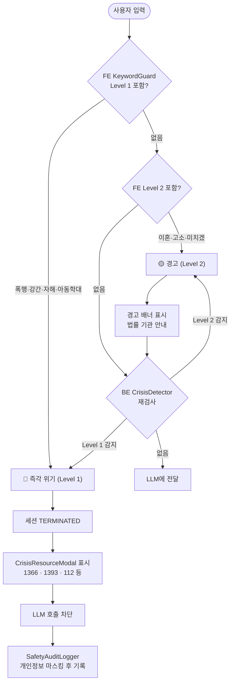

# 위험 키워드 감지 · 위기 대응 정책

생명/신체 위협이 감지되면 세션은 즉시 중단되고 전문 기관 핫라인이 안내된다. 이 서비스는 그 상황을 처리할 능력이 없음을 인정하는 것이 가장 안전한 대응이다.

## Source of truth

- FE: `frontend/lib/constants/crisisResources.ts`, `frontend/lib/utils/keywordGuard.ts`
- FE 컴포넌트: `frontend/components/shared/CrisisResourceModal.tsx`, `frontend/components/mediation/CrisisInline.tsx`
- BE: `backend/.../safety/CrisisDetector.java`, `safety/CrisisDetectedEvent.java`, `safety/CrisisResponse.java`
- BE 이벤트 처리: `safety/SafetyAuditLogger.java`, `service/SessionService.java` (TERMINATED 전이)

---

## 분류

### Level 1 — 즉각적 위기 (세션 강제 종료 + 모달)

```typescript
export const CRISIS_KEYWORDS = {
  domestic_violence: [
    '때리','때렸','맞았','맞고','폭행','폭력',
    '학대','때릴','때려','구타','상해',
  ],
  sexual_violence: [
    '강간','성폭행','성폭력','강제로',
  ],
  self_harm: [
    '죽고 싶','죽고싶','자살','자해','뛰어내리',
    '목 매','목매','약 먹고 죽',
  ],
  child_abuse: [
    '아이를 때','애를 때','아동학대',
  ],
};
```

감지 시 동작:
1. **세션 즉시 중단** — `SessionStatus.TERMINATED`로 전이
2. **CrisisResourceModal 표시** — 핫라인 카드 노출
3. **감사 로그** — `SafetyAuditLogger`가 `safety_audit_log` 테이블에 기록 (개인정보 마스킹)
4. **LLM 호출 차단** — 입력이 LLM에 닿지 않음

### Level 2 — 경고 (세션 계속 + 안내 배너)

```typescript
export const WARNING_KEYWORDS = {
  legal: ['이혼','절연','고소','신고','소송','변호사'],
  extreme_emotion: ['미치겠','참을 수 없','죽여버리'],
};
```

감지 시:
- 세션은 진행
- 경고 배너 표시 ("법률 결정은 도와드릴 수 없어요")
- LLM 입력에는 포함 (다른 검사로 처리)

## 감지 흐름



## 감지 로직

```typescript
function checkKeywords(text: string): { level: 1 | 2 | null; category: string | null } {
  for (const [category, keywords] of Object.entries(CRISIS_KEYWORDS)) {
    for (const keyword of keywords) {
      if (text.includes(keyword)) return { level: 1, category };
    }
  }
  for (const [category, keywords] of Object.entries(WARNING_KEYWORDS)) {
    for (const keyword of keywords) {
      if (text.includes(keyword)) return { level: 2, category };
    }
  }
  return { level: null, category: null };
}
```

FE는 입력 단계에서 즉시 검사 → 모달/배너 표시. BE는 API 진입 시 `CrisisDetector.detect(content)`로 재검사 — 이중 안전장치.

## 핫라인 카드 (`crisisResources.ts`)

### 즉각적 위기 (Level 1)

| 번호 | 기관 | 운영 |
|---|---|---|
| **1366** | 여성긴급전화 (가정폭력·성폭력) | 24시간 |
| **1393** | 자살예방상담전화 | 24시간 |
| **1577-0199** | 정신건강 위기상담 | 24시간 |
| **112 / 1391** | 경찰 / 아동학대 신고 | 24시간 |
| **1388** | 청소년 상담 | 24시간 |

### 법률·상담 (Level 2)

| 번호 | 기관 | 용도 |
|---|---|---|
| **132** | 대한법률구조공단 | 무료 법률 상담 |
| **1644-7077** | 한국가정법률상담소 | 가족·이혼 법률 상담 |
| **1577-9337** | 건강가정지원센터 | 시·군·구별 가족 상담 |

## 모달 카피 (Level 1)

```
중요한 안내

말씀해주신 상황은 저희 서비스의 범위를 넘어서는
매우 중요한 문제예요. 지금 바로 전문 기관의 도움을 받아주세요.

[즉각적 위기]
━━━━━━━━━━━━━━━━━━━━━━
가정폭력·성폭력 (여성긴급전화)
1366  (24시간, 무료)

자살예방상담전화
1393  (24시간, 무료)

정신건강 위기상담
1577-0199  (24시간, 무료)

아동학대 신고
112 또는 1391
━━━━━━━━━━━━━━━━━━━━━━

[전화 걸기] [문자 상담] [나중에]
```

## 배너 카피 (Level 2)

```
안내

"이혼"과 같은 법적 결정은 저희 서비스가 도와드릴 수 없어요.
이 서비스는 관계 회복을 위한 대화 정리를 돕는 것이 목표입니다.
법적 조언이 필요하시면 대한법률구조공단(132)을 이용해주세요.
```

## 표시 정책 미세 규칙

- "이혼 절차", "이혼 변호사" 같은 **행동 의도 키워드** → 법률·상담 배너
- "헤어지고 싶다" 같은 **일반 감정 표현** → 위기 분류 안 함 (화풀이 표현으로도 자주 사용됨)
- 즉각적 위기 키워드는 일반 감정 키워드보다 우선

## 사용자 데이터 보호

위기 감지된 입력의 원문은 30일 후 `RetentionScheduler`에 의해 다른 입력과 동일하게 자동 만료. 감사 로그(`safety_audit_log`)는 **개인 식별 정보 마스킹** 후 보관.

## 책임 한계 (약관 명시)

위기 키워드 감지 시 다시봄은 **핫라인을 안내**할 뿐, 직접 위기 개입 행위(상담, 출동, 신고 대행 등)는 하지 않는다. 이는 [terms-of-service.md](./terms-of-service.md) 제5~7조에 명시.

## 변경 시 절차

1. `frontend/lib/constants/crisisResources.ts` 갱신
2. `backend/src/main/resources/safety/forbidden-words.yml` (위기 키워드 섹션) 갱신
3. 본 문서 갱신
4. CrisisResourceModal 텍스트 검토 (전화번호 정확성)
