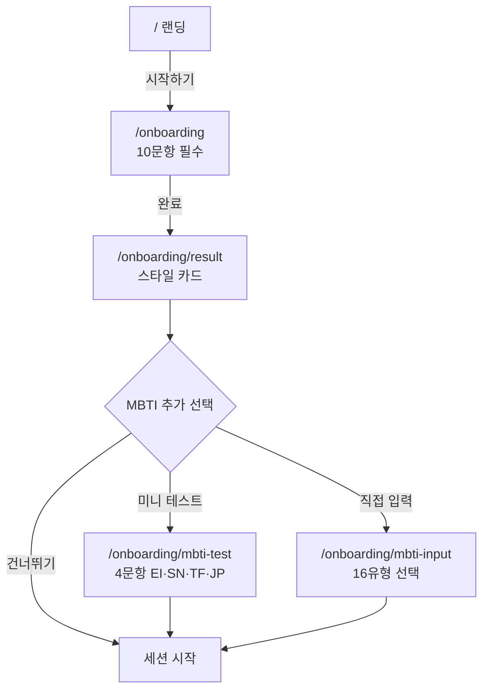
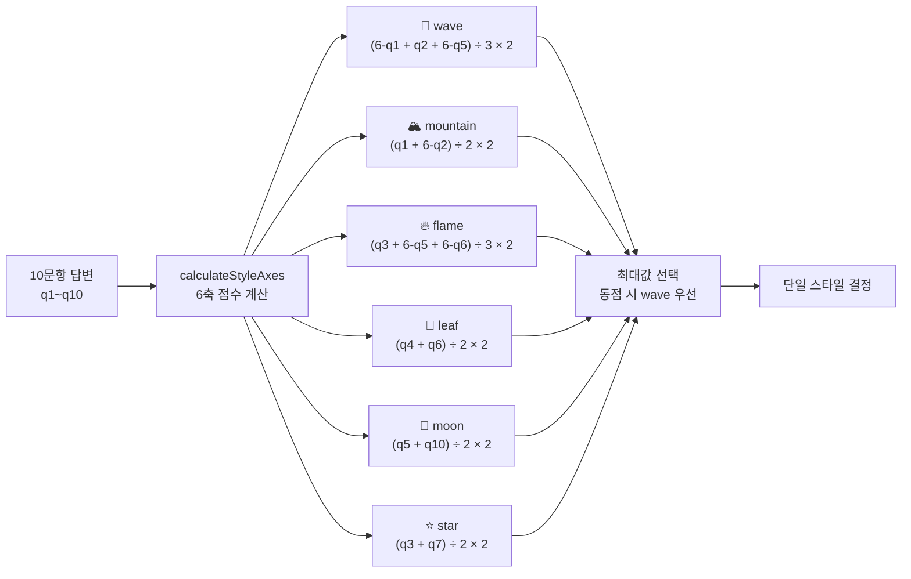

# 온보딩 정책

신규 사용자의 커뮤니케이션 스타일을 추정하여 이후 LLM 응답 톤·관계 분석 컨텍스트로 활용.

## Source of truth

- 문항: `frontend/lib/constants/onboardingQuestions.ts`
- 스타일 정의: `frontend/lib/constants/communicationStyles.ts`
- 매핑 알고리즘: `frontend/lib/utils/styleCalculator.ts`, `backend/.../service/StyleCalculator.java`
- API: `POST /api/users/me/onboarding`
- 페이지: `frontend/app/(onboarding)/onboarding/**`
- BE 저장: `backend/.../domain/User.java` (`communicationStyle`, `onboardingAnswers`)

## 흐름



10문항은 **필수**, MBTI는 결과 화면 이후 **선택 추가** (commit 68b19d5에서 변경).

## 10문항 (5점 리커트)

| ID | 문항 | 측정 |
|---|---|---|
| q1 | 나는 갈등이 생기면 일단 시간을 두고 싶어하는 편이다 | withdrawal |
| q2 | 상대가 감정적으로 격해지면, 나도 같이 감정이 올라온다 | emotional_flooding |
| q3 | 문제가 생기면 "왜 그랬는지" 이유를 듣고 싶다 | logical_orientation |
| q4 | 상대가 내 감정을 먼저 알아주면 문제는 저절로 풀린다 | empathy_priority |
| q5 | 서운한 감정을 말보다 행동으로 보여주는 편이다 | expression_mode |
| q6 | 상대 말투가 날카로우면 내용보다 그 말투에 더 상처받는다 | tone_sensitivity |
| q7 | 사과할 때는 "내가 뭘 잘못했는지" 구체적으로 아는 게 중요하다 | apology_style |
| q8 | 갈등 중에 상대가 농담을 하면 분위기가 풀린다고 느낀다 | repair_receptivity |
| q9 | 중요한 이야기일수록 직접 만나서 해야 한다 | channel_preference |
| q10 | 관계에서 "말하지 않아도 아는 것"이 중요하다 | implicit_expectation |

## 6가지 커뮤니케이션 스타일

| 코드 | 이모지 | 라벨 | 설명 |
|---|---|---|---|
| `wave` | 🌊 | 파도형 | 감정 표현 풍부, 즉각적 |
| `mountain` | 🏔️ | 산형 | 차분, 거리 두고 생각 |
| `flame` | 🔥 | 불꽃형 | 직설적, 명확함 선호 |
| `leaf` | 🌿 | 이파리형 | 조화·공감 중시 |
| `moon` | 🌙 | 달빛형 | 분위기·행동으로 표현 |
| `star` | ⭐ | 별빛형 | 논리·이유 중시 |

각 스타일은 `strengths`, `caution`, `color` 메타 보유 — 결과 카드와 조합 해석에 사용.

## 매핑 알고리즘 (요약)



```typescript
function calculateStyleAxes(answers: number[]): Record<Style, number> {
  const [q1,q2,q3,q4,q5,q6,q7,q8,q9,q10] = answers;
  return {
    wave:     ((6-q1) + q2 + (6-q5)) / 3 * 2,
    mountain: (q1 + (6-q2)) / 2 * 2,
    flame:    (q3 + (6-q5) + (6-q6)) / 3 * 2,
    leaf:     (q4 + q6) / 2 * 2,
    moon:     (q5 + q10) / 2 * 2,
    star:     (q3 + q7) / 2 * 2,
  };
}
function determineStyle(answers: number[]) {
  const axes = calculateStyleAxes(answers);
  return Object.entries(axes).sort((a,b) => b[1]-a[1])[0][0];
}
```

가장 강한 축을 단일 결과로 선택. 동점 시 객체 키 순서 (wave > mountain > ...).

## 조합 해석 (A-B 스타일 조합)

리포트에서 A·B 양쪽 스타일을 받은 후 조합별 강점/주의/조언 표시.

```typescript
STYLE_COMBINATION_INSIGHTS = {
  'wave-mountain': { strength: '...', challenge: '...', advice: '...' },
  'wave-flame':    { ... },
  // 6×6 = 36가지 (동일 스타일 포함)
};
```

상세는 `frontend/lib/constants/communicationStyles.ts`.

## MBTI 보강 (선택)

10문항 결과 카드 후 사용자가 추가 입력 가능. 두 가지 경로:

- **mbti-test**: 4문항(EI/SN/TF/JP) 미니 테스트
- **mbti-input**: 16유형 중 직접 선택

저장: `User.mbtiType` (nullable). LLM 프롬프트 컨텍스트로 보강 — **단독 결정 변수로는 사용하지 않음**.

> 현 구현 상태 (2026-04-27 갱신): `User.mbtiType` 필드 구현 완료 (Flyway V11, `backend/.../service/prompt/UserProfileFragment.java` 보강). `UserProfileFragment`가 6스타일 + MBTI를 함께 주입. 단독 결정 변수가 아닌 보강 정보로 명시.

## LLM 프롬프트 활용 방식

`UserProfileFragment` (`backend/.../service/prompt/UserProfileFragment.java`) 가 User 엔티티를 자연어 요약 블록으로 변환해 채팅·리포트 프롬프트에 주입.

```
<user_profile note="참고용 — 단독 결정 변수 아님, 사용자 발화 우선" sender="USER_A">
- 커뮤니케이션 스타일: 파도형🌊
  감정 표현이 풍부하고 즉각적인 스타일.
- 강점: 진솔한 감정 표현, 따뜻한 공감 능력
- 주의: 감정 격앙 시 휴식 필요, 상대에게 숨 돌릴 시간 주기
</user_profile>
```

- 6스타일 메타(label/emoji/strengths/caution)는 `StyleCalculator.CommunicationStyle` enum이 권위본
- Solo 모드: 본인 1블록 / Duo 모드: USER_A·USER_B 두 블록 연속
- 온보딩 미완료(`communicationStyle == null`) 사용자는 블록 생략
- LLM은 톤 미세 조정에만 참고하며 사용자에게 라벨을 인용·노출하지 않음 (`shared/docs/prompts/system.md` 6번 원칙)

주입 위치는 `shared/docs/prompts/README.md` Layer 3.5 참조.

## API

### `POST /api/users/me/onboarding`

```jsonc
// Request
{ "answers": [4,2,3,5,2,4,3,5,4,3], "mbtiType": "INFP" /* optional */ }

// Response
{
  "communicationStyle": "wave",
  "styleInfo": {
    "emoji": "🌊", "label": "파도형",
    "description": "...", "strengths": [...], "caution": [...]
  }
}
```

`OnboardingRequest` DTO: `backend/.../api/dto/request/OnboardingRequest.java`

## v2 결정 흡수

`shared/docs/v2/ONBOARDING_V2.md` 작업의 결정 사항은 다음과 같이 반영됨 (구현 완료):

- 10문항 필수, MBTI는 선택 추가 (commit 68b19d5)
- 결과 카드 리디자인: `frontend/components/result/StyleCombination.tsx`
- 조합 해석 36개 데이터 (`communicationStyles.ts`)
- 결과 페이지 → 회원가입 게이트 (commit 003557a)
