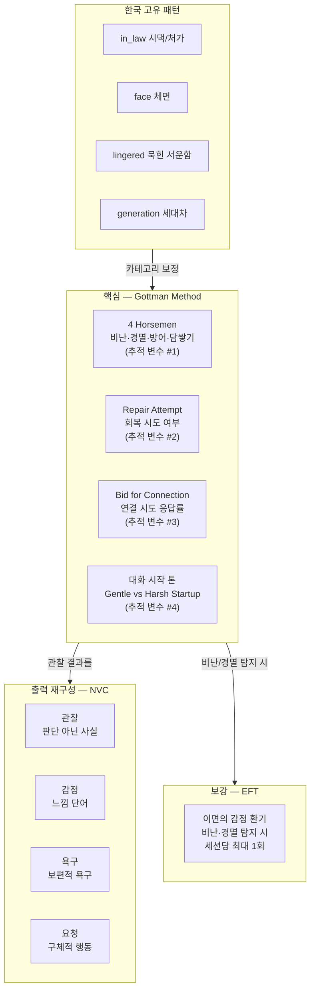

# 심리학 모델 채택 정책

## 채택 기준

다시봄은 다음 3원칙으로 모델을 선별한다:

1. **단호한 모델, 부드러운 서비스** — 내부 로직은 학술적으로 명확하되 사용자 출력은 관찰형/가설형
2. **과적합 방지** — 추적 변수 4개로 제한 (5번째 변수 추가 금지)
3. **한국 적용성** — 한국 표본 검증 연구가 있는 모델 우선

## 모델 레이어 구조

## 채택 모델

### Gottman Method (핵심)

| 구성요소 | 학술 신뢰도 | 한국 적용 검증 | 사용 결정 |
|---|---|---|---|
| 4 Horsemen (비난·경멸·방어·담쌓기) | ★★★★★ | 한국 245쌍 결혼만족도 60% 설명 | **핵심 사용** |
| Repair Attempt | ★★★★★ | 다수 효과 검증 | **핵심 사용** |
| Bid for Connection | ★★★★ | 일부 적용 | 가설형 사용 |
| Sound Relationship House | ★★★★ | 다문화가정 한국 효과 검증 | 평가용 사용 |
| 5:1 Magic Ratio | ★★★ | 단순화 위험 | 정량 점수 산출에만 |
| 이혼 예측 90~94% 주장 | ★★ | 교차검증 부재, 학계 비판 누적 | **절대 사용 금지** |
| Gender-specific 권고 | ★★ | 후속 연구에서 재현 실패 | **절대 사용 금지** |

### NVC (Nonviolent Communication)

- **역할**: Gottman 관찰을 사용자에게 출력할 때의 **재구성 언어**
- 4단계 (관찰-감정-욕구-요청) 출력 형식 강제 — `shared/prompts/nvc/four_steps.md`

### EFT (Emotion Focused Therapy) — 보강 레이어

- **역할**: 비난/경멸 탐지 시 "이면의 감정" 환기 한 줄
- **제한**: 한 세션당 1회 (과도한 정서 환기는 부담)

## 배제 모델

| 모델 | 배제 이유 |
|---|---|
| Bowen 다세대 전수 | 평가 기간이 길고 단발 응답에 부적합. 추후 "묵힌 서운함" 카테고리 일부 반영 검토 |
| 사티어 의사소통 5유형 | Gottman 4 Horsemen과 개념 중복 + 추적 변수 추가는 과적합 |
| Imago 부부 대화법 | 미러링 기법은 NVC와 통합되어 이미 반영 |
| 애착이론 (회피형/불안형) | 임상 진단 라벨 → 낙인 위험. UI 전면 금지 |

## 추적 변수 4개 (오직 이것만)

LLM은 이 4가지 변수만 관찰·기록한다. 5번째를 추가하지 않는다.

1. **4 Horsemen 발생 여부** — criticism, contempt, defensiveness, stonewalling
2. **Repair Attempt 시도 여부** — 회복 시도 발화의 존재 및 수용 여부
3. **Bid for Connection 응답률** — 한쪽이 연결 시도 시 다른 쪽 반응
4. **대화 시작 톤** — gentle startup vs harsh startup

## 출력 절대 금지

| 카테고리 | 금지 이유 | 대체 |
|---|---|---|
| 이혼·관계 파국 가능성 수치/확률 | 학술적 근거 부재 + 사용자 불안 | 출력하지 않음 |
| Gender-specific 권고 ("남편이니까/아내라서") | 재현 실패 + 성차별 | 행동 패턴만 언급 |
| 단정형 어미 ("~~입니다") | 진단/판결 인상 | "~~할 수 있어요" / "~~로 들릴 수 있어요" |
| 진단명/임상 용어 | 의료법 + 낙인 | 행동 기술로 대체 |
| 한 세션 다중 제안 | 사용자 압도 | 한 세션당 최대 1가지 행동 변화 제안 |

상세 표현 변환은 [forbidden-words.md](./forbidden-words.md) 참조.

## 한국 고유 갈등 카테고리 (Gottman으로 안 잡히는 패턴)

Gottman은 미국 백인 중산층 표본 기반. 한국 패턴 4종 별도:

| 카테고리 | 코드 | 표시명 | 학술 근거 |
|---|---|---|---|
| 시댁/처가 | `in_law` | "시댁/처가 관련" | 한국 이혼 통계 "가족 간 불화" 7.4% 별도 사유 |
| 체면 | `face` | "다른 사람 앞에서의 무시" | 이성범(2014) 부부 대화 체면 연구 |
| 묵힌 서운함 | `lingered` | "오래 묵힌 서운함" | 김지영(2005) 화병 연구 |
| 세대차/원가족 | `generation` | "세대차/원가족 영향" | 이두원(2009) 세대별 의사소통 행태 |

구현: `frontend/lib/constants/categories.ts`의 `korean_specific` major + 백엔드 `RelationType.KOREAN_SPECIFIC`.

## 정량 점수 노출 정책

| 항목 | 노출 여부 |
|---|---|
| 화해 기여도 비율 (정수, 5단위) | **노출** |
| 4 Horsemen 점수 (0~10, 정수) | **노출** (단, "위험"·"심각" 등 부정 표현 금지) |
| 종합 관계 위험도 | **금지** |
| 시계열 점수 변화 그래프 | **금지** (불안 트리거) |
| 다른 부부와의 비교/랭킹 | **금지** |

표현 강제 규칙: [ratio-calculation.md](./ratio-calculation.md) 참조.

### 재검토 트리거

다음 하나 충족 시 정책 재검토:

1. MAU 1,000 이상 도달
2. 점수 관련 부정 피드백 ≥ 10%
3. 점수로 인한 사용자 분쟁 ≥ 5건

## 의료법·법적 경계

다시봄은 다음 어느 것도 **아니다**:

- 의료법상 의료행위
- 심리치료, 심리상담
- 부부 상담, 가족 상담
- 법률 자문

사용 금지 단어: "치료", "치유", "진단", "분석", "처방", "권고", "심리" (단독 사용)
대체: "정리", "돌아보기", "관찰", "살펴보기", "제안", "마음", "감정"

상세는 [terms-of-service.md](./terms-of-service.md), [forbidden-words.md](./forbidden-words.md).

## Source of truth

- 프롬프트 실제: `shared/prompts/system.md`, `shared/prompts/gottman/*.md`, `shared/prompts/nvc/four_steps.md`
- 카테고리 코드: `frontend/lib/constants/categories.ts`, `backend/.../domain/enums/RelationType.java`
- 추적 변수 처리: `backend/.../service/report/ReportResponseParser.java`, `safety/RatioEnforcer.java`

## Solo 모드의 이론적 정당성 (V1.5)

Solo Mode가 메인이 됨에 따라, "한쪽만 입력해도 의미있는 정리가 되는가"라는 학술적 근거 명시.

### 근거

1. **Gottman의 Self-Soothing 개념**: Gottman은 부부 둘 다 진정해야 갈등 해결이 시작된다고 봄. **혼자만의 자기진정**도 그 첫 단계로 인정.
2. **NVC의 자기공감(Self-Empathy)**: Marshall Rosenberg의 NVC는 4단계를 **자기 자신에게 먼저** 적용하는 것을 권장. Solo는 이 단계를 직접 지원.
3. **EFT의 일차 정서 환기**: 한쪽만 자신의 일차 정서(외로움, 인정 욕구)에 접근해도 관계 회복의 시작점이 됨.

### Solo 모드의 한계 명시

- 화해 기여도 비율은 계산하지 않음 (양쪽 데이터 부재)
- 갈등 유형(factual/difference/mixed) 분류 불가
- 리포트는 "A의 관점 정리"로 제한
- 듀얼 모드 전환 권유로 한계 보완

### 듀얼 모드의 역할

V1.5 이후 듀얼 모드는 **고급 사용자(양쪽 합의 가능한 부부)**를 위한 보조 옵션. 양쪽 입력 시 화해 기여도 + 갈등 유형 + 양방향 NVC 메시지 생성.

## 변경 이력

| 일자 | 변경 |
|---|---|
| 2026-04-26 | Gottman + NVC + EFT 통합, 한국 카테고리 4종 추가, 이혼 예측·gender-specific 권고 절대 금지 명시 |
| 2026-04-26 | V1.5 Solo-First 전환 — Solo 모드 이론적 정당성 섹션 추가 |
