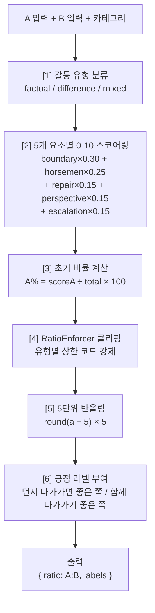
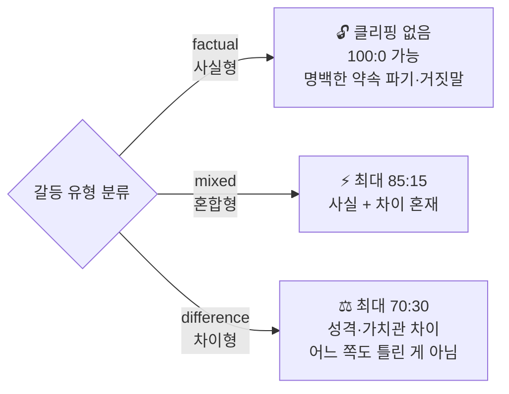

# 화해 기여도 계산

> **UI 표기 절대 규칙**: "과실비율"이라는 단어 사용 금지. 코드 변수명도 `contributionRatio` 또는 `reconciliationRatio`만 허용.

## Source of truth

- BE 알고리즘: `backend/.../service/report/ReportResponseParser.java`, `safety/RatioEnforcer.java` (클리핑 강제)
- BE DTO: `backend/.../api/dto/response/ReportResponse.java` (`contributionRatio` 필드)
- FE 표시: `frontend/components/result/ContributionRatio.tsx`, `frontend/lib/utils/ratio.ts`

## 알고리즘 흐름



## [1] 갈등 유형 분류



LLM이 분류:

| 유형 | 정의 | 클리핑 한도 |
|---|---|---|
| `factual` (사실형) | 명백한 약속 파기, 거짓말, 선 넘는 행동 — 객관적 판단 가능 | 100:0 까지 |
| `difference` (차이형) | 성격·가치관·취향·욕구 차이 — 어느 쪽도 틀린 게 아님 | **최대 70:30** |
| `mixed` (혼합형) | 사실 + 차이 혼재 | 최대 85:15 |

## [2] 5개 요소 스코어링

| 요소 | 가중치 | 0-2 | 3-5 | 6-8 | 9-10 |
|---|---|---|---|---|---|
| boundaryViolation (경계 침범) | **0.30** | 침범 없음 | 작은 약속 불이행 | 명확한 약속 파기 | 심각한 신뢰 파괴 |
| fourHorsemenUsage (4 Horsemen 사용) | 0.25 | 없음/미미 | 1-2 패턴 | 3+ 패턴 반복 | **경멸 명확** (가장 위험) |
| repairAttemptLack (회복 시도 부족) | 0.15 | 여러 번 시도 + 수용 | 한두 번 | 시도 없음 | 상대 시도 명시적 거부 |
| perspectiveTakingLack (조망수용 부족) | 0.15 | Turn 5-6 잘 표현 | 부분 시도 | 자기 입장만 | Turn 5-6 스킵 + 무시 |
| escalationContribution (격화 기여) | 0.15 | 차분 | 일부 감정적 | 자주 격앙 | 격화 주된 원인 |

```java
score = 0.30*boundary + 0.25*horsemen + 0.15*repair + 0.15*perspective + 0.15*escalation;
// 0-10 범위
```

## [3] 초기 비율

```typescript
function initialRatio(scoreA: number, scoreB: number) {
  const total = scoreA + scoreB;
  if (total === 0) return { a: 50, b: 50 };
  return { a: (scoreA/total) * 100, b: (scoreB/total) * 100 };
}
```

## [4] 클리핑 (RatioEnforcer로 코드 강제)

LLM 출력만 믿지 않고 **`RatioEnforcer.enforce()`가 코드 레벨에서 강제 적용**:

```java
public EnforcedRatio enforce(int a, int b, ConflictType type) {
  switch (type) {
    case DIFFERENCE: if (a > 70) { a = 70; b = 30; }
                     if (b > 70) { a = 30; b = 70; } break;
    case MIXED:      if (a > 85) { a = 85; b = 15; }
                     if (b > 85) { a = 15; b = 85; } break;
    case FACTUAL:    /* 클리핑 없음 (100:0 가능) */ break;
  }
  return new EnforcedRatio(a, b);
}
```

LLM이 우회 시도해도 후처리에서 차단.

## [5] 5단위 반올림

```typescript
const roundedA = Math.round(ratio.a / 5) * 5;
const roundedB = 100 - roundedA;
```

73:27 같은 정밀 숫자는 오히려 불신 유발 → 5 단위로 통일.

## [6] 긍정 라벨

숫자만 보여주지 않고 라벨 병행. 어느 쪽도 "나쁜 사람"이 되지 않도록.

```java
if (a > b)  return Labels("먼저 다가가면 좋은 쪽", "마음 열고 기다려주면 좋은 쪽");
if (b > a)  return Labels("마음 열고 기다려주면 좋은 쪽", "먼저 다가가면 좋은 쪽");
return Labels("함께 다가가기 좋은 쪽", "함께 다가가기 좋은 쪽");
```

## 엣지 케이스

| 케이스 | 처리 |
|---|---|
| 양쪽 점수 동일 | 50:50, 둘 다 "함께 다가가기 좋은 쪽" |
| Solo 모드 | **비율 계산 안 함** — 다음 출력으로 대체:<br>① 4 Horsemen 자가 관찰 (A 점수만)<br>② NVC 4문장 초안<br>③ 메타포 카드 1종<br>④ "상대도 입력하면 균형 볼 수 있어요" 권유 |
| 위기 키워드 감지 | 세션 즉시 중단, **리포트 미생성** |
| 차이형에서 LLM이 90:10 출력 | RatioEnforcer가 70:30으로 자동 강제 |

## UI 노출 규칙 (강제)

| 항목 | 규칙 |
|---|---|
| 수치 형식 | 소수점 없는 정수만 |
| 레이블 텍스트 | "화해 기여도", "비난/경멸/방어/담쌓기" 한국어 |
| 색상 | 따뜻한 단일 계열 그라디언트. **빨강/위험색 금지** |
| 동반 문구 | 노출 시마다 "잘잘못이 아니라 노력의 양"임을 명시 |
| 부정 표현 | "위험", "위기", "심각" 등 사용 금지 ([forbidden-words.md](./forbidden-words.md)) |
| 비교 | 다른 부부와의 비교 점수/랭킹 **금지** |
| 시계열 | 점수 변화 그래프 **금지** (불안 트리거) |

## 정책 재검토 트리거

다음 중 하나 충족 시 정량 점수 노출 정책 재검토:

1. MAU ≥ 1,000
2. 점수 관련 부정 피드백 ≥ 10%
3. 점수 분쟁 사례 ≥ 5건

옵션:
- A: 현 정책 유지
- B: 점수 노출 옵트인 (기본 비노출)
- C: 내부 로깅 전용 (사용자 비노출)

## 샘플 케이스

### 사실형 — A가 약속 3번 연속 당일 취소

```
A 점수: boundary 8, horsemen 5, repair 6, perspective 7, escalation 5 → 6.45
B 점수: boundary 1, horsemen 3, repair 3, perspective 2, escalation 3 → 2.25
초기:   A 74.1 : B 25.9
factual → 클리핑 없음
반올림: A 75 : B 25
```

### 차이형 — 연락 빈도 갈등

```
A 점수: 4.5 / B 점수: 3.5
초기:   A 56.25 : B 43.75
difference → 70 이하 → 그대로
반올림: A 55 : B 45
```

### 혼합형 — 돈 문제 + 가치관 차이

```
A 점수: 6.8 / B 점수: 2.2
초기:   A 75.6 : B 24.4
mixed → 85 이하 → 그대로
반올림: A 75 : B 25
```
