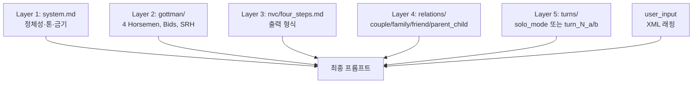

# LLM 프롬프트 아키텍처

런타임 LLM 프롬프트의 계층화 구조와 로딩 메커니즘.

## 개요

다시봄 BE는 Claude Code CLI를 통해 다음 5개 레이어를 조합한 프롬프트를 매 호출마다 동적으로 조립합니다:

```
<system>
  system.md (역할·말투·금기)
</system>

<context>
  gottman/           (갈등 이론 지식 베이스)
  nvc/               (출력 템플릿)
  relations/         (관계 유형별 가이드)
  turns/             (턴별 태스크 지시)
</context>

<user_input>
  PromptSanitizer이 정제한 사용자 입력
</user_input>
```

## 레이어 설명

### Layer 1 — System (`system.md`)
LLM의 역할·말투·금기를 정의. 모든 호출에 포함.

### Layer 2 — Gottman 이론 (`gottman/`)
- `four_horsemen.md` — 비난·경멸·방어·담쌓기 정의 + 해독제
- `bids_and_repair.md` — 연결 요청 + 회복 시도
- `sound_relationship_house.md` — 7층 구조 (Love Maps ~ Shared Meaning)

### Layer 3 — NVC 출력 템플릿 (`nvc/`)
- `four_steps.md` — 모든 "상대에게 할 말" 조언을 4단계로 강제 (관찰·느낌·욕구·부탁)

### Layer 4 — 관계 유형별 가이드 (`relations/`)
- `couple.md` — 부부 관계 (Four Horsemen, Bids, Love Maps)
- `family.md` — 가족 관계 (세대 차이, 용서)
- `friend.md` — 친구 관계 (기대치 정렬, 경계)
- `parent_child.md` — 부모-자식 관계 (권력 비대칭, 자율성)

### Layer 5 — 턴별 태스크 지시 (`turns/`)
- `turn_1_a.md` — A의 첫 입력 → 위험 감지 + B용 중립 요약
- `turn_2_b.md` — B의 첫 입력 → A용 요약 + 갈등 유형 분류
- `turn_3_a.md` — B의 답 기반 A용 심화 질문
- `turn_4_b.md` — A의 답 기반 B용 심화 질문
- `turn_5_a.md` — A용 조망수용 질문
- `turn_6_b.md` — B용 조망수용 질문
- `solo_mode.md` — 혼자 진행 모드 (2-3턴 단축)

## 프롬프트 계층화



## 로딩 및 재로드

### 시작 시
`PromptLoader`가 모든 `.md` 파일을 메모리 캐시로 로드 (`@PostConstruct`).

### 런타임 재로드
```bash
POST /api/admin/prompts/reload
```
(ADMIN 인증 필요) — 컨테이너 재시작 없이 캐시 무효화 후 재로드.

## 조립 및 실행

`PromptAssembler.assemble(turn, role, conflictType, relationType)`이 필요한 레이어를 동적으로 조합하여 최종 프롬프트를 생성. `ClaudeCodeBridge`가 XML 태그로 래핑 후 Claude Code CLI에 전달.

## 자세한 설계 문서

전체 아키텍처, 에러 처리, PromptSanitizer 상세 설명:
- `shared/docs/llm/system-prompts.md` — 5-레이어 설계 의도
- `shared/docs/llm/bridge-architecture.md` — ClaudeCodeBridge 구현 상세
