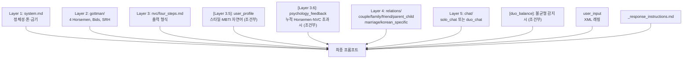

# LLM 프롬프트 아키텍처

런타임 LLM 프롬프트의 계층화 구조와 로딩 메커니즘.

## 개요

다시봄 BE는 Claude Code CLI를 통해 다음 레이어를 조합한 프롬프트를 매 호출마다 동적으로 조립합니다 (V1.5 카톡식):

```
system.md                       # Layer 1 — 역할·말투·금기
gottman/four_horsemen.md        # Layer 2 — 갈등 이론
nvc/four_steps.md               # Layer 3 — 출력 템플릿
[<user_profile>]                # Layer 3.5 — 사용자 프로필(있을 때만, 자연어 요약)
[<psychology_feedback>]         # Layer 3.6 — 누적 점수 기반 톤 지시(임계 초과 시)
relations/<type>.md             # Layer 4 — 관계 유형별 가이드
chat/{solo,duo}_chat.md         # Layer 5 — 채팅 모드
<conversation_history>          # 동적 — 본인(Solo) 또는 양쪽(Duo) 메시지
<current_user_message>          # 동적 — 이번 사용자 발화
chat/_response_instructions.md  # 형식 강제(본문 + <turn_meta> JSON)
[<duo_balance>]                 # Duo 모드에서 불균형 감지 시 관심 분배 지시
```

`[…]` 표시 블록은 조건부로 등장합니다.

## 레이어 설명

### Layer 1 — System (`system.md`)
LLM의 역할·말투·금기를 정의. 모든 호출에 포함.

### Layer 2 — Gottman 이론 (`gottman/`)
- `four_horsemen.md` — 비난·경멸·방어·담쌓기 정의 + 해독제

### Layer 3 — NVC 출력 템플릿 (`nvc/`)
- `four_steps.md` — 모든 "상대에게 할 말" 조언을 4단계로 강제 (관찰·느낌·욕구·부탁)

### Layer 3.5 — 사용자 프로필 (동적 주입)
- `<user_profile>` 블록은 `UserProfileFragment.render(User)`가 코드로 빌드해 주입.
- 6스타일(wave/mountain/flame/leaf/moon/star) label/emoji/strengths/caution은 `StyleCalculator.CommunicationStyle` enum이 권위본.
- Solo는 본인 1블록, Duo는 `sender="USER_A"` / `sender="USER_B"` 두 블록 연속. 온보딩 미완료 사용자에게는 출력 생략.
- (2026-05-31) 온보딩 선택화 이후 대부분 사용자는 스타일 미설정이 기본값 — `<user_profile>`는 자동 생략되고 중재는 Phase D 동적 컨텍스트가 주 경로. 스타일이 설정된 경우에만 톤 힌트로 보강.

### Layer 3.6 — 누적 심리 피드백 (`<psychology_feedback>`, 동적 주입)
- 코드 빌더: `PsychologyFeedbackFormatter.render(Session)`
- 입력: `sessions.horsemen_history` + `sessions.nvc_completion_history` (V8)
- 임계 초과 시(예: criticism 누적 평균 ≥ 0.4) "이번 턴에는 NVC 욕구 명시를 우선" 같은 자연어 지시 출력. 임계 미만이면 빈 문자열.

### Layer 4 — 관계 유형별 가이드 (`relations/`)
- `couple.md` — 부부/연인 관계 (Four Horsemen, Bids, Love Maps)
- `family.md` — 가족 관계 (세대 차이, 용서)
- `friend.md` — 친구 관계 (기대치 정렬, 경계)
- `parent_child.md` — 부모-자식 관계 (권력 비대칭, 자율성)
- `marriage.md` — 결혼 전·후 전환기 (역할 기대, 시댁·처가)
- `korean_specific.md` — 한국 문화 특수 갈등 패턴 (서열·체면·눈치)

### Layer 5 — 채팅 모드 (`chat/`)

**Solo 모드** (V1.5 부터):
- `solo_chat.md` — Solo 카톡 시스템 프롬프트 (사용자 1인 상담)
- `solo_report.md` — Solo 최종 리포트 (Sonnet 4)

**Duo 모드** (양쪽 합류 후):
- `duo_chat.md` — Duo 카톡 시스템 프롬프트 (양쪽 격리, 중재자만 통합)
- `duo_report.md` — Duo 최종 리포트 (Sonnet 4, 화해 기여도 포함)
- `<duo_balance>` 동적 블록 — 발화량/감정 강도가 한쪽으로 치우쳤을 때 `DuoBalanceFormatter`가 관심 분배 지시 주입 (편들기 금지)

**공통**:
- `_response_instructions.md` — 모든 카톡 응답의 공통 형식 지시. 본문(한국어 1~3문장) 뒤에 `<turn_meta>{"horsemen":{...},"nvc_completion":{...}}</turn_meta>` JSON 블록을 정확히 1회 첨부하도록 강제. 메타 블록은 `ChatTurnMetaParser`가 추출해 세션 누적에 사용하며, 실패 시 graceful (본문은 정상 표시).
- `welcome_partner.md` — B가 합류할 때 A와 B에게 각각 보내는 환영 메시지 (조건부, Duo 전이 시 1회).
- `partner_joined_summary.md` — B 합류 시 B에게 Solo 대화 요약을 전달하는 메시지 (격리 원칙 준수).

## 프롬프트 계층화



## 로딩 및 재로드

### 시작 시
`PromptLoader`가 모든 `.md` 파일을 메모리 캐시로 로드 (`@PostConstruct`).

### 런타임 재로드
```bash
POST /api/admin/prompts/reload
```
(ADMIN 인증 필요) — 컨테이너 재시작 없이 캐시 무효화 후 재로드.

## 조립 및 실행

V1.5 카톡식 흐름은 `ChatPromptAssembler`가 담당:
- `assembleSoloTurn(Session, User, currentMessage, recentMessages)` — Solo 모드
- `assembleDuoTurn(Session, userA, userB, currentSender, currentMessage, allMessages)` — Duo 모드

레이어 합성 후 `ClaudeCodeBridge`가 Claude Code CLI에 전달. 응답은 `ChatTurnMetaParser`가 본문/메타로 분리.

리포트 생성은 `ReportGenerationService`가 동일 레이어 + `chat/{solo,duo}_report.md`를 사용해 Sonnet으로 호출.

V1.5 이전 6턴 모델용 레거시 `PromptAssembler`는 더 이상 신규 흐름에서 사용되지 않음. 신규 흐름은 `ChatPromptAssembler`가 전담.

## 자세한 설계 문서

- `backend/docs/llm-bridge.md` — ClaudeCodeBridge 구현 상세
- `backend/docs/architecture.md` — Layer/State Machine 흐름
