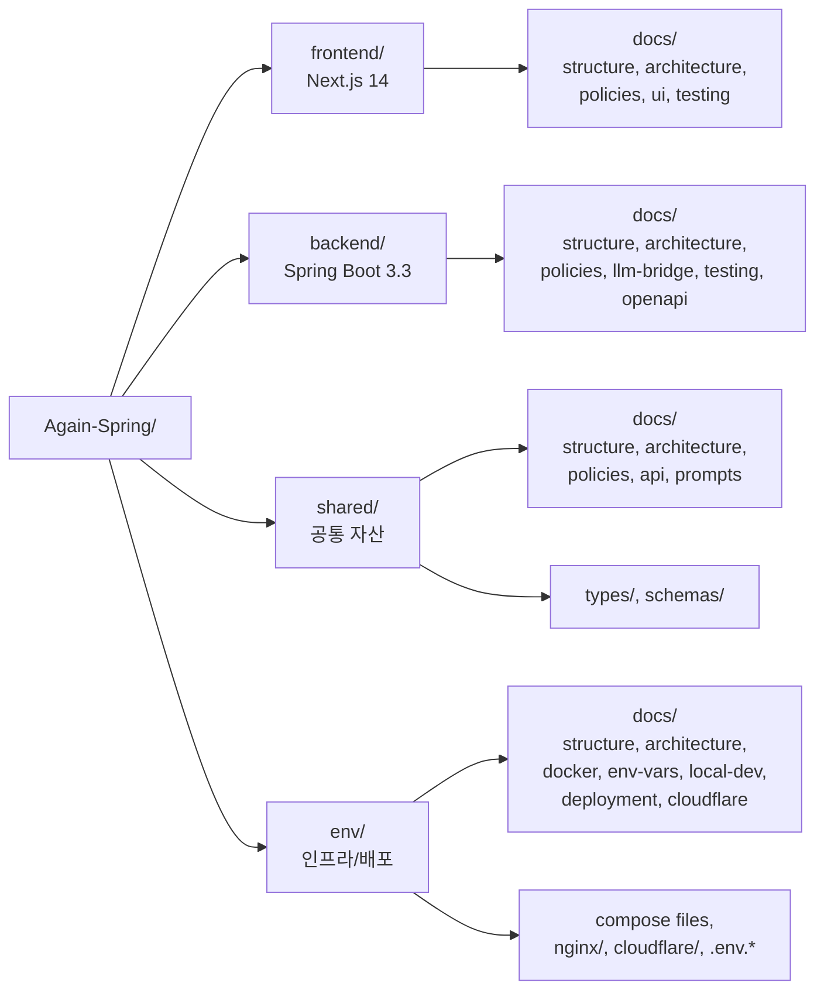

# 모노레포 구조



### 상세 구조:

```
Again-Spring/
├── README.md                       # 프로젝트 소개 (루트)
├── CLAUDE.md                       # Claude Code 작업 규칙 (루트)
│
├── env/                            # 환경 · 인프라 · 배포
│   ├── docker-compose.yml          # local: MariaDB only
│   ├── docker-compose.dev.yml      # dev: name=againspring-dev
│   ├── docker-compose.prod.yml     # prod: name=againspring-prod
│   ├── .env.{example,dev.example,prod.example}
│   ├── nginx/{dev,prod}.conf       # 리버스 프록시 (8090/8091)
│   ├── cloudflare/                 # Tunnel 자산
│   └── docs/                       # ← env 관련 모든 문서
│
├── llm-worker/                     # LLM 전용 Spring Boot 워커 (Claude CLI 실행)
│   ├── build.gradle.kts
│   ├── Dockerfile                  # multi-stage + Claude CLI 설치
│   └── src/main/java/com/againspring/llmworker/
│       ├── controller/             # InvocationController (4 endpoints)
│       ├── pool/                   # LlmWorkerPool (ThreadPoolExecutor 100 + Queue 500)
│       ├── service/                # ClaudeCliInvoker (ProcessBuilder)
│       ├── health/                 # ClaudeCliHealthIndicator
│       ├── dto/                    # 요청/응답 DTO
│       └── exception/              # LlmException 계층
│
├── social-poster/                  # 소셜 자동 포스팅 사이드카 (dev 전용, Playwright 기반)
│   ├── Dockerfile                  # Playwright + nodemon (dev 핫리로드)
│   ├── extract-session.js          # 브라우저 콘솔 세션 추출 스크립트 (Windows PC용)
│   ├── src/server.js               # Express 앱, 라우터 등록, 포트 9100
│   ├── src/seed-server.js          # 서버 headless 세션 시딩 CLI
│   ├── src/lib/
│   │   ├── anti-bot.js             # 봇 탐지 우회 (핑거프린트, jitter, warmup, webdriver 마스킹)
│   │   ├── session.js              # storageState 로드/저장 (anti-bot context 적용)
│   │   ├── x-selectors.js          # X CSS 셀렉터 (UI 변경 시 여기만 수정 → restart)
│   │   └── ig-selectors.js         # Instagram CSS 셀렉터
│   └── src/routes/
│       ├── publish-x.js            # X 트윗 스레드 발행
│       ├── publish-instagram.js    # Instagram 이미지+캡션 발행
│       ├── session-health.js       # 세션 유효성 확인 + 쿠키 워밍업 갱신
│       └── test-login.js           # Admin UI 로그인 테스트 엔드포인트
│
├── backend/                        # Spring Boot 3.3 + Java 21 + MariaDB
│   ├── build.gradle.kts
│   ├── Dockerfile                  # multi-stage (Node.js/Claude CLI 미포함 — llm-worker로 이동)
│   ├── src/main/java/com/againspring/
│   │   ├── api/                    # REST Controllers + DTO
│   │   ├── service/                # 비즈니스 로직 + State Machine
│   │   ├── domain/                 # JPA Entity + Enum
│   │   ├── repository/             # Spring Data JPA
│   │   ├── llm/remote/             # RemoteLlmProvider + RemoteCancelableInvocation (기본)
│   │   ├── llm/bridge/             # ClaudeCodeBridge + PromptSanitizer (fallback)
│   │   ├── safety/                 # KeywordGuard, CrisisDetector, RatioEnforcer
│   │   ├── security/               # JWT + Spring Security + Rate limit
│   │   ├── config/                 # OpenAPI, CORS, Async, Scheduling
│   │   └── common/                 # 예외 + 공통 DTO
│   ├── src/main/resources/
│   │   ├── application{,-dev,-prod,-test}.yml
│   │   ├── db/migration/V1~V5.sql  # Flyway
│   │   └── safety/                 # 금지어/위험 키워드 yml
│   └── docs/                       # ← BE 특화 문서
│
├── frontend/                       # Next.js 14 + React 18 + Tailwind
│   ├── package.json                # scripts: dev, build, lint, lint:words
│   ├── Dockerfile                  # multi-stage, non-root, NEXT_PUBLIC_* ARG
│   ├── app/                        # App Router (auth, onboarding, session, dashboard)
│   ├── components/                 # shared, mediation, onboarding, result
│   ├── lib/
│   │   ├── api/                    # axios + Bearer interceptor
│   │   ├── auth/                   # OAuth helper
│   │   ├── store/                  # Zustand (user, session) + persist
│   │   ├── constants/              # 금지어, 카테고리, MBTI 매핑 등
│   │   ├── types/                  # TypeScript 타입
│   │   └── utils/                  # keywordGuard, ratio, styleCalculator
│   ├── mocks/                      # MSW (browser worker + handlers + fixtures)
│   ├── scripts/check-forbidden-words.js
│   └── docs/                       # ← FE 특화 문서
│
├── shared/                         # FE+BE 공유 자산
│   ├── schemas/openapi.yaml        # OpenAPI 정의 (Swagger 보조)
│   ├── types/                      # TS 공통 타입 (common, user, session, report)
│   └── docs/                       # ← FE+BE 공통 문서
│       ├── prompts/                # ← BE PromptLoader 런타임 로딩 (NOT docs)
│       │   ├── system.md
│       │   ├── gottman/{four_horsemen,sound_relationship_house,bids_and_repair}.md
│       │   ├── nvc/four_steps.md
│       │   ├── relations/{couple,family,friend,parent_child}.md
│       │   └── turns/{solo_mode,turn_1_a,turn_2_b,turn_3_a,turn_4_b,turn_5_a,turn_6_b}.md
│       ├── policies/               # 서비스 정책
│       ├── api/                    # API 명세 (도메인별 8파일) + DB 스키마
│       └── (llm 관련 설계 문서)      # bridge-architecture, system-prompts 등
│
└── .gitignore                      # env/.env.{dev,prod} 보호
```

## 4-분할 구조 (격리 원칙)

다시봄은 4개의 독립된 도메인으로 분할되어 있습니다:

| 폴더 | 책임 |
|---|---|
| **`env/`** | 컨테이너 정의 + 환경변수 + 도메인 라우팅 — 운영·배포 |
| **`backend/`** | API + 비즈니스 + DB + 프롬프트 어셈블 + 보안 — JVM 프로세스 |
| **`llm-worker/`** | Claude CLI 실행 전용 워커 — 100풀 + 큐500, HTTP API |
| **`frontend/`** | UI + 라우팅 + 상태 + axios — Next.js 프로세스 |
| **`social-poster/`** | 소셜 자동 포스팅 사이드카 — Playwright 세션 재사용, X·Instagram 발행, dev 전용 |
| **`shared/docs/`** | 양쪽이 합의한 정책/명세/아키텍처 — **유일한 공유 문서** |
| **`shared/docs/prompts/`** | LLM 시스템·턴 프롬프트 — BE가 시작 시 로드 (런타임 자산) |

## 문서 4분할 규칙

루트 `README.md` / `CLAUDE.md` 외 모든 .md는 다음 4곳에서만 관리합니다:

- `env/docs/` — 환경/설치/배포
- `backend/docs/` — BE 특화
- `frontend/docs/` — FE 특화
- `shared/docs/` — 공통

예외: `shared/prompts/**.md`는 docs가 아니라 BE 런타임이 읽는 자산.

## 작업 규칙

| 작업 종류 | 작업 위치 | 참고 docs |
|---|---|---|
| API 추가/변경 | `backend/src/.../api/`, `frontend/lib/api/` | `shared/docs/api/rest-spec.md` → 해당 도메인 `.md` |
| DB 스키마 변경 | `backend/src/main/resources/db/migration/V{n+1}__*.sql` | `shared/docs/api/database-schema.md` |
| 프롬프트 변경 | `shared/docs/prompts/*.md` (런타임 자산) | `shared/docs/prompts/README.md` |
| LLM 브릿지 코드 | `backend/.../llm/bridge/` | `shared/docs/llm/bridge-architecture.md` |
| 정책 검증 (금지어/위험) | `frontend/lib/constants/`, `backend/.../safety/` | `shared/docs/policies/forbidden-words.md` |
| 소셜 포스터 셀렉터/로직 수정 | `social-poster/src/lib/`, `social-poster/src/routes/` | `shared/docs/v15/social-poster-troubleshooting.md` |
| 도커 / nginx / 배포 | `env/` | `env/docs/` |
